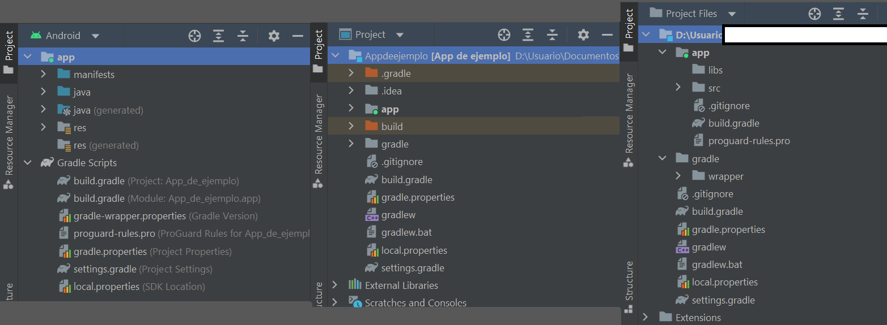

# Anatomía del Proyecto


Fuente: developer.android.com


## DIRECTORIOS

Cuando un proyecto es creado, se crean por defecto una serie de directorios que son los que van a almacenar los archivos que componen el proyecto.

Algunos de estos archivos ya han sido creados y otros los crearemos nosotros en función de nuestras necesidades.

En la ventana de herramientas llamada `project` (por defecto se puede encontrar en el margen izquierdo arriba del todo) vemos todos los archivos que componen el proyecto.

### Modos de visualización

Existen varias formas de visualizar estos archivos:

<figure><figcaption>
Tipos de visualizaciones
</figcaption></figure>

#### Modo Android

El modo Android (izquierda) es una forma que tiene Android Studio de organizar los archivos de un proyecto de la manera lógica desde el punto de vista de un proyecto de desarrollo de aplicaciones Android. Es la forma más habitual de visualizar nuestros archivos.

#### Modo Project

En este modo (centro) podemos ver los archivos que se han creado para que el proyecto funcione, incluyendo aquellas que no tienen nada que ver con nuestro proyecto en sí. Es decir, todos los archivos que se han creado para hacer posible la construcción de la aplicación y su buen funcionamiento.&#x20;

Además, se incluyen las librerías externas.

#### Modo Project Files

Este modo (derecha) nos permite ver los archivos del proyecto exactamente como se encuentran guardados en el disco duro.&#x20;


En esta guía vamos a trabajar casi todo el tiempo con el modo Android.

