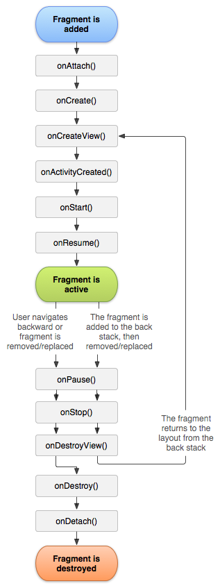

# Fragments

Los **Fragments** se pueden identificar como s**ub-activities** o lo que es lo mismo, partes de la interfaz de usuario en una pantalla.


Fuente: developer.android


## DEFINICIÓN

Un **Fragment** es una parte de la IU que se caracteriza por ser reutilizable y modular. Esto implica que se pueden utilizar varios **Fragments** en una misma **Activity** y estos **Fragments** se pueden reutilizar en otras **Activities**.

Puede pensar en un **Fragment** como una sección modular de una actividad que tiene un ciclo de vida propio, que recibe sus propios eventos de entrada y que puedes agregar o quitar mientras la actividad se esté ejecutando.

Un fragmento siempre debe estar alojado en una actividad y el ciclo de vida del fragmento se ve afectado directamente por el ciclo de vida de la actividad anfitriona.&#x20;


Por ejemplo, cuando la actividad está pausada, también lo están todos sus fragmentos, y cuando la actividad se destruye, lo mismo ocurre con todos los fragmentos.&#x20;

Sin embargo, mientras una actividad se está ejecutando, puedes manipular cada fragmento de forma independiente.


<figure><figcaption>
Fuente: developer.android
</figcaption></figure>

## COMO CREAR UN FRAGMENTO

Para crear un fragmento, debes crear una subclase `Fragment` (o una subclase existente de ella). La clase `Fragment` tiene un código que se asemeja bastante a una `Activity`.

### Ciclo de Vida

<figure><figcaption>
Fuente: developer.android
</figcaption></figure>

Generalmente, debes implementar al menos los siguientes métodos del ciclo de vida:

* `onCreate()` -> El sistema lo llama cuando crea el fragmento. En tu implementación, debes inicializar componentes esenciales del fragmento que quieras conservar cuando el fragmento se pause o se detenga, y luego se reanude.
* `onCreateView()` -> El sistema lo llama cuando el fragmento debe diseñar su interfaz de usuario por primera vez. A fin de diseñar una IU para tu fragmento, debes mostrar un `View` desde este método, que será la raíz del diseño de tu fragmento. Puedes mostrar un valor nulo si el fragmento no proporciona una IU.
* `onPause()` -> El sistema llama a este método como el primer indicador de que el usuario está abandonando el fragmento (aunque no siempre significa que el fragmento se esté destruyendo). Generalmente, este es el momento en el que debes confirmar los cambios que deban conservarse más allá de la sesión de usuario actual (porque es posible que el usuario no vuelva).

La mayoría de las aplicaciones deben implementar al menos estos tres métodos para cada fragmento, pero hay muchos otros métodos de devolución de llamada que también debes usar para manipular varias fases del ciclo de vida del fragmento.


Existe muchisima más información en [developer.android](https://developer.android.com/guide/components/fragments?hl=es).&#x20;

Esto es solo un baño general para conocer el concepto.

