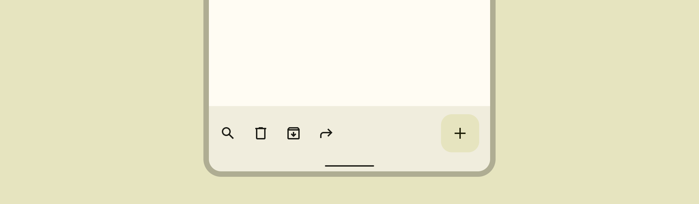

# AppBarLayout y BottomAppBar

## DEFINICIÓN

### AppBarLayout


Fuente: developer.android



Fuente: material design


<figure><figcaption><p>Fuente: material design</p></figcaption></figure>

Hereda de `LinearLayout`.

`AppBarLayout` es un `LinearLayout` vertical que implementa muchas de las caracteristicas del concepto de **Top** **App Bar** en **Material Design**.

Los hijos tendrán que proveer el comportamiento que desean tener cuando se hace scroll. Para ello se utiliza `AppBarLayout.LayoutParams.setScrollFlags(int)` y el layout asociado con `app:layout_scrollFlags`.

Esta View debe ser utilizada como hijo directo de un CoordinatorLayout, si se utiliza como parte de otro ViewGroup, muchas de sus funcionalidades no funcionarán.

Además, `AppBarLayout` necesita un `NestedScrollView` separado (al mismo nivel dentro del CoordinatorLayout) para saber cuando hacer Scroll. El layout\_behaviour de esta View tiene que ser una instancia de `AppBarLayout.ScrollingViewBehavior`.

### BottonAppBar


Fuente: developer.android



Fuente: material design



Fuente: Github&#x20;


<figure><figcaption><p>Fuente: material design</p></figcaption></figure>

Hereda de `ViewGroup.Toolbar`.

La `BottomAppBar` es una extensión de Toolbar que soporta backgrounds con formas que incluyen el `FloatingActionButton`.

Se puede anclar un FAB a la BottomAppBar llamando a `CoordinatorLayout.LayoutParams.setAnchorId(int)`, o utilizando el atributo `app:layout_anchor` en el XML del FAB.


PRECAUCIÓN

`ExtendedFloatingActionButton` no se encuentra soportado actualmente en las `BottomAppBar` segun las guias de diseño de Material Design.

Se puede utilizar pero las animaciones no se verán.


Hay dos modos que determinan donde se verá el FAB en relación con la BottomAppBar:

* `FAB_ALIGNMENT_MODE_CENTER` -> El FAB estará centrado. Primario
* `FAB_ALIGNMENT_MODE_END` -> El FAB estará en el lateral derecho. Secundario

No utilice el atributo `android:background` o `BottomAppBar.setBackground` por que los fondos se manejan de manera interna. Utilice en cambio `app:backgroundTint`.

Para activar los Temas para los items del menú, debe utilizar el atributo `materialThemeOverlay` con un Overlay que defina el color correcto en `colorControlNormal`.

## EJEMPLO

A continuación se va a aplicar el ejemplo que muestran las guías de diseño de **Material Design** con el contenido que estamos utilizando en los últimos proyectos:

### AppBarLayout

<pre class="language-xml" data-title="activity_main.xml"><code class="lang-xml"><strong>&#x3C;?xml version="1.0" encoding="utf-8"?>
</strong>&#x3C;androidx.coordinatorlayout.widget.CoordinatorLayout 
xmlns:android="http://schemas.android.com/apk/res/android"
    xmlns:app="http://schemas.android.com/apk/res-auto"
    xmlns:tools="http://schemas.android.com/tools"
    android:layout_width="match_parent"
    android:layout_height="match_parent">

    &#x3C;com.google.android.material.appbar.AppBarLayout
        android:id="@+id/appbar"

        android:layout_height="wrap_content"
        android:layout_width="match_parent">

        &#x3C;com.google.android.material.appbar.MaterialToolbar
            android:layout_width="match_parent"
            android:layout_height="?attr/actionBarSize"
            app:toolbarId="@+id/toolbar"
            app:menu="@menu/top_app_bar"
            app:layout_scrollFlags="scroll|enterAlways|snap"
            app:title="App de Prueba"
            app:navigationIcon="@drawable/ic_drawer_menu_24px"
            style="@style/Widget.MaterialComponents.Toolbar.Primary">

        &#x3C;/com.google.android.material.appbar.MaterialToolbar>
    &#x3C;/com.google.android.material.appbar.AppBarLayout>

    &#x3C;androidx.core.widget.NestedScrollView
        android:layout_width="match_parent"
        android:layout_height="match_parent"
        app:layout_behavior="com.google.android.material.appbar.
        AppBarLayout$ScrollingViewBehavior">

        &#x3C;androidx.constraintlayout.widget.ConstraintLayout
            android:layout_width="match_parent"
            android:layout_height="match_parent">

            &#x3C;ImageView
                android:id="@+id/ivPhoto"
                android:layout_width="wrap_content"
                android:layout_height="wrap_content"
                android:layout_marginTop="80dp"
                app:layout_constraintEnd_toEndOf="parent"
                app:layout_constraintStart_toStartOf="parent"
                app:layout_constraintTop_toTopOf="parent"
                android:src="@drawable/im_james_sunderland" />

            &#x3C;ImageView
                android:id="@+id/ivGender"
                android:layout_width="wrap_content"
                android:layout_height="wrap_content"
                android:layout_marginTop="20dp"
                android:layout_marginEnd="20dp"
                app:layout_constraintBottom_toTopOf="@+id/ivPhoto"
                app:layout_constraintEnd_toEndOf="parent"
                app:layout_constraintTop_toTopOf="parent"
                android:src="@drawable/ic_male" />

            &#x3C;TextView
                style="@android:style/TextAppearance.Material.Display1"
                android:id="@+id/tvName"
                android:layout_width="wrap_content"
                android:layout_height="wrap_content"
                android:layout_marginTop="30dp"
                app:layout_constraintEnd_toEndOf="parent"
                app:layout_constraintStart_toStartOf="parent"
                app:layout_constraintTop_toBottomOf="@+id/ivPhoto"
                android:text="James Sunderland" />

            &#x3C;TextView
                style="@android:style/TextAppearance.Material.Body2"
                android:id="@+id/tvGame"
                android:layout_width="wrap_content"
                android:layout_height="wrap_content"
                android:layout_marginTop="10dp"
                app:layout_constraintEnd_toEndOf="parent"
                app:layout_constraintStart_toStartOf="parent"
                app:layout_constraintTop_toBottomOf="@+id/tvName"
                android:text="Silent Hill 2" />


            &#x3C;TextView
                android:id="@+id/tvDescription"
                style="@android:style/TextAppearance.Material.Body1"
                android:layout_width="wrap_content"
                android:layout_height="wrap_content"
                android:layout_marginTop="50dp"
                android:paddingHorizontal="20dp"
                app:layout_constraintEnd_toEndOf="parent"
                app:layout_constraintStart_toStartOf="parent"
                app:layout_constraintTop_toBottomOf="@+id/tvGame"
                android:text="@string/loren_ipsum" />

        &#x3C;/androidx.constraintlayout.widget.ConstraintLayout>
    &#x3C;/androidx.core.widget.NestedScrollView>
&#x3C;/androidx.coordinatorlayout.widget.CoordinatorLayout>

</code></pre>


La mayor parte del código que crea Android coincide con el del ejemplo.

Sin embargo, hay que realizar algunos cambios.


Para mostrar correctamente los iconos de la barra hay que crear también un archivo de Layout para el menú llamado `top_app_bar.xml`.


```xml
<?xml version="1.0" encoding="utf-8"?>
<menu xmlns:android="http://schemas.android.com/apk/res/android"
    xmlns:app="http://schemas.android.com/apk/res-auto">

    <item
        android:id="@+id/favorite"
        android:icon="@drawable/ic_favorite"
        android:title="favorite"
        android:contentDescription="favorite"
        app:showAsAction="ifRoom" />

    <item
        android:id="@+id/search"
        android:icon="@drawable/ic_search"
        android:title="search"
        android:contentDescription="search"
        app:showAsAction="ifRoom" />

    <item
        android:id="@+id/more"
        android:title="more"
        android:contentDescription="more"
        app:showAsAction="never" />

</menu>
```


<figure><figcaption></figcaption></figure>

#### Añadiendo comportamientos a la barra

La primera opción es que una barra prominente se convierta primero en una barra normal y se mantenga así mientras el texto se desliza por debajo. Para ello utilizamos la siguiente linea de código:

```xml
<com.google.android.material.appbar.AppBarLayout 
    ... 
    app:liftOnScroll="true">
```

La segunda opción es como el ejemplo, que la barra desaparezca cuando se hace scroll hacia abajo y vuelva a aparecer cuando se hace scroll hacia arriba. Para ello añadimos la siguiente linea:

<pre class="language-xml"><code class="lang-xml">&#x3C;com.google.android.material.appbar.MaterialToolbar
    ...
<strong>    app:layout_scrollFlags="scroll|enterAlways|snap"/>
</strong></code></pre>


Existen muchas más opciones de diseño que se pueden implementar en la web de material design.


### BottomAppBar


```xml
<?xml version="1.0" encoding="utf-8"?>
<androidx.coordinatorlayout.widget.CoordinatorLayout xmlns:android="http://schemas.android.com/apk/res/android"
    xmlns:app="http://schemas.android.com/apk/res-auto"
    xmlns:tools="http://schemas.android.com/tools"
    android:layout_width="match_parent"
    android:layout_height="match_parent">

    <androidx.core.widget.NestedScrollView
        android:layout_width="match_parent"
        android:layout_height="match_parent"
        app:layout_behavior="com.google.android.material.appbar.AppBarLayout$ScrollingViewBehavior">

        <androidx.constraintlayout.widget.ConstraintLayout
            android:layout_width="match_parent"
            android:layout_height="match_parent">

            <ImageView
                android:id="@+id/ivPhoto"
                android:layout_width="wrap_content"
                android:layout_height="wrap_content"
                android:layout_marginTop="80dp"
                app:layout_constraintEnd_toEndOf="parent"
                app:layout_constraintStart_toStartOf="parent"
                app:layout_constraintTop_toTopOf="parent"
                android:src="@drawable/im_james_sunderland" />

            <ImageView
                android:id="@+id/ivGender"
                android:layout_width="wrap_content"
                android:layout_height="wrap_content"
                android:layout_marginTop="20dp"
                android:layout_marginEnd="20dp"
                app:layout_constraintBottom_toTopOf="@+id/ivPhoto"
                app:layout_constraintEnd_toEndOf="parent"
                app:layout_constraintTop_toTopOf="parent"
                android:src="@drawable/ic_male" />

            <TextView
                style="@android:style/TextAppearance.Material.Display1"
                android:id="@+id/tvName"
                android:layout_width="wrap_content"
                android:layout_height="wrap_content"
                android:layout_marginTop="30dp"
                app:layout_constraintEnd_toEndOf="parent"
                app:layout_constraintStart_toStartOf="parent"
                app:layout_constraintTop_toBottomOf="@+id/ivPhoto"
                android:text="James Sunderland" />

            <TextView
                style="@android:style/TextAppearance.Material.Body2"
                android:id="@+id/tvGame"
                android:layout_width="wrap_content"
                android:layout_height="wrap_content"
                android:layout_marginTop="10dp"
                app:layout_constraintEnd_toEndOf="parent"
                app:layout_constraintStart_toStartOf="parent"
                app:layout_constraintTop_toBottomOf="@+id/tvName"
                android:text="Silent Hill 2" />


            <TextView
                android:id="@+id/tvDescription"
                style="@android:style/TextAppearance.Material.Body1"
                android:layout_width="wrap_content"
                android:layout_height="wrap_content"
                android:layout_marginTop="50dp"
                android:paddingHorizontal="20dp"
                app:layout_constraintEnd_toEndOf="parent"
                app:layout_constraintStart_toStartOf="parent"
                app:layout_constraintTop_toBottomOf="@+id/tvGame"
                android:text="@string/loren_ipsum" />

        </androidx.constraintlayout.widget.ConstraintLayout>
    </androidx.core.widget.NestedScrollView>
    <com.google.android.material.bottomappbar.BottomAppBar
        android:id="@+id/bottomAppBar"
        android:layout_width="match_parent"
        android:layout_height="wrap_content"
        android:layout_gravity="bottom"
        style="@style/Widget.MaterialComponents.BottomAppBar.Colored"
        app:navigationIcon="@drawable/ic_drawer_menu_24px"
        app:menu="@menu/bottom_app_bar"
        app:hideOnScroll="true"
        />

    <com.google.android.material.floatingactionbutton.FloatingActionButton
        android:layout_width="wrap_content"
        android:layout_height="wrap_content"
        app:srcCompat="@drawable/ic_add_24dp"
        app:layout_anchor="@id/bottomAppBar"
        />
</androidx.coordinatorlayout.widget.CoordinatorLayout>
```


Tambien debemos crear un archivo de Layout para los elementos de este menú que se llamará `bottom_app_bar.xml`:


```xml
<?xml version="1.0" encoding="utf-8"?>
<menu xmlns:android="http://schemas.android.com/apk/res/android"
    xmlns:app="http://schemas.android.com/apk/res-auto">
    <item
    android:id="@+id/accelerator"
    android:icon="@drawable/ic_male"
    android:title="accelerator"
    android:contentDescription="accelerator"
    app:showAsAction="ifRoom"/>
    
    <item
    android:id="@+id/rotation"
    android:icon="@drawable/ic_female"
    android:title="rotation"
    android:contentDescription="rotation"
    app:showAsAction="ifRoom"/>
    
    <item
    android:id="@+id/dashboard"
    android:icon="@drawable/ic_search"
    android:title="dashboard"
    android:contentDescription="dashboard"
    app:showAsAction="ifRoom"/>
</menu>
```


<figure><figcaption></figcaption></figure>

#### Añadiendo comportamientos a la barra

Como en el caso anterior la barra se puede esconder al hacer scroll o no. En el ejemplo se vé este comportamiento y para implementarlo solo hay que hacer uso del siguiente atributo:

<pre class="language-xml"><code class="lang-xml">&#x3C;com.google.android.material.bottomappbar.BottomAppBar
<strong>    ...
</strong>    app:hideOnScroll="true"
/>
</code></pre>

## USO COMBINADO DE AMBAS

Se pueden utilizar ambas barras al mismo tiempo, sin embargo hay que seguir algunas recomendaciones de estilo que define Google en el siguiente enlace:


Fuente: material design


&#x20;                                                 
