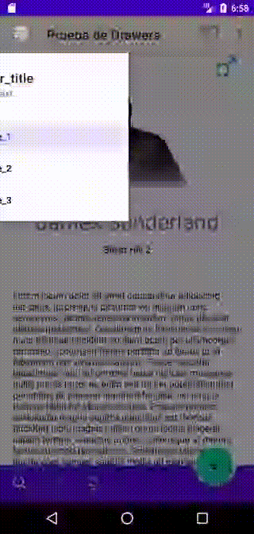

# NavigationView y BottomNavigationView

## DEFINICIÓN

### NavigationView


Fuente: developer.android



Fuente: developer.android



Fuente: material design


<figure><figcaption><p>Fuente: material design</p></figcaption></figure>

Hereda de `FrameLayout`.

Representa un menú de navegación estandar para aplicaciones.

El contenido del menú puede ser incluido en un archivo de resource de menú.

Debe estar contenido en un `DrawerLayout`.


**DRAWER LAYOUT**

`DrawerLayout` actúa como un contenedor de nivel superior para el contenido de las ventanas que tienen drawers interactivos que pueden ser extraidos de cualquiera de los dos límites verticales de la pantalla.

Si existe un `Drawer`, todo el contenido de la pantalla debe estar contenido en un `DrawerLayout` como veremos a continuación.


### BottomNavigationView


Fuente: developer.android



Fuente: material design


<figure><figcaption><p>Fuente: material design</p></figcaption></figure>

Hereda de `FrameLayout.NavigationBarView`.

Representa una barra de navegación estandar para las aplicaciones. Es una implementación de `bottom navigation` de **Material Design**.

Hace sencillo para los usuaros poder explorar y moverse entre las diferentes Views de nivel superior con un solo toque. Deben usarse solo sí la App tiene de 3 a 5 destinos de nivel superior.

El contenido de la barra se puede añadir con un archivo de resource de menú. Cada una de las entradas del menú será utilizada para pintar un item en la barra.

## EJEMPLO

Empezamos con lo que habíamos acabado en el ejemplo anterior. Ahora vamos a implementar los nuevos conceptos para ir dando embergadura a nuestra APP.

### Navigation View

Como ya hemos dicho, para implementar un `NavigationView`, que es básicamente un **Navigation Drawer**, debemos seguir los siguientes pasos:

* Meter todo el Layout en un `DrawerLayout`.

```xml
<androidx.drawerlayout.widget.DrawerLayout xmlns:android="http://schemas.android.com/apk/res/android"
    xmlns:app="http://schemas.android.com/apk/res-auto"
    xmlns:tools="http://schemas.android.com/tools"
    android:id="@+id/dlPrueba"
    android:layout_width="match_parent"
    android:layout_height="match_parent"
    tools:openDrawer="start">
```

* Añadir un `NavigationView` al final de nuestro `DraweLayout`.

```xml
<com.google.android.material.navigation.NavigationView
    android:id="@+id/nav"
    android:layout_width="wrap_content"
    android:layout_height="match_parent"
    android:layout_gravity="start"
    android:background="@android:color/white"
    app:headerLayout="@layout/nav_header"
    app:menu="@menu/navigation_drawer"
    android:layout_marginTop="?attr/actionBarSize"/>
```

* Crear nuestro archivo `nav_header.xml` que es de donde sacaremos el título de nuestro Drawer:


```xml
<?xml version="1.0" encoding="utf-8"?>
<LinearLayout xmlns:android="http://schemas.android.com/apk/res/android"
    xmlns:app="http://schemas.android.com/apk/res-auto"
    xmlns:tools="http://schemas.android.com/tools"
    android:layout_width="match_parent"
    android:layout_height="wrap_content"
    android:orientation="vertical">

    <TextView
        android:layout_width="wrap_content"
        android:layout_height="wrap_content"
        android:layout_marginTop="24dp"
        android:layout_marginStart="24dp"
        android:layout_marginEnd="24dp"
        android:textAppearance="?attr/textAppearanceHeadline6"
        android:text="header_title"
        />

    <TextView
        android:layout_width="wrap_content"
        android:layout_height="wrap_content"
        android:layout_marginBottom="24dp"
        android:layout_marginStart="24dp"
        android:layout_marginEnd="24dp"
        android:textAppearance="?attr/textAppearanceBody2"
        android:textColor="@color/material_on_surface_emphasis_medium"
        android:text="header_text"
        />

</LinearLayout>
```


* Crear nuestro archivo `navigation_drawer.xml` que es el menú que se mostrará bajo el encabezado del Drawer:


```xml
<?xml version="1.0" encoding="utf-8"?>
<menu xmlns:android="http://schemas.android.com/apk/res/android">
    <group
        android:id="@+id/group1"
        android:checkableBehavior="single">
        <item
            android:id="@+id/item1"
            android:icon="@drawable/ic_favorite"
            android:title="title_1"
            android:checked="true" />
        <item
            android:id="@+id/item2"
            android:icon="@drawable/ic_favorite"
            android:title="title_2" />
        <item
            android:id="@+id/item3"
            android:icon="@drawable/ic_favorite"
            android:title="title_3" />
    </group>
</menu>
```


* Por último configuramos el listener del botón de Navegación de la TopAppBar:

```kotlin
binding.TopToolbar.setNavigationOnClickListener {
    binding.dlPrueba.openDrawer(GravityCompat.START)
}
```

Y con todo eso echo nos queda el siguiente resultado:


```xml
<?xml version="1.0" encoding="utf-8"?>
<androidx.drawerlayout.widget.DrawerLayout xmlns:android="http://schemas.android.com/apk/res/android"
    xmlns:app="http://schemas.android.com/apk/res-auto"
    xmlns:tools="http://schemas.android.com/tools"
    android:id="@+id/dlPrueba"
    android:layout_width="match_parent"
    android:layout_height="match_parent"
    tools:openDrawer="start">
    <androidx.coordinatorlayout.widget.CoordinatorLayout
        android:layout_width="match_parent"
        android:layout_height="match_parent">

        <com.google.android.material.appbar.AppBarLayout
            android:id="@+id/topAppBar"
            android:layout_height="wrap_content"
            android:layout_width="match_parent">

            <com.google.android.material.appbar.MaterialToolbar
                android:id="@+id/TopToolbar"
                android:layout_width="match_parent"
                android:layout_height="?attr/actionBarSize"
                app:toolbarId="@+id/toolbar"
                app:menu="@menu/top_app_bar"
                app:layout_scrollFlags="scroll|enterAlways|snap"
                app:title="Prueba de Drawers"
                app:navigationIcon="@drawable/ic_drawer_menu_24px"
                style="@style/Widget.MaterialComponents.Toolbar.Surface">

            </com.google.android.material.appbar.MaterialToolbar>
        </com.google.android.material.appbar.AppBarLayout>
        <androidx.core.widget.NestedScrollView
            android:layout_width="match_parent"
            android:layout_height="match_parent"
            app:layout_behavior="com.google.android.material.appbar.AppBarLayout$ScrollingViewBehavior">
            <androidx.constraintlayout.widget.ConstraintLayout
                android:layout_width="match_parent"
                android:layout_height="match_parent">

                <ImageView
                    android:id="@+id/ivPhoto"
                    android:layout_width="wrap_content"
                    android:layout_height="wrap_content"
                    android:layout_marginTop="80dp"
                    app:layout_constraintEnd_toEndOf="parent"
                    app:layout_constraintStart_toStartOf="parent"
                    app:layout_constraintTop_toTopOf="parent"
                    android:src="@drawable/im_james_sunderland" />

                <ImageView
                    android:id="@+id/ivGender"
                    android:layout_width="wrap_content"
                    android:layout_height="wrap_content"
                    android:layout_marginTop="20dp"
                    android:layout_marginEnd="20dp"
                    app:layout_constraintBottom_toTopOf="@+id/ivPhoto"
                    app:layout_constraintEnd_toEndOf="parent"
                    app:layout_constraintTop_toTopOf="parent"
                    android:src="@drawable/ic_male" />

                <TextView
                    style="@android:style/TextAppearance.Material.Display1"
                    android:id="@+id/tvName"
                    android:layout_width="wrap_content"
                    android:layout_height="wrap_content"
                    android:layout_marginTop="30dp"
                    app:layout_constraintEnd_toEndOf="parent"
                    app:layout_constraintStart_toStartOf="parent"
                    app:layout_constraintTop_toBottomOf="@+id/ivPhoto"
                    android:text="James Sunderland" />

                <TextView
                    style="@android:style/TextAppearance.Material.Body2"
                    android:id="@+id/tvGame"
                    android:layout_width="wrap_content"
                    android:layout_height="wrap_content"
                    android:layout_marginTop="10dp"
                    app:layout_constraintEnd_toEndOf="parent"
                    app:layout_constraintStart_toStartOf="parent"
                    app:layout_constraintTop_toBottomOf="@+id/tvName"
                    android:text="Silent Hill 2" />


                <TextView
                    android:id="@+id/tvDescription"
                    style="@android:style/TextAppearance.Material.Body1"
                    android:layout_width="wrap_content"
                    android:layout_height="wrap_content"
                    android:layout_marginTop="50dp"
                    android:paddingHorizontal="20dp"
                    app:layout_constraintEnd_toEndOf="parent"
                    app:layout_constraintStart_toStartOf="parent"
                    app:layout_constraintTop_toBottomOf="@+id/tvGame"
                    android:text="@string/loren_ipsum" />

            </androidx.constraintlayout.widget.ConstraintLayout>
        </androidx.core.widget.NestedScrollView>
        <com.google.android.material.bottomappbar.BottomAppBar
            android:id="@+id/bottomAppBar"
            android:layout_width="match_parent"
            android:layout_height="wrap_content"
            android:layout_gravity="bottom"
            style="@style/Widget.MaterialComponents.BottomAppBar.Colored"
            app:menu="@menu/bottom_app_bar"
            app:hideOnScroll="true"
            app:fabAlignmentMode="end"
            />

        <com.google.android.material.floatingactionbutton.FloatingActionButton
            android:layout_width="wrap_content"
            android:layout_height="wrap_content"
            app:srcCompat="@drawable/ic_add_24dp"
            app:layout_anchor="@id/bottomAppBar"
            />
    </androidx.coordinatorlayout.widget.CoordinatorLayout>
    <com.google.android.material.navigation.NavigationView
        android:id="@+id/nav"
        android:layout_width="wrap_content"
        android:layout_height="match_parent"
        android:layout_gravity="start"
        android:background="@android:color/white"
        app:headerLayout="@layout/nav_header"
        app:menu="@menu/navigation_drawer"
        android:layout_marginTop="?attr/actionBarSize"/>
</androidx.drawerlayout.widget.DrawerLayout>
```



```kotlin
package com.example.android.appdeejemplo

import androidx.appcompat.app.AppCompatActivity
import android.os.Bundle
import android.view.View
import android.widget.AdapterView
import android.widget.ArrayAdapter
import android.widget.Toast
import androidx.core.view.GravityCompat
import androidx.navigation.ui.AppBarConfiguration
import com.example.android.appdeejemplo.databinding.ActivityMainBinding


class MainActivity : AppCompatActivity() {

    private lateinit var binding: ActivityMainBinding

    override fun onCreate(savedInstanceState: Bundle?) {
        super.onCreate(savedInstanceState)
        binding = ActivityMainBinding.inflate(layoutInflater)
        setContentView(binding.root)

        binding.TopToolbar.setNavigationOnClickListener {
            binding.dlPrueba.openDrawer(GravityCompat.START)
        }
    }
}
```


<figure><figcaption><p>Navigation Drawer implementado</p></figcaption></figure>

### BottomNavigationView

Lo más importante que debemos tener en cuenta es que la `BottomNavigationView` no se coloca al pie de la pantalla por defecto sino que la debemos colocar ahí nosotros.

Esto puede suponer un quebradero de cabeza para `Activities` con un Layout muy complejo.

Además, para que funcionen las animaciones de desaparición con Scroll debe ser descendiente directo de un CoordinatorLayout.

En el caso del `BottomNavigationView` solo necesitamos dos archivos:

* Añadir a nuestro activity\_main.xml una View del tipo `BottomNavigationView`:

```xml
<com.google.android.material.bottomnavigation.BottomNavigationView
    android:id="@+id/bottom_navigation"
    style="@style/Widget.MaterialComponents.BottomNavigationView.Colored"
    android:layout_width="match_parent"
    android:layout_height="?attr/actionBarSize"
    app:layout_behavior="com.google.android.material.behavior.HideBottomViewOnScrollBehavior"
    app:layout_constraintBottom_toBottomOf="@+id/coordinatorLayout"
    app:layout_constraintEnd_toEndOf="parent"
    app:layout_constraintStart_toStartOf="parent"
    app:menu="@menu/bottom_app_bar" />
```


IMPORTANTE

La View de arriba debe encontrarse dentro de un `ConstraintLayout`  del tamaño de la pantalla para poder relacionarla con el pie de la pantalla.


* Crear un archivo de Menú en el cual cada uno de los items representa una entrada en el menú de navegación. En este caso vamos a utilizar un archivo ya conocido:


```xml
<?xml version="1.0" encoding="utf-8"?>
<menu xmlns:android="http://schemas.android.com/apk/res/android"
    xmlns:app="http://schemas.android.com/apk/res-auto">
    <item
        android:id="@+id/search"
        android:icon="@drawable/ic_search"
        android:title="search"
        android:contentDescription="search"
        app:showAsAction="ifRoom"/>
    <item
        android:id="@+id/male"
        android:icon="@drawable/ic_male"
        android:title="male"
        android:contentDescription="male"
        app:showAsAction="ifRoom"/>
    <item
        android:id="@+id/female"
        android:icon="@drawable/ic_female"
        android:title="female"
        android:contentDescription="female"
        app:showAsAction="ifRoom"/>
</menu>
```


Vamos a ver como queda el archivo de Layout completo y de ahí directamente veremos el resultado:


```xml
<?xml version="1.0" encoding="utf-8"?>
<androidx.drawerlayout.widget.DrawerLayout xmlns:android="http://schemas.android.com/apk/res/android"
    xmlns:app="http://schemas.android.com/apk/res-auto"
    xmlns:tools="http://schemas.android.com/tools"
    android:id="@+id/dlPrueba"
    android:layout_width="match_parent"
    android:layout_height="match_parent"
    tools:openDrawer="start">
    <androidx.constraintlayout.widget.ConstraintLayout
        android:layout_width="match_parent"
        android:layout_height="match_parent">

        <com.google.android.material.bottomnavigation.BottomNavigationView
            android:id="@+id/bottom_navigation"
            style="@style/Widget.MaterialComponents.BottomNavigationView.Colored"
            android:layout_width="match_parent"
            android:layout_height="?attr/actionBarSize"
            app:layout_behavior="com.google.android.material.behavior.HideBottomViewOnScrollBehavior"
            app:layout_constraintBottom_toBottomOf="@+id/coordinatorLayout"
            app:layout_constraintEnd_toEndOf="parent"
            app:layout_constraintStart_toStartOf="parent"
            app:menu="@menu/bottom_app_bar" />

        <androidx.coordinatorlayout.widget.CoordinatorLayout
            android:id="@+id/coordinatorLayout"
            android:layout_width="match_parent"
            android:layout_height="match_parent">

            <com.google.android.material.appbar.AppBarLayout
                android:id="@+id/topAppBar"
                android:layout_width="match_parent"
                android:layout_height="wrap_content">

                <com.google.android.material.appbar.MaterialToolbar
                    android:id="@+id/TopToolbar"
                    style="@style/Widget.MaterialComponents.Toolbar.Surface"
                    android:layout_width="match_parent"
                    android:layout_height="?attr/actionBarSize"
                    app:layout_scrollFlags="scroll|enterAlways|snap"
                    app:menu="@menu/top_app_bar"
                    app:navigationIcon="@drawable/ic_drawer_menu_24px"
                    app:title="Prueba de Drawers"
                    app:toolbarId="@+id/toolbar"></com.google.android.material.appbar.MaterialToolbar>
            </com.google.android.material.appbar.AppBarLayout>

            <androidx.core.widget.NestedScrollView
                android:id="@+id/nestedScrollView"
                android:layout_width="match_parent"
                android:layout_height="match_parent"
                app:layout_anchor="@+id/nestedScrollView"
                app:layout_anchorGravity="center"
                app:layout_behavior="com.google.android.material.appbar.AppBarLayout$ScrollingViewBehavior">

                <androidx.constraintlayout.widget.ConstraintLayout
                    android:layout_width="match_parent"
                    android:layout_height="match_parent">

                    <ImageView
                        android:id="@+id/ivPhoto"
                        android:layout_width="wrap_content"
                        android:layout_height="wrap_content"
                        android:layout_marginTop="80dp"
                        android:src="@drawable/im_james_sunderland"
                        app:layout_constraintEnd_toEndOf="parent"
                        app:layout_constraintStart_toStartOf="parent"
                        app:layout_constraintTop_toTopOf="parent" />

                    <ImageView
                        android:id="@+id/ivGender"
                        android:layout_width="wrap_content"
                        android:layout_height="wrap_content"
                        android:layout_marginTop="20dp"
                        android:layout_marginEnd="20dp"
                        android:src="@drawable/ic_male"
                        app:layout_constraintBottom_toTopOf="@+id/ivPhoto"
                        app:layout_constraintEnd_toEndOf="parent"
                        app:layout_constraintTop_toTopOf="parent" />

                    <TextView
                        android:id="@+id/tvName"
                        style="@android:style/TextAppearance.Material.Display1"
                        android:layout_width="wrap_content"
                        android:layout_height="wrap_content"
                        android:layout_marginTop="30dp"
                        android:text="James Sunderland"
                        app:layout_constraintEnd_toEndOf="parent"
                        app:layout_constraintStart_toStartOf="parent"
                        app:layout_constraintTop_toBottomOf="@+id/ivPhoto" />

                    <TextView
                        android:id="@+id/tvGame"
                        style="@android:style/TextAppearance.Material.Body2"
                        android:layout_width="wrap_content"
                        android:layout_height="wrap_content"
                        android:layout_marginTop="10dp"
                        android:text="Silent Hill 2"
                        app:layout_constraintEnd_toEndOf="parent"
                        app:layout_constraintStart_toStartOf="parent"
                        app:layout_constraintTop_toBottomOf="@+id/tvName" />

                    <TextView
                        android:id="@+id/tvDescription"
                        style="@android:style/TextAppearance.Material.Body1"
                        android:layout_width="wrap_content"
                        android:layout_height="wrap_content"
                        android:layout_marginTop="50dp"
                        android:paddingHorizontal="20dp"
                        android:text="@string/loren_ipsum"
                        app:layout_constraintEnd_toEndOf="parent"
                        app:layout_constraintStart_toStartOf="parent"
                        app:layout_constraintTop_toBottomOf="@+id/tvGame" />

                </androidx.constraintlayout.widget.ConstraintLayout>
            </androidx.core.widget.NestedScrollView>
            <!--        <com.google.android.material.bottomappbar.BottomAppBar-->
            <!--            android:id="@+id/bottomAppBar"-->
            <!--            android:layout_width="match_parent"-->
            <!--            android:layout_height="wrap_content"-->
            <!--            android:layout_gravity="bottom"-->
            <!--            style="@style/Widget.MaterialComponents.BottomAppBar.Colored"-->
            <!--            app:menu="@menu/bottom_app_bar"-->
            <!--            app:hideOnScroll="true"-->
            <!--            app:fabAlignmentMode="end"-->
            <!--            />-->

            <!--        <com.google.android.material.floatingactionbutton.FloatingActionButton-->
            <!--            android:layout_width="wrap_content"-->
            <!--            android:layout_height="wrap_content"-->
            <!--            app:srcCompat="@drawable/ic_add_24dp"-->
            <!--            app:layout_anchor="@id/bottomAppBar"-->
            <!--            />-->

        </androidx.coordinatorlayout.widget.CoordinatorLayout>
    </androidx.constraintlayout.widget.ConstraintLayout>
    <com.google.android.material.navigation.NavigationView
        android:id="@+id/nav"
        android:layout_width="wrap_content"
        android:layout_height="match_parent"
        android:layout_gravity="start"
        android:background="@android:color/white"
        app:headerLayout="@layout/nav_header"
        app:menu="@menu/navigation_drawer"
        android:layout_marginTop="?attr/actionBarSize"/>
</androidx.drawerlayout.widget.DrawerLayout>
```


<figure><figcaption><p>Resultado final con BottomNavigationView</p></figcaption></figure>
