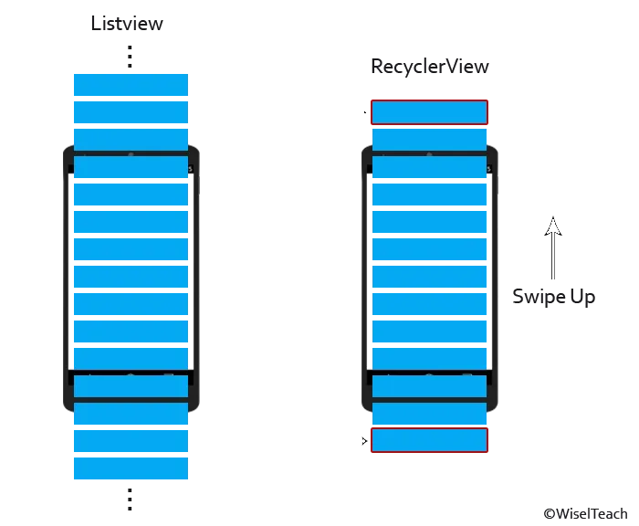
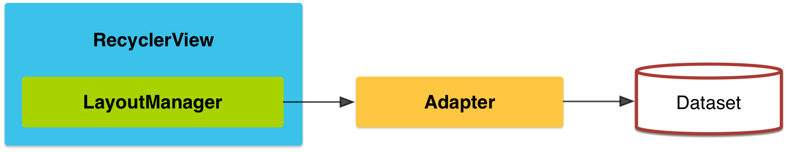
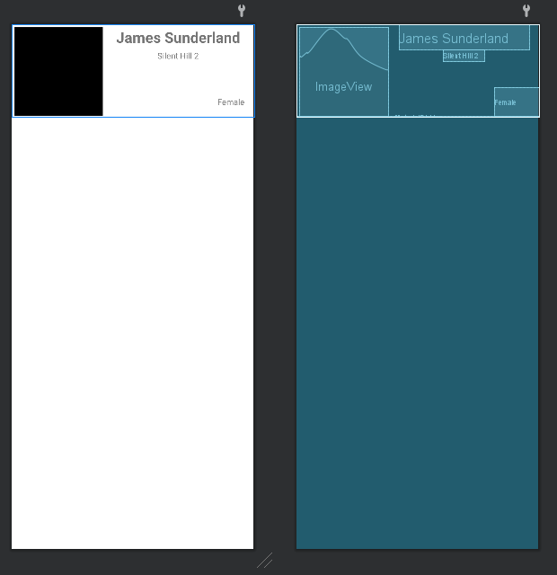

# RecyclerView


Fuente: developer.android



Fuente: developer.android



Fuente: developer.android


## DEFINICIÓN

Hereda de `ViewGroup`.

`RecyclerView` es el nombre de la **View** así como el nombre de la **biblioteca de Jetpack** que se encarga de gestionar estas **Views**.

`RecyclerView` facilita que se muestren de manera eficiente grandes conjuntos de datos.&#x20;

Usted proporciona los datos y defines el aspecto de cada elemento, y la biblioteca `RecyclerView` creará los elementos de forma dinámica cuando se los necesite.


Es el sucesor de ListView.

Es más eficiente y versátil.


## USO DESDE XML


```xml
<?xml version="1.0" encoding="utf-8"?>
<FrameLayout xmlns:android="http://schemas.android.com/apk/res/android"
    xmlns:tools="http://schemas.android.com/tools"
    android:layout_width="match_parent"
    android:layout_height="match_parent"
    tools:context=".RecyclerViewActivity">

    <androidx.recyclerview.widget.RecyclerView
        android:id="@+id/rvSilentHill"
        android:layout_width="match_parent"
        android:layout_height="match_parent" />

</FrameLayout>
```


## CONFIGURACIÓN

La configuración de `RecyclerView` es mucho más complejo de lo que estamos acostumbrados ya que hay que desarrollar unos cuantos archivos para su buen funcionamiento.

A continuación se va a desarrollar de manera pormenorizada la configuración de un `RecyclerView`,  sin embargo, la mejor forma que conozco de entenderlo es viendo el siguiente video de AristiDevs.


Canal: [Programación Android by AristiDevs](https://www.youtube.com/@AristiDevs)


### Resumen

Un `RecyclerView` genera una vista de tipo Lista o Grid sin necesidad de tener cargados todos los datos en tiempo real sino que los va rescatando de un **DataSet** a través de un **Adapter** y reaprovecha aquellos que ya no se muestran en pantalla.

<figure><figcaption><p>Fuente: WiseITeach</p></figcaption></figure>

Esto es óptimo pero su funcionamiento, para aquellos que no tienen práctica, es bastante lioso.

El funcionamiento de un RecyclerView se basa en el siguiente esquema:

<figure><figcaption><p>Fuente: developer.android</p></figcaption></figure>

El RecyclerView le pide al adapter que rescate una información del DataSet y el adapter le pasa esta información junto con Como se va a mostrar al ViewHolder que es el que se va a encargar de pintar cada una de las entradas. Una vez estas entradas son pintadas por el ViewHolder se devuelven a la Activity.

Conforme se avance en el proyecto de práctica lo irán entendiendo.

### Presentación proyecto

Se va a realizar un listado con los personajes de la **saga Silent Hill** utilizando un **RecyclerView**.

Para el proyecto necesitamos los siguientes archivos:

* `activity_recycler_view.xml`&#x20;
* `recycler_entry.xml`
* `RecyclerViewActivity.kt`
* `SilentHillCharacter.kt`
* `CharacterProvider.kt`
* `SilentHillAdapter.kt`
* `SilentHillViewHolder.kt`

Vamos a empezar poco a poco y entenderemos todo lo que se está desarrollando.

### Crear la Activity y el Layout

Este es el apartado más sencillo. Creamos la `RecyclerViewActivity.kt` con un archivo de Layout que se llamará `activity_recycler_view.xml`.

Vamos a utilizar un `FrameLayout` que permite utilizar el espacio definido en su interior para un único item, en este caso el `RecyclerView`.&#x20;


```xml
<?xml version="1.0" encoding="utf-8"?>
<FrameLayout xmlns:android="http://schemas.android.com/apk/res/android"
    xmlns:tools="http://schemas.android.com/tools"
    android:layout_width="match_parent"
    android:layout_height="match_parent"
    tools:context=".RecyclerViewActivity">
    <androidx.recyclerview.widget.RecyclerView
        android:id="@+id/rvSilentHill"
        android:layout_width="match_parent"
        android:layout_height="wrap_content" />
</FrameLayout>
```


Con lo anterior ya tenemos listo el archivo de **Layout** y no nos tendremos que preocupar más por él.

El archivo `RecyclerViewActivity.kt` por ahora lo podemos dejar preparado con ViewBinding y poco más:


```kotlin
package com.example.android.appdeejemplo

import androidx.appcompat.app.AppCompatActivity
import android.os.Bundle
import androidx.recyclerview.widget.LinearLayoutManager
import com.example.android.appdeejemplo.databinding.ActivityRecyclerViewBinding
import com.example.android.appdeejemplo.recycleradapter.SilentHillAdapter

class RecyclerViewActivity : AppCompatActivity() {

    private lateinit var binding: ActivityRecyclerViewBinding

    override fun onCreate(savedInstanceState: Bundle?) {
        super.onCreate(savedInstanceState)

        binding = ActivityRecyclerViewBinding.inflate(layoutInflater)
        setContentView(binding.root)
    }
```


### Crear el DataSet

Los datos que se asignan a las entradas de un RecyclerView pueden provenir de muchos sitios.

* Pueden encontrarse **hardcodeados en la Activity**, cosa que no es adecuada.
* Pueden encontrarse en una **data class**.
* Pueden obtenerse de una **API**.
* Pueden obtenerse de una consulta a una **base de datos**.

En este caso, **se van a obtener de una data class** ya que el resto de opciones son bastante más complejas y requieren de la preexistencia de una API o de una Base de Datos.

Por tanto, creamos una data class llamada `SilentHillCharacter.kt` que va a albergar el modelo de Personaje de Silent Hill:


```kotlin
package com.example.android.appdeejemplo

data class SilentHillCharacter(
    val name: String,
    val game: String,
    val gender: String,
    val photo: String
)
```



**Como vemos, la variable photo es un string.**&#x20;

Esto se debe a que en esta variable almacenaremos la ruta o url de la imagen a mostrar.


Pero esta **data class** solo contiene el modelo de personaje no lo datos de cada uno de ellos.

Para solucionar esto, vamos a crear otra clase llamada `CharacterProvider.kt` que va a contener como `companion object` una lista con todos los personajes que vamos a listar:


```kotlin
package com.example.android.appdeejemplo

class CharacterProvider {
    companion object {
        val silentHillCharacters: List<SilentHillCharacter> = listOf(
            SilentHillCharacter(
                "James Sunderland",
                "Silent Hill 2",
                "male",
                "https://static.wikia.nocookie.net/silent/images/e/e1/James_Sunderland_-_SH_2_Remake_Render.png/revision/latest/top-crop/width/200/height/150?cb=20181007212337"
            ),
            SilentHillCharacter(
                "Heather Mason",
                "Silent Hill 3",
                "female",
                "https://static.wikia.nocookie.net/silent/images/c/c0/Heather_Mason.png/revision/latest/top-crop/width/200/height/150?cb=20150414154920"
            ),
            SilentHillCharacter(
                "Alessa Gillespie",
                "Silent Hill 1",
                "female",
                "https://static.wikia.nocookie.net/silent/images/6/6e/Alessa_-_SH1.png/revision/latest/top-crop/width/200/height/150?cb=20181129164025"
            ),
            SilentHillCharacter(
                "Harry Mason",
                "Silent Hill 1",
                "male",
                "https://static.wikia.nocookie.net/silent/images/9/95/Harry_SH2.png/revision/latest/top-crop/width/200/height/150?cb=20181009235807"
            ),
            SilentHillCharacter(
                "Lisa Garland",
                "Silent Hill 1",
                "female",
                "https://static.wikia.nocookie.net/silent/images/b/be/Lisa_-_SH1.png/revision/latest/top-crop/width/200/height/150?cb=20181201145728"
            ),
            SilentHillCharacter(
                "Maria",
                "Silent Hill 2",
                "female",
                "https://static.wikia.nocookie.net/silent/images/2/2d/Maria_SH_2.png/revision/latest/top-crop/width/200/height/150?cb=20181009144357"
            ),
            SilentHillCharacter(
                "Angela Orosco",
                "Silent Hill 2",
                "female",
                "https://static.wikia.nocookie.net/silent/images/f/fb/Angela_SH2.png/revision/latest/top-crop/width/200/height/150?cb=20181009182241"
            ),
            SilentHillCharacter(
                "Cheryl Mason",
                "Silent Hill 1",
                "female",
                "https://static.wikia.nocookie.net/silent/images/1/1a/Cheryl_-_SH1.png/revision/latest/top-crop/width/200/height/150?cb=20190128002630"
            )
        )
    }
}
```



[**COMPANION OBJECT**](https://app.gitbook.com/s/NUxBzPdjFckiTygOoDkz/programacion-orientada-a-objetos/otros-conceptos#objetos-companeros)

Recordamos que un `companion object` es un objeto que se declara dentro de una clase pero que puede ser llamado sin necesidad de crear una instancia de dicha clase..


Con estas dos clases hechas podemos hacer referencia a la lista de personajes de la siguiente manera:

```kotlin
CharacterProvider.silentHillCharacters
```

### Crear el Layout de las entradas

En un `RecyclerView`, las entradas de la lista siguen todas el mismo Layout definido en un archivo `xml`.

En este caso el diseño va a ser muy sencillo pero hay que crearlo.&#x20;

Generamos un archivo de layout llamado `recycler_entry.xml`.

En este archivo desarrollamos cómo se verá una entrada de la lista:


```xml
<?xml version="1.0" encoding="utf-8"?>
<androidx.constraintlayout.widget.ConstraintLayout 
    xmlns:android="http://schemas.android.com/apk/res/android"
    xmlns:tools="http://schemas.android.com/tools"
    android:layout_width="match_parent"
    android:layout_height="wrap_content"
    xmlns:app="http://schemas.android.com/apk/res-auto">

    <ImageView
        android:id="@+id/ivPhoto"
        android:layout_width="150dp"
        android:layout_height="150dp"
        android:layout_margin="5dp"
        tools:background="@color/black"
        app:layout_constraintStart_toStartOf="parent"
        app:layout_constraintTop_toTopOf="parent"/>
    <TextView
        android:id="@+id/tvName"
        android:layout_width="wrap_content"
        android:layout_height="wrap_content"
        android:textSize="25sp"
        android:textStyle="bold"
        android:padding="5dp"
        tools:text="James Sunderland"
        app:layout_constraintStart_toEndOf="@+id/ivPhoto"
        app:layout_constraintTop_toTopOf="parent"
        app:layout_constraintEnd_toEndOf="parent"/>

    <TextView
        android:id="@+id/tvGame"
        android:layout_width="wrap_content"
        android:layout_height="wrap_content"
        tools:text="Silent Hill 2"
        app:layout_constraintTop_toBottomOf="@+id/tvName"
        app:layout_constraintStart_toEndOf="@id/ivPhoto"
        app:layout_constraintEnd_toEndOf="parent"
        />
    <TextView
        android:id="@+id/tvGender"
        android:layout_width="wrap_content"
        android:layout_height="wrap_content"
        android:padding="15dp"
        tools:text="Female"
        app:layout_constraintEnd_toEndOf="parent"
        app:layout_constraintBottom_toBottomOf="parent"/>
    <com.google.android.material.divider.MaterialDivider
        android:layout_width="match_parent"
        android:layout_height="wrap_content"
        app:layout_constraintTop_toBottomOf="@id/ivPhoto"
        app:layout_constraintStart_toStartOf="parent"/>
</androidx.constraintlayout.widget.ConstraintLayout>
```


<figure><figcaption><p>Design View</p></figcaption></figure>


**tools**

La función tools nos permite previsualizar en el editor cómo quedará el diseño previsto sin tener que definir valores reales.

`tools:text` -> pone un texto de ejemplo que no se mostrará al ejecutar la App

`tools:background` -> Pone un color de fondo que no se mostrará al ejecutar la App


### Crear el Adapter y el ViewHolder

A continuación lo que vamos a hacer es crear un nuevo package que llamaremos `recycleradapter`. Esto nos permitirá tener las clases del adaptador más ordenadas.

En este package creamos una clase de Kotlin llamada `SilentHillAdapter.kt` y otra que se llame `SilentHillViewHolder.kt`

A continuación ire desarrollando una serie de pasos que creo que aclaran el proceso de desarrollo del adapter

#### Paso 1. Definir `SilentHillAdapter()`

En primer lugar vamos a definir el `adapter`:


```kotlin
package com.example.android.appdeejemplo.recycleradapter

import android.view.ViewGroup
import androidx.recyclerview.widget.RecyclerView

class SilentHillAdapter(): RecyclerView.Adapter<SilentHillViewHolder>() {
    
    override fun onCreateViewHolder(parent: ViewGroup, viewType: Int): SilentHillViewHolder {
    }
    override fun onBindViewHolder(holder: SilentHillViewHolder, position: Int) {
    }
    override fun getItemCount(): Int {
    }

}
```


A primera vista es un caos pero vamos a intentar explicar paso por paso:

<pre class="language-kotlin"><code class="lang-kotlin"><strong>class SilentHillAdapter(): RecyclerView.Adapter&#x3C;SilentHillViewHolder>() {
</strong></code></pre>

En esta primera línea definimos:&#x20;

* el nombre de la clase `SilentHillAdapter()` -
* que extiende de `RecyclerView.Adapter()`&#x20;
* cuyo **ViewHolder** es `<SilentHillViewHolder>`

Cuando hagamos esto, Android Studio nos dará un error:

> Class 'SilentHillAdapter' is not abstract and does not implement abstract base class member

Esto significa que los miembros de la clase `RecyclerView.Adapter` no están implementados en la clase `SilentHillAdapter` y si pulsamos la bombillita roja que sale al lado de la implementación de la clase nos dará la opción de implementar los miembros que son:

```kotlin
override fun onCreateViewHolder(parent: ViewGroup, viewType: Int): SilentHillViewHolder {
}
override fun onBindViewHolder(holder: SilentHillViewHolder, position: Int) {
}
override fun getItemCount(): Int {
}
```

#### paso 2. `getItemCount()`

El **Adapter** debe conocer cuantas entradas va a tener nuestra lista para poder gestionarla de manera correcta. Esto lo lleva a cabo con la función miembro `getItemCount()`.

Para saber éste número de **items** en una lista, lo más sencillo sería hacer:

```kotlin
mylist.size
```

Sin embargo en lo que hemos visto hasta ahora, el **Adapter** no tiene acceso a ninguna lista de Personajes.

Por ese motivo, debemos pasarle la lista como **parámetro** al **Adapter** y después la podremos utilizar en nuestra función miembro:

```kotlin
package com.example.android.appdeejemplo.recycleradapter

import android.view.ViewGroup
import androidx.recyclerview.widget.RecyclerView
import com.example.android.appdeejemplo.SilentHillCharacter


class SilentHillAdapter(private val SilentHillList:List<SilentHillCharacter>):
    RecyclerView.Adapter<SilentHillViewHolder>() {
    
    override fun getItemCount(): Int = SilentHillList.size
}
```

La lista la pasamos como `private val SilentHillList:List<SilentHillCharacter>` a la clase y en nuestra función `getItemCount(): Int` podemos obtener de manera fácil y sencilla la **cantidad de Items**.

#### paso 3. `onCreateViewHolder()`

A continuación nuestro **Adapter** debe decirle al ViewHolder qué Layout debe utilizar y ésto lo hace con la función `onCreateViewHolder()`.

El **layout** que debe utilizar es el que hemos creado anteriormente para las entradas, el archivo `recycler_entry.xml`.&#x20;

Para hacer esto utilizamos la función `LayoutInflater`:

```kotlin
package com.example.android.appdeejemplo.recycleradapter

import android.view.LayoutInflater
import android.view.ViewGroup
import androidx.recyclerview.widget.RecyclerView
import com.example.android.appdeejemplo.R
import com.example.android.appdeejemplo.SilentHillCharacter


class SilentHillAdapter(private val SilentHillList:List<SilentHillCharacter>):
    RecyclerView.Adapter<SilentHillViewHolder>() {
    
    override fun onCreateViewHolder(parent: ViewGroup, viewType: Int): SilentHillViewHolder {
        val layoutInflater = LayoutInflater.from(parent.context)
        return SilentHillViewHolder(layoutInflater.inflate(
        R.layout.recycler_entry, 
        parent, 
        false
        ))
    }
    
    override fun getItemCount(): Int = SilentHillList.size

}
```


**Context**

Cuando nos piden el **context** en una función y no nos encontramos en una Activity (como es el caso) puede parecer necesario pasar el contexto por parámetro, sin embargo, no es lo indicado.

Si tenemos acceso a cualquier **View** en la función, de esa **View** se puede sacar el contexto utilizando `View.context`.

En este caso **parent** es del tipo **ViewGroup** que hereda de **View** y por lo tanto se puede utilizar `parent.context`.


Cuando tengamos lista esta función miembro veremos que nos da error:

> Too many arguments for public constructor SilentHillViewHolder() defined in com.example.android.appdeejemplo.recycleradapter.SilentHillViewHolder

Esto se debe a que la clase `SilentHillViewHolder()` no se encuentra bien definida y por tanto, aún no admite el parámetro View que le estamos mandando.

Vamos a solucionarlo.

#### paso 4. Definir `SilentHillViewHolder()`

Por ahora el ViewHolder no tiene ninguna información así que vamos a empezar con él.&#x20;

Lo primero es hacer que extienda de la clase ViewHolder:

```kotlin
class SilentHillViewHolder(): ViewHolder(view) {
}
```

Después, es necesario que pueda recibir por parámetro la View que necesitamos que reciba:

```kotlin
class SilentHillViewHolder(view: View): ViewHolder(view) {
}
```

A continuación debemos acceder a las vistas que componen `recycler_entry.xml` para ello podemos utilizar dos métodos:

* **Utilizando R**

```kotlin
    val name = view.findViewById<TextView>(R.id.tvName)
    val game = view.findViewById<TextView>(R.id.tvGame)
    val gender = view.findViewById<TextView>(R.id.tvGender)
    val photo = view.findViewById<ImageView>(R.id.ivPhoto)
```

Con el método R podemos utilizar la View que recibe la clase como parámetro para asignar cada vista a una variable.

* **Utilizando ViewBinding**

```kotlin
val binding = RecyclerEntryBinding.bind(view)
```

Con esta simple línea de código podemos acceder directamente a todas las Views que continene el archivo de layout.

Una vez hecho esto, debemos generar una función que en este caso llamaremos `bind()`

```kotlin
fun bind(characterModel: SilentHillCharacter) {
    binding.tvName.text = characterModel.name
    binding.tvGame.text = characterModel.game
    binding.tvGender.text = characterModel.gender
}
```

Con esta función vamos a relacionar las vistas con los datos contenidos en un objeto de la clase `SilentHillCharacter`.


**IMPORTANTE**

En el ejemplo, no se hace referencia a la imagen ya que eso lo haremos después.


Ya tenemos terminada la primera versión del `ViewHolder`.


```kotlin
package com.example.android.appdeejemplo.recycleradapter

import android.view.View
import android.widget.Toast
import androidx.recyclerview.widget.RecyclerView.ViewHolder
import com.example.android.appdeejemplo.SilentHillCharacter
import com.example.android.appdeejemplo.databinding.RecyclerEntryBinding
import com.squareup.picasso.Picasso

class SilentHillViewHolder(view: View): ViewHolder(view) {

    val binding = RecyclerEntryBinding.bind(view)

    fun bind(characterModel: SilentHillCharacter) {
        binding.tvName.text = characterModel.name
        binding.tvGame.text = characterModel.game
        binding.tvGender.text = characterModel.gender
    }
}
```


#### Paso 5. onBindViewHolder()

Para terminar con nuestro adapter, debemos indicarle al ViewHolder cual es el item que tiene que dibujar en cada momento. Esto se hace con la función `onBindViewHolder()`.


```kotlin
package com.example.android.appdeejemplo.recycleradapter

import android.view.LayoutInflater
import android.view.ViewGroup
import androidx.recyclerview.widget.RecyclerView
import com.example.android.appdeejemplo.R
import com.example.android.appdeejemplo.SilentHillCharacter


class SilentHillAdapter(private val SilentHillList:List<SilentHillCharacter>):RecyclerView.Adapter<SilentHillViewHolder>() {
    
    override fun onCreateViewHolder(parent: ViewGroup, viewType: Int): SilentHillViewHolder {
        val layoutInflater = LayoutInflater.from(parent.context)
        return SilentHillViewHolder(layoutInflater.inflate(R.layout.recycler_entry, parent, false))
    }
    
    override fun onBindViewHolder(holder: SilentHillViewHolder, position: Int) {
        val item = SilentHillList[position]
        holder.bind(item)
    }
    
    override fun getItemCount(): Int = SilentHillList.size

}
```


Como vemos, lo primero que hacemos es definir el **item** que se va a mostrar utilizando la lista que se le pasa como argumento al **Adapter** y la **posición**.

Después solo queda utilzar la función `bind()` del **ViewHolder** con el **item** como argumento.

### Configurar la Activity

Con el **Adapter** y el **ViewHolder** correctamente configurados, solo queda configurar la `RecyclerView` en la **Activity** en la que se va a mostrar.&#x20;

Para ello vamos a definir una función `setUpRecyclerView()` que se llamará nada en el interior de `OnCreate()`.


```kotlin
package com.example.android.appdeejemplo

import androidx.appcompat.app.AppCompatActivity
import android.os.Bundle
import androidx.recyclerview.widget.LinearLayoutManager
import com.example.android.appdeejemplo.databinding.ActivityRecyclerViewBinding
import com.example.android.appdeejemplo.recycleradapter.SilentHillAdapter

class RecyclerViewActivity : AppCompatActivity() {

    private lateinit var binding: ActivityRecyclerViewBinding

    override fun onCreate(savedInstanceState: Bundle?) {
        super.onCreate(savedInstanceState)

        binding = ActivityRecyclerViewBinding.inflate(layoutInflater)
        setContentView(binding.root)

        setUpRecyclerView()
    }

    private fun setUpRecyclerView() {
        binding.rvSilentHill.layoutManager = LinearLayoutManager(this)
        binding.rvSilentHill.adapter = SilentHillAdapter(CharacterProvider.silentHillCharacters)
    }
}
```


En la función `setUpRecyclerView()` se define:

* el `LayoutManager` que se va a utilizar, pudiendo elegir entre:
  * LinearLayoutManager
  * GridLayoutManager
  * StaggeredGridLayoutManager
* el `Adaptador` que se va a utilizar, en este caso, el que hemos desarrollado, pasándole por parámetro la lista de personajes que nos facilita el `CharacterProvider` que también hemos desarrollado nosotros.&#x20;

### Resultado

<figure><figcaption><p>resultado</p></figcaption></figure>

## MEJORA DEL RESULTADO

Sin embargo, como podemos ver, falta la imagen de cada uno de los personajes.

También podemos requerir que cuando se pulse en uno de los item se ejecute una acción.

### Imagen

Para mostrar la imagen que se encuentra en internet vamos a utilizar la librería Picasso.


Para configurar la librería Picasso para mostrar estas imágenes mire éste [**enlace**](../paradigmas-de-diseno/views/pallete-widgets/imageview.md#utilizar-picasso-para-mostrar-la-imagen).


En el `ViewHolder` que, recordemos, es el elemento que se encarga de gestionar cada uno de los items de manera individual, modificamos la función `bind()` con lo siquiente:

```kotlin
Picasso.get().load(characterModel.photo).into(binding.ivPhoto)
```

### OnClickListener

Del mismo modo que hemos hecho con las imágenes, es el `ViewHolder` el encargado de que en cada uno de los Items se genere un `OnClickListener`.

Es por ese motivo que añadimos el siguiente código a la función `bind()`:

```kotlin
itemView.setOnClickListener { Toast.makeText(
    binding.ivPhoto.context,
    binding.tvName.text,
    Toast.LENGTH_SHORT).show()
}
```

De tal manera que cada vez que se toque en cualquier parte del `itemView` (cada Item ocupa un ItemView) se mostrará un Toast con el nombre del personaje.

Tras añadir estas características, nos quedará el ViewHolder como sigue:


```kotlin
package com.example.android.appdeejemplo.recycleradapter

import android.view.View
import android.widget.Toast
import androidx.recyclerview.widget.RecyclerView.ViewHolder
import com.example.android.appdeejemplo.SilentHillCharacter
import com.example.android.appdeejemplo.databinding.RecyclerEntryBinding
import com.squareup.picasso.Picasso

class SilentHillViewHolder(view: View): ViewHolder(view) {

    val binding = RecyclerEntryBinding.bind(view)

    fun bind(characterModel: SilentHillCharacter) {
        binding.tvName.text = characterModel.name
        binding.tvGame.text = characterModel.game
        binding.tvGender.text = characterModel.gender
        Picasso.get().load(characterModel.photo).into(binding.ivPhoto)
        itemView.setOnClickListener { Toast.makeText(
            binding.ivPhoto.context,
            binding.tvName.text,
            Toast.LENGTH_SHORT).show()
        }
    }
}
```


### Resultado Final

<figure><figcaption><p>Resultado final</p></figcaption></figure>
