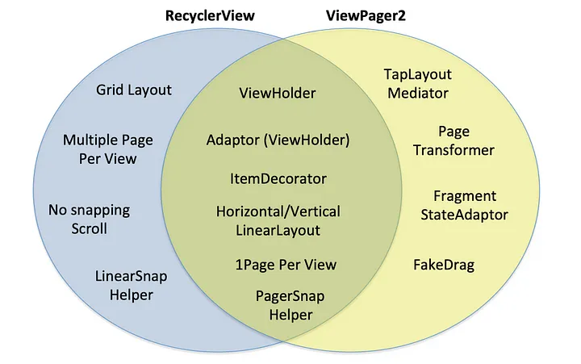
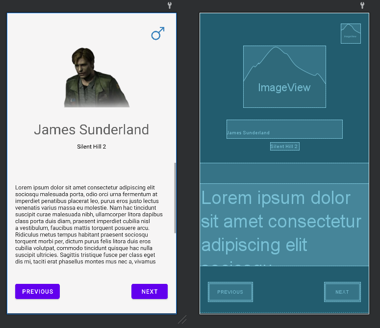

# ViewPager2


Fuente: developer.android



Fuente: developer.android



Fuente: developer.android


## DEFINICIÓN

Hereda de `ViewGroup`.

Muestra objetos de **Views** o **Fragments** en formato deslizable, como si de diapositivas se tratara.

### RecyclerView VS ViewPager2

La realidad es que `ViewPager2` es muy parecido a un `RecyclerView` y, de hecho, puede utilizar el **Adapter** y **ViewHolder** de un `RecyclerView`. Sin embargo, tiene una serie de diferencias:

<figure><figcaption><p>Fuente: medium (<a href="https://medium.com/@elye-project?source=post_page-----5bd90559d4df--------------------------------">Elye</a>)</p></figcaption></figure>

#### RecyclerView

Las ventajas que tiene `RecyclerView` son:

* Permite utilizar GridLayoutManager.
* Permite ver varias "Páginas" por VIsta.
* No frena el Scroll en cada "página".
* Con `LinearSnapHelper` se puede hacer que el scroll siempre frene en una "página" y no entre medio.

#### ViewPager2

Las ventajas que tiene `ViewPager2` son:

* Con `TabLayoutMediator` permite configurar un `TabLayout` que funcione en conjunto con el `ViewPager2`.
* Con `PageTransformer` se pueden desarrollar nuevas **transiciones** entre páginas.
* con `FragmentStateAdaptor` permite que se utilicen **Fragments** en vez de **ViewHolders**.
* con `FakeDrag` se puede crear una zona de la pantalla que controle el **scroll**.

#### Elementos comunes

`ViewPager2` coje muchos elementos de `RecyclerView` como son:

* El uso de `ViewHolder` para controlar lo que se muestra en cada una de las "páginas".
* El uso de `RecyclerViewAdaptor(ViewHolder)` cuando no se utilizan Fragments.
* El uso de `LinearLayoutManager` (no se define explícitamente pues es obligatorio).
* La posibilidad de mostrar una "página" por Vista.
* El uso de `PagerSnapHelper` que permite a `RecyclerView` paginar las vistas de la misma manera que lo hace ViewPager2 y que se pare el scroll en cada una de las "páginas".

## CONFIGURACIÓN

Una vez visto lo anterior, sabemos que puede tener dos usos:&#x20;

* Uso de `ViewPager2` con **ViewHolder**.
* Uso de `ViewPager2` con **Fragments**.

## Uso de `ViewPager2` con **ViewHolder**

Este caso de uso es muy parecido al funcionamiento de un RecyclerView. Necesitamos desarrollar los siguientes archivos:

* `MainActivity.kt`
* `activity_main.xml`
* `page_model.xml`
* `CharacterModel.kt`
* `CharacterProvider.kt`
* `PagerAdapter.kt`
* `PagerViewHolder.kt`


El ejemplo va a ser el mismo que con el `RecyclerView` pero ligeramente más desarrollado.


Vamos a comenzar:

### Crear la Activity y el Layout

Lo primero que debemos hacer es crear una Activity y en el Layout definir una vista ViewPager2:


```xml
<?xml version="1.0" encoding="utf-8"?>
<androidx.constraintlayout.widget.ConstraintLayout xmlns:android="http://schemas.android.com/apk/res/android"
    xmlns:app="http://schemas.android.com/apk/res-auto"
    xmlns:tools="http://schemas.android.com/tools"
    android:layout_width="match_parent"
    android:layout_height="match_parent"
    tools:context=".MainActivity">

    <androidx.viewpager2.widget.ViewPager2
        android:id="@+id/vpPager"
        android:layout_width="match_parent"
        android:layout_height="match_parent"
        app:layout_constraintBottom_toBottomOf="parent"
        app:layout_constraintEnd_toEndOf="parent"
        app:layout_constraintHorizontal_bias="0.5"
        app:layout_constraintStart_toStartOf="parent"
        app:layout_constraintTop_toTopOf="parent"
        app:layout_constraintVertical_bias="0.5" />

</androidx.constraintlayout.widget.ConstraintLayout>
```


Por ahora con el archivo `MainActivity.kt` no vamos a hacer nada.

### Definir el modelo de datos

Los datos que se asignan a las entradas de un RecyclerView pueden provenir de muchos sitios.

* Pueden encontrarse **hardcodeados en la Activity**, cosa que no es adecuada.
* Pueden encontrarse en una **data class**.
* Pueden obtenerse de una **API**.
* Pueden obtenerse de una consulta a una **base de datos**.

En este caso, **se van a obtener de una data class** ya que el resto de opciones son bastante más complejas y requieren de la preexistencia de una API o de una Base de Datos.

Para el modelo de datos, por tanto, vamos a crear una **Data Class** llamada `CharacterModel.kt` que va a definir el modelo de personaje y una **clase con un método público** (companion object en Kotlin) que hará de Proveedor, en este caso `CharacterProvider.kt`


```kotlin
package com.example.silenthillpagerapp.model

data class CharacterModel(
    val name: String,
    val game: String,
    val description: Int,
    val background: Int,
    val gender: Int,
    val photo: Int
)
```



```kotlin
package com.example.silenthillpagerapp.model

import com.example.silenthillpagerapp.R

class CharacterProvider {
    companion object {
        val characterList: List<CharacterModel> = listOf(
            CharacterModel(
                name = "James Sunderland",
                game = "Silent Hill 2",
                description = R.string.loren_ipsum,
                background = R.color.background,
                gender = R.drawable.ic_male,
                photo = R.drawable.im_james_sunderland
            ),
            CharacterModel(
                name = "Heather Mason",
                game = "Silent Hill 3",
                description = R.string.loren_ipsum,
                background = R.color.background,
                gender = R.drawable.ic_female,
                photo = R.drawable.im_heather_mason
            ),
            CharacterModel(
                name = "Alessa Gillespie",
                game = "Silent Hill 1",
                description = R.string.loren_ipsum,
                background = R.color.background,
                gender = R.drawable.ic_female,
                photo = R.drawable.im_alessa
            ),
            CharacterModel(
                name = "Harry Mason",
                game = "Silent Hill 1",
                description = R.string.loren_ipsum,
                background = R.color.background,
                gender = R.drawable.ic_male,
                photo = R.drawable.im_harry_mason
            ),
            CharacterModel(
                name = "Lisa Garland",
                game = "Silent Hill 1",
                description = R.string.loren_ipsum,
                background = R.color.background,
                gender = R.drawable.ic_female,
                photo = R.drawable.im_lisa_garland
            ),
            CharacterModel(
                name = "Maria",
                game = "Silent Hill 2",
                description = R.string.loren_ipsum,
                background = R.color.background,
                gender = R.drawable.ic_female,
                photo = R.drawable.im_maria
            ),
            CharacterModel(
                name = "Angela Orosco",
                game = "Silent Hill 2",
                description = R.string.loren_ipsum,
                background = R.color.background,
                gender = R.drawable.ic_female,
                photo = R.drawable.im_angela_orosco
            ),
            CharacterModel(
                name = "Cheryl Mason",
                game = "Silent Hill 1",
                description = R.string.loren_ipsum,
                background = R.color.background,
                gender = R.drawable.ic_female,
                photo = R.drawable.im_cheryl_mason
            )
        )
    }
}
```



AVISO

En este ejemplo, al contrario que en el de RecyclerView, no vamos a utilizar imagenes de Internet.&#x20;

Además, se van a utilizar resources de la App en vez de todo Strings Hardcodeadas.


### Definir el Layout de cada página

El Layout de cada página se define de la misma manera que en un RecyclerView con un archivo de Layout en xml llamado `page_model.xml`.


```xml
<?xml version="1.0" encoding="utf-8"?>
<androidx.constraintlayout.widget.ConstraintLayout xmlns:android="http://schemas.android.com/apk/res/android"
    xmlns:app="http://schemas.android.com/apk/res-auto"
    xmlns:tools="http://schemas.android.com/tools"
    android:id="@+id/clPage"
    android:layout_width="match_parent"
    android:layout_height="match_parent"
    android:background="@color/background">

    <ImageView
        android:id="@+id/ivPhoto"
        android:layout_width="wrap_content"
        android:layout_height="wrap_content"
        android:layout_marginTop="80dp"
        app:layout_constraintEnd_toEndOf="parent"
        app:layout_constraintStart_toStartOf="parent"
        app:layout_constraintTop_toTopOf="parent"
        tools:src="@drawable/im_james_sunderland" />

    <ImageView
        android:id="@+id/ivGender"
        android:layout_width="wrap_content"
        android:layout_height="wrap_content"
        android:layout_marginTop="20dp"
        android:layout_marginEnd="20dp"
        app:layout_constraintBottom_toTopOf="@+id/ivPhoto"
        app:layout_constraintEnd_toEndOf="parent"
        app:layout_constraintTop_toTopOf="parent"
        tools:src="@drawable/ic_male" />

    <TextView
        style="@android:style/TextAppearance.Material.Display1"
        android:id="@+id/tvName"
        android:layout_width="wrap_content"
        android:layout_height="wrap_content"
        android:layout_marginTop="30dp"
        app:layout_constraintEnd_toEndOf="parent"
        app:layout_constraintStart_toStartOf="parent"
        app:layout_constraintTop_toBottomOf="@+id/ivPhoto"
        tools:text="James Sunderland" />

    <TextView
        style="@android:style/TextAppearance.Material.Body2"
        android:id="@+id/tvGame"
        android:layout_width="wrap_content"
        android:layout_height="wrap_content"
        android:layout_marginTop="10dp"
        app:layout_constraintEnd_toEndOf="parent"
        app:layout_constraintStart_toStartOf="parent"
        app:layout_constraintTop_toBottomOf="@+id/tvName"
        tools:text="Silent Hill 2" />

    <ScrollView
        android:id="@+id/scrollView2"
        android:layout_width="match_parent"
        android:layout_height="250dp"
        android:layout_marginTop="30dp"
        app:layout_constraintStart_toStartOf="parent"
        app:layout_constraintTop_toBottomOf="@+id/tvGame">

        <TextView
            android:id="@+id/tvDescription"
            style="@android:style/TextAppearance.Material.Body1"
            android:layout_width="wrap_content"
            android:layout_height="wrap_content"
            android:layout_marginTop="50dp"
            android:paddingHorizontal="20dp"
            app:layout_constraintEnd_toEndOf="parent"
            app:layout_constraintStart_toStartOf="parent"
            app:layout_constraintTop_toBottomOf="@+id/tvGame"
            tools:text="@string/loren_ipsum" />
    </ScrollView>

    <Button
        android:id="@+id/btNext"
        android:layout_width="wrap_content"
        android:layout_height="wrap_content"
        android:layout_marginTop="30dp"
        android:layout_marginEnd="20dp"
        android:layout_marginBottom="20dp"
        app:layout_constraintBottom_toBottomOf="parent"
        app:layout_constraintEnd_toEndOf="parent"
        app:layout_constraintTop_toBottomOf="@+id/scrollView2"
        android:text="Next" />
    <Button
        android:id="@+id/btPrevious"
        android:layout_width="wrap_content"
        android:layout_height="wrap_content"
        android:layout_marginTop="30dp"
        android:layout_marginStart="20dp"
        android:layout_marginBottom="20dp"
        app:layout_constraintBottom_toBottomOf="parent"
        app:layout_constraintStart_toStartOf="parent"
        app:layout_constraintTop_toBottomOf="@+id/scrollView2"
        android:text="Previous" />


</androidx.constraintlayout.widget.ConstraintLayout>
```


Y queda de esta manera tan atractiva:

<figure><figcaption><p>page-model.xml</p></figcaption></figure>

### Definir el Adapter y el ViewHolder

Esto se ha visto en profundidad en la entrada de RecyclerView por lo que aquí no vamos a parar tanto:


```kotlin
package com.example.silenthillpagerapp.adapter

import android.view.LayoutInflater
import android.view.ViewGroup
import androidx.recyclerview.widget.RecyclerView
import com.example.silenthillpagerapp.model.CharacterModel
import com.example.silenthillpagerapp.R

class PagerAdapter(private val characterList: List<CharacterModel>): RecyclerView.Adapter<PagerViewHolder>() {

    override fun onCreateViewHolder(parent: ViewGroup, viewType: Int): PagerViewHolder {
        val layoutInflater = LayoutInflater.from(parent.context)
        return PagerViewHolder(layoutInflater.inflate(
            R.layout.page_model,
            parent,
            false
        ))
    }
    override fun onBindViewHolder(holder: PagerViewHolder, position: Int) {
        holder.bind(characterList[position])
    }
    override fun getItemCount(): Int = characterList.size
}
```



```kotlin
package com.example.silenthillpagerapp.adapter

import android.view.View
import android.widget.Button
import android.widget.ImageView
import android.widget.TextView
import androidx.appcompat.content.res.AppCompatResources
import androidx.constraintlayout.widget.ConstraintLayout
import androidx.recyclerview.widget.RecyclerView.ViewHolder
import com.example.silenthillpagerapp.model.CharacterModel
import com.example.silenthillpagerapp.model.CharacterProvider
import com.example.silenthillpagerapp.R

class PagerViewHolder(private val view: View): ViewHolder(view) {

    val name = view.findViewById<TextView>(R.id.tvName)
    val game = view.findViewById<TextView>(R.id.tvGame)
    val description = view.findViewById<TextView>(R.id.tvDescription)
    val background = view.findViewById<ConstraintLayout>(R.id.clPage)
    val gender = view.findViewById<ImageView>(R.id.ivGender)
    val photo = view.findViewById<ImageView>(R.id.ivPhoto)
    val btNext = view.findViewById<Button>(R.id.btNext)
    val btPrevious = view.findViewById<Button>(R.id.btPrevious)

    fun bind(characterModel: CharacterModel) {
        name.text = characterModel.name
        game.text = characterModel.game
        description.text = view.context.getString(characterModel.description)
        background.background = AppCompatResources.getDrawable(view.context, characterModel.background)
        gender.setImageDrawable(AppCompatResources.getDrawable(view.context, characterModel.gender))
        photo.setImageDrawable(AppCompatResources.getDrawable(view.context, characterModel.photo))

        when (absoluteAdapterPosition) {
            0 -> {
                btPrevious.visibility = View.GONE
            }
            CharacterProvider.characterList.size - 1 -> {
                btNext.text = "Finish"
            }
            else -> {
                btPrevious.visibility = View.VISIBLE
            }
        }
    }
}
```


#### Función bind(CharacterModel)

En este caso quería explicar esta función por que es importante a la hora de implementar la lógica de este formato.

Si recordamos en el CharacterModel, teníamos:

```kotlin
val name: String,
val game: String,
val description: Int,
val background: Int,
val gender: Int,
val photo: Int
```

Como vemos, la descripción a pesar de ser (físicamente) una **String**, es de tipo **Int**. Esto se debe a que al rescatarla del `CharacterProvider`, se está llamando a un recurso **string** almacenado en el archivo `strings.xml` esta llamada devuelve un identificador entero de ese recurso. Es por eso que su tipo es Int a pesar de ser un texto.

Lo mismo ocurre con el **background,  gender y photo**. En este caso, podemos ver como su rescate del `CharacterProvider` sigue otra lógica que la de la **description**. Esto se debe a que la description es un recurso string mientras que el resto son recursos drawables.


PRECAUCIÓN

Como vemos, los colores almacenados en colors.xml son drawables.

Existe una función `ContextCompat.getColor` pero requiere de un drawable no de un Int. Es por eso que en este caso no se puede utilizar.


Por último, la parte que hace referencia a los botones es fundamental para que en la primera página no se muestra el botón de atrás y en la última se muestre el botón de finalizar en vez de el de siguiente.&#x20;

Su comportamiento lo desarrollaremos posteriormente.

### Ejecutar el Pager en la Activity

Una vez tenemos todo lo anterior hecho, podemos ir a MainActivity.kt y crear la función `setUpPager()`.

```kotlin
import androidx.appcompat.app.AppCompatActivity
import android.os.Bundle
import android.widget.Adapter
import androidx.viewpager2.widget.ViewPager2
import com.example.silenthillpagerapp.adapter.PagerAdapter
import com.example.silenthillpagerapp.model.CharacterProvider

class MainActivity : AppCompatActivity(), OnItemSelected {

    lateinit var adapter: Adapter

    override fun onCreate(savedInstanceState: Bundle?) {
        super.onCreate(savedInstanceState)
        setContentView(R.layout.activity_main)
        setUpPager()
    }
    private fun setUpPager() {
        val vpPager = findViewById<ViewPager2>(R.id.vpPager)
        vpPager.adapter = PagerAdapter(CharacterProvider.characterList, this)
    }
```

Esto ya funciona, sin embargo, cada página tiene unos botones que debemos configurar:

### Dar funcionalidad a los botones

Lo primero que vamos a hacer es crear una interface que llamaremos `OnItemSelected` y nos permitirá transmitir esta información entre el Adapter, el ViewHolder y la Activity.

```kotlin
package com.example.silenthillpagerapp.adapter

interface OnItemSelected {
    fun onNextClickListener(position: Int)
    fun onPreviousClickListener(position: Int)
}
```

Ahora debemos implementar estas funciones:

#### PagerViewHolder:

En el ViewHolder introducimos como parámetro la **interface** y dentro de la función bind definimos que cuando se clique sobre uno de los dos botones se hará una llamada la función que para cada uno corresponde dentro de la **interface:**

```kotlin
package com.example.silenthillpagerapp.adapter

import android.view.View
import android.widget.Button
import android.widget.ImageView
import android.widget.TextView
import androidx.appcompat.content.res.AppCompatResources
import androidx.constraintlayout.widget.ConstraintLayout
import androidx.recyclerview.widget.RecyclerView.ViewHolder
import com.example.silenthillpagerapp.model.CharacterModel
import com.example.silenthillpagerapp.model.CharacterProvider
import com.example.silenthillpagerapp.R

class PagerViewHolder(private val view: View, 
private val onItemSelected: OnItemSelected? = null
): ViewHolder(view) {

    (...)

    fun bind(characterModel: CharacterModel) {
       
       (...)

        btPrevious.setOnClickListener(){
            onItemSelected?.onPreviousClickListener(absoluteAdapterPosition)
        }

        btNext.setOnClickListener(){
            onItemSelected?.onNextClickListener(absoluteAdapterPosition)
        }
    }
}
```

Como además, vamos a utilizar los botones para navegar, necesitamos saber cual es la posición del adaptador, o lo que es lo mismo, la página en la que nos encontramos. Es por eso que en las llamadas a las funciones de la interface se pasa por parámetro la **absoluteAdapterPosition.**

#### PagerAdapter

Al `PagerAdapter` también le debemos mandar por parámetro la interface ya que en la función miembro `onCreateViewHolder`, le tenemos que pasar por parámetro dicha interface.

```kotlin
class PagerAdapter(private val characterList: List<CharacterModel>, 
private val onItemSelected: OnItemSelected? = null
): RecyclerView.Adapter<PagerViewHolder>() {

    override fun onCreateViewHolder(parent: ViewGroup, viewType: Int): PagerViewHolder {
        val layoutInflater = LayoutInflater.from(parent.context)
        return PagerViewHolder(layoutInflater.inflate(
            R.layout.page_model,
            parent,
            false
        ), onItemSelected)
    }
    override fun onBindViewHolder(holder: PagerViewHolder, position: Int) {
        holder.bind(characterList[position])
    }
    override fun getItemCount(): Int = characterList.size
}
```

#### MainActivity

En el MainActivity indicamos que la clase extiende de OnItemSelected y nos pedirá que implementemos los miembros. De esta manera podremos darle lógica al comportamiento de los botones:

```kotlin
package com.example.silenthillpagerapp

import androidx.appcompat.app.AppCompatActivity
import android.os.Bundle
import android.widget.Adapter
import android.widget.Toast
import androidx.viewpager2.widget.ViewPager2
import com.example.silenthillpagerapp.adapter.OnItemSelected
import com.example.silenthillpagerapp.adapter.PagerAdapter
import com.example.silenthillpagerapp.model.CharacterProvider
import com.example.silenthillpagerapp.transformer.DepthPageTransformer
import com.example.silenthillpagerapp.transformer.ZoomOutPageTransformer

class MainActivity : AppCompatActivity(), OnItemSelected {

    lateinit var adapter: Adapter


    override fun onCreate(savedInstanceState: Bundle?) {
        super.onCreate(savedInstanceState)
        setContentView(R.layout.activity_main)

        setUpPager()
    }
    private fun setUpPager() {
        (...)
    }

    override fun onNextClickListener(position: Int) {
        val vpPager = findViewById<ViewPager2>(R.id.vpPager)
        if (position == CharacterProvider.characterList.size - 1) {
            vpPager.setCurrentItem(0, true)
            Toast.makeText(this, "Back to the begining", Toast.LENGTH_SHORT).show()
        } else {
            vpPager.setCurrentItem(position + 1, true)
        }
    }

    override fun onPreviousClickListener(position: Int) {
        val vpPager = findViewById<ViewPager2>(R.id.vpPager)
        vpPager.setCurrentItem(position - 1, true)
    }

}
```

Finalmente, el resultado es bastante gratificante:

<figure><figcaption></figcaption></figure>

### Transformer

Si no nos gusta que la animación sea la clásica de diapositiva, podemos crear nuestras propias animaciones y añadirlas a nuestro ViewPager2.

En este ejemplo sólo vamos a utilizar los dos ejemplos de Google:


```kotlin
package com.example.silenthillpagerapp.transformer

import android.view.View
import androidx.viewpager2.widget.ViewPager2

private const val MIN_SCALE = 0.75f

class DepthPageTransformer : ViewPager2.PageTransformer {

    override fun transformPage(view: View, position: Float) {
        view.apply {
            val pageWidth = width
            when {
                position < -1 -> { // [-Infinity,-1)
                    // This page is way off-screen to the left.
                    alpha = 0f
                }
                position <= 0 -> { // [-1,0]
                    // Use the default slide transition when moving to the left page
                    alpha = 1f
                    translationX = 0f
                    translationZ = 0f
                    scaleX = 1f
                    scaleY = 1f
                }
                position <= 1 -> { // (0,1]
                    // Fade the page out.
                    alpha = 1 - position

                    // Counteract the default slide transition
                    translationX = pageWidth * -position
                    // Move it behind the left page
                    translationZ = -1f

                    // Scale the page down (between MIN_SCALE and 1)
                    val scaleFactor = (MIN_SCALE + (1 - MIN_SCALE) * (1 - Math.abs(position)))
                    scaleX = scaleFactor
                    scaleY = scaleFactor
                }
                else -> { // (1,+Infinity]
                    // This page is way off-screen to the right.
                    alpha = 0f
                }
            }
        }
    }
}
```



```kotlin
package com.example.silenthillpagerapp.transformer

import android.view.View
import androidx.viewpager2.widget.ViewPager2

private const val MIN_SCALE = 0.85f
private const val MIN_ALPHA = 0.5f

class ZoomOutPageTransformer : ViewPager2.PageTransformer {

    override fun transformPage(view: View, position: Float) {
        view.apply {
            val pageWidth = width
            val pageHeight = height
            when {
                position < -1 -> { // [-Infinity,-1)
                    // This page is way off-screen to the left.
                    alpha = 0f
                }
                position <= 1 -> { // [-1,1]
                    // Modify the default slide transition to shrink the page as well
                    val scaleFactor = Math.max(MIN_SCALE, 1 - Math.abs(position))
                    val vertMargin = pageHeight * (1 - scaleFactor) / 2
                    val horzMargin = pageWidth * (1 - scaleFactor) / 2
                    translationX = if (position < 0) {
                        horzMargin - vertMargin / 2
                    } else {
                        horzMargin + vertMargin / 2
                    }

                    // Scale the page down (between MIN_SCALE and 1)
                    scaleX = scaleFactor
                    scaleY = scaleFactor

                    // Fade the page relative to its size.
                    alpha = (MIN_ALPHA +
                            (((scaleFactor - MIN_SCALE) / (1 - MIN_SCALE)) * (1 - MIN_ALPHA)))
                }
                else -> { // (1,+Infinity]
                    // This page is way off-screen to the right.
                    alpha = 0f
                }
            }
        }
    }
}
```


Esto lo aplicamos en la función setUpPager() de la MainActivity:

```kotlin
private fun setUpPager() {
    val vpPager = findViewById<ViewPager2>(R.id.vpPager)
    vpPager.adapter = PagerAdapter(CharacterProvider.characterList, this)
    vpPager.setPageTransformer(DepthPageTransformer())
}
```

**Ejemplo DepthPageTransformer**

<figure><figcaption></figcaption></figure>

**Ejemplo ZoomOutPageTransformer**

<figure><figcaption></figcaption></figure>

## Uso de `ViewPager2` con **Fragments**

El caso de los Fragments es un poco más tedioso por que implica un poco más de configuración, sin embargo, es más versátil.

Para este segundo ejemplo vamos a necesitar desarrollar los siguientes archivos:

* `MainActivity.kt`
* `activity_main.xml`
* `PageFragment.kt`
* `fragment_page.xml`
* `CharacterModel.kt`
* `CharacterProvider.kt`
* `MyFragmentStateAdapter.kt`


El ejemplo será igual que el anterior pero sin botones de siguiente y previo ya que requieren un poco más de conocimiento sobre `Fragments`.&#x20;

A cambio, se utilizará este proyecto para añadirle `Tabs`.


Empecemos:

### Crear la Activity y el Layout

Lo primero que debemos hacer es crear una **Activity** y en el **Layout** definir una vista ViewPager2:


```xml
<?xml version="1.0" encoding="utf-8"?>
<androidx.constraintlayout.widget.ConstraintLayout xmlns:android="http://schemas.android.com/apk/res/android"
    xmlns:app="http://schemas.android.com/apk/res-auto"
    xmlns:tools="http://schemas.android.com/tools"
    android:layout_width="match_parent"
    android:layout_height="match_parent"
    tools:context=".MainActivity">

    <androidx.viewpager2.widget.ViewPager2
        android:id="@+id/pager"
        android:layout_width="match_parent"
        android:layout_height="match_parent"
        app:layout_constraintBottom_toBottomOf="parent"
        app:layout_constraintEnd_toEndOf="parent"
        app:layout_constraintStart_toStartOf="parent"
        app:layout_constraintTop_toTopOf="parent" />
</androidx.constraintlayout.widget.ConstraintLayout>
```


Por ahora con el archivo `MainActivity.kt` no vamos a hacer nada.

### [Definir el modelo de datos](viewpager2.md#definir-el-modelo-de-datos)

El `CharacterProvider.kt` es exactamente el mismo que en el ejemplo anterior.

Sin embargo la `CharacterModel.kt` que es la data class que ofrece el modelo, es muy importante que implemente la Interface `Parcelable`.


**PARCELABLE vs SERIALIZABLE**

En Android, no se pueden **mandar objetos entre Activities por medio de Intents** o a **Fragments a través de los parámetros** de manera directa.&#x20;

Es necesario que el objeto que mandemos implemente la `interfaz Parcelable` o la `interfaz Serializable`.

**Serializable**

[**https://developer.android.com/reference/java/io/Serializable**](https://developer.android.com/reference/java/io/Serializable)

Fue la primera interfaz que se implementó para este proceso. Está implementada en Java y es bastante lenta en comparación con Parcelable ya que genera objetos temporales y, por ende, recolección de basura. Su implementación es un poco más sencilla.

**Parcelable**

[**https://developer.android.com/reference/android/os/Parcelable**](https://developer.android.com/reference/android/os/Parcelable)

Es más rápida y eficiente que la anterior. Además se encuentra implementada en Kotlin. Es la recomendada.


Una vez la implementemos, nos pedirá que implementemos sus miembros. En este caso, los miembros que implementa Android suelen ser siempre iguales y no hay que hacer ninguna modificación (de manera general):


```kotlin
package com.example.fragmentpagerapp.model

import android.os.Parcel
import android.os.Parcelable

data class CharacterModel (
        val name: String,
        val game: String,
        val description: Int,
        val background: Int,
        val gender: Int,
        val photo: Int
): Parcelable {
        constructor(parcel: Parcel) : this(
                parcel.readString().toString(),
                parcel.readString().toString(),
                parcel.readInt(),
                parcel.readInt(),
                parcel.readInt(),
                parcel.readInt()
        ) {
        }
        override fun writeToParcel(parcel: Parcel, flags: Int) {
                parcel.writeString(name)
                parcel.writeString(game)
                parcel.writeInt(description)
                parcel.writeInt(background)
                parcel.writeInt(gender)
                parcel.writeInt(photo)
        }
        override fun describeContents(): Int {
                return 0
        }
        companion object CREATOR : Parcelable.Creator<CharacterModel> {
                override fun createFromParcel(parcel: Parcel): CharacterModel {
                        return CharacterModel(parcel)
                }

                override fun newArray(size: Int): Array<CharacterModel?> {
                        return arrayOfNulls(size)
                }
        }
}
```


### Crear el Fragment que contendrá la información

Este Fragment será el que indique el Layout de cada una de las páginas:


```xml
<?xml version="1.0" encoding="utf-8"?>
<androidx.constraintlayout.widget.ConstraintLayout xmlns:android="http://schemas.android.com/apk/res/android"
    xmlns:app="http://schemas.android.com/apk/res-auto"
    xmlns:tools="http://schemas.android.com/tools"
    android:id="@+id/clPage"
    android:layout_width="match_parent"
    android:layout_height="match_parent"
    android:background="@color/background">

    <ImageView
        android:id="@+id/ivPhoto"
        android:layout_width="wrap_content"
        android:layout_height="wrap_content"
        android:layout_marginTop="80dp"
        app:layout_constraintEnd_toEndOf="parent"
        app:layout_constraintStart_toStartOf="parent"
        app:layout_constraintTop_toTopOf="parent"
        tools:src="@drawable/im_james_sunderland" />

    <ImageView
        android:id="@+id/ivGender"
        android:layout_width="wrap_content"
        android:layout_height="wrap_content"
        android:layout_marginTop="20dp"
        android:layout_marginEnd="20dp"
        app:layout_constraintBottom_toTopOf="@+id/ivPhoto"
        app:layout_constraintEnd_toEndOf="parent"
        app:layout_constraintTop_toTopOf="parent"
        tools:src="@drawable/ic_male" />

    <TextView
        style="@android:style/TextAppearance.Material.Display1"
        android:id="@+id/tvName"
        android:layout_width="wrap_content"
        android:layout_height="wrap_content"
        android:layout_marginTop="30dp"
        app:layout_constraintEnd_toEndOf="parent"
        app:layout_constraintStart_toStartOf="parent"
        app:layout_constraintTop_toBottomOf="@+id/ivPhoto"
        tools:text="James Sunderland" />

    <TextView
        style="@android:style/TextAppearance.Material.Body2"
        android:id="@+id/tvGame"
        android:layout_width="wrap_content"
        android:layout_height="wrap_content"
        android:layout_marginTop="10dp"
        app:layout_constraintEnd_toEndOf="parent"
        app:layout_constraintStart_toStartOf="parent"
        app:layout_constraintTop_toBottomOf="@+id/tvName"
        tools:text="Silent Hill 2" />

    <ScrollView
        android:id="@+id/scrollView2"
        android:layout_width="match_parent"
        android:layout_height="250dp"
        android:layout_marginTop="30dp"
        app:layout_constraintStart_toStartOf="parent"
        app:layout_constraintTop_toBottomOf="@+id/tvGame">

        <TextView
            android:id="@+id/tvDescription"
            style="@android:style/TextAppearance.Material.Body1"
            android:layout_width="wrap_content"
            android:layout_height="wrap_content"
            android:layout_marginTop="50dp"
            android:paddingHorizontal="20dp"
            app:layout_constraintEnd_toEndOf="parent"
            app:layout_constraintStart_toStartOf="parent"
            app:layout_constraintTop_toBottomOf="@+id/tvGame"
            tools:text="@string/loren_ipsum" />
    </ScrollView>

</androidx.constraintlayout.widget.ConstraintLayout>
```


El archivo `PageFragment.kt` será el que actue como `ViewHolder`. Lo configuraremos en pasos posteriores.

### Definir el FragmentStateAdapter

A continuación procederemos a definir el Adapter. Este Adapter extenderá de FragmentStateAdapter(fragment) y por ello tendrá que implementar dos miembros:

* `getItemCount()`
* `createFragment()`

Como necesitamos saber cuantos Ítems tenemos, tendremos que pasarle al Adapter una lista por parámetro.

```kotlin
class MyFragmentStateAdapter(
    fragment: FragmentActivity,
    private val characterList: List<CharacterModel>
) : FragmentStateAdapter(fragment) {
```

Ahora que tenemos todo lo necesario podemos implementar los miembros:

#### `getItemCount()`

```kotlin
override fun getItemCount(): Int = characterList.size
```

`createFragment()`

Esta función simplemente llamará al newInstance del Fragment con los parámetros que necesita para bindear las vistas, luego lo veremos:

```kotlin
override fun createFragment(position: Int): Fragment = PageFragment.newInstance(
    position,
    characterList[position]
)
```

Y así nos queda un Adapter de la siguiente manera:

```kotlin
package com.example.fragmentpagerapp.adapter

import androidx.fragment.app.Fragment
import androidx.fragment.app.FragmentActivity
import androidx.viewpager2.adapter.FragmentStateAdapter
import com.example.fragmentpagerapp.PageFragment
import com.example.fragmentpagerapp.model.CharacterModel

class MyFragmentStateAdapter(
    fragment: FragmentActivity,
    private val characterList: List<CharacterModel>
) : FragmentStateAdapter(fragment) {

    override fun getItemCount(): Int = characterList.size

    override fun createFragment(position: Int): Fragment = PageFragment.newInstance(
        position,
        characterList[position]
    )
}
```

### Implementar la lógica del Fragment

El Fragment recibirá por parámetro la posición de la página actual y el objeto del tipo CharacterModel que tiene que bindear.


**AVISO**

La **sintaxis del Fragment** parece compleja a simple vista pero es la forma estándar de recuperar la información de los parámetro y poderlos utilizar.

Tambien se hace referencia a diferentes etapas del **ciclo de vida del Fragment**.&#x20;

Estas conceptos se explicará en la entrada sobre **Fragments**.


```kotlin
package com.example.fragmentpagerapp

import android.os.Bundle
import androidx.fragment.app.Fragment
import android.view.LayoutInflater
import android.view.View
import android.view.ViewGroup
import androidx.appcompat.content.res.AppCompatResources
import com.example.fragmentpagerapp.databinding.FragmentPageBinding
import com.example.fragmentpagerapp.model.CharacterModel

class PageFragment(): Fragment() {

    private var _binding: FragmentPageBinding? = null
    private val binding get() = _binding!!

    private var position: Int? = null
    private var character: CharacterModel? = null

    override fun onCreate(savedInstanceState: Bundle?) {
        super.onCreate(savedInstanceState)

        arguments?.let {
            position = it.getInt(POSITION)
            character = it.getParcelable<CharacterModel>(CHARACTER)!!
        }
    }

    override fun onCreateView(
        inflater: LayoutInflater, container: ViewGroup?,
        savedInstanceState: Bundle?
    ): View? {
        _binding = FragmentPageBinding.inflate(inflater, container, false)
        return binding.root
    }

    override fun onViewCreated(view: View, savedInstanceState: Bundle?) {
        super.onViewCreated(view, savedInstanceState)
        binding.tvName.text = character?.name
        binding.tvGame.text = character?.game
        binding.tvDescription.text = view.context.getString(character?.description!!)
        binding.scrollView2.background = AppCompatResources.getDrawable(view.context, character?.background!!)
        binding.ivGender.setImageDrawable(AppCompatResources.getDrawable(view.context, character?.gender!!))
        binding.ivPhoto.setImageDrawable(AppCompatResources.getDrawable(view.context, character?.photo!!))
    }

    override fun onDestroy() {
        super.onDestroy()
        _binding = null
    }

    companion object {

        private const val POSITION = "position_bundle"
        private const val CHARACTER = "character_bundle"

        @JvmStatic
        fun newInstance(
            position: Int,
            character: CharacterModel
        ) =
            PageFragment().apply {
                arguments = Bundle().apply {
                    putInt(POSITION, position)
                    putParcelable(CHARACTER, character)
                }
            }
    }
}
```

En el Fragment, lo único que afecta a la Lógica de la App es la parte de OnViewCreated que es el momento en el que Bindeamos las vistas con la información del modelo.

### Bindear el adapter con el ViewPager2

Lo único que nos queda es relacionar nuestro adapter con el ViewPager2 en la MainActivity y asignarle un Transformer como hemos visto arriba:

```kotlin
package com.example.fragmentpagerapp

import androidx.appcompat.app.AppCompatActivity
import android.os.Bundle
import com.example.fragmentpagerapp.adapter.MyFragmentStateAdapter
import com.example.fragmentpagerapp.databinding.ActivityMainBinding
import com.example.fragmentpagerapp.model.CharacterProvider
import com.example.fragmentpagerapp.transformer.ZoomOutPageTransformer

private lateinit var binding: ActivityMainBinding

class MainActivity : AppCompatActivity() {
    override fun onCreate(savedInstanceState: Bundle?) {
        super.onCreate(savedInstanceState)
        
        binding = ActivityMainBinding.inflate(layoutInflater)
        setContentView(binding.root)

        val pagerAdapter = MyFragmentStateAdapter(this, 
        CharacterProvider.characterList
        )
        
        binding.pager.adapter = pagerAdapter
        binding.pager.setPageTransformer(ZoomOutPageTransformer())
    }
}
```

Como resultado tenemos la siguiente grabación:

<figure><figcaption><p>Resultado final con Fragments</p></figcaption></figure>
