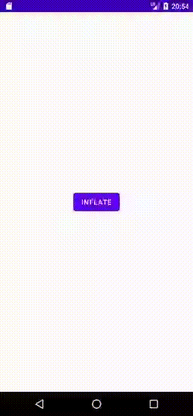

# ViewStub


Fuente: developer.android



Fuente: developer.android


## DEFINICIÓN

Hereda de `View`.

`ViewStub` es una **View** invisible y con tamaño nulo que puede utilizarse para inicializar (inflate) recursos de layout cuando éstos se vayan a utilizar (lazily) y no antes. Esto aumenta la eficiencia en el uso de los recursos de la App.

Cuando un `ViewStub` se hace visible o cuando la función `inflate()` es invocada, el recurso de Layout  se inicializa.

En ese momento, el `ViewStub` se reemplaza a sí mismo en el Padre por el Layout inicializado. Estas Views deben estar contenidas en un archivo de Layout propio y se define el Layout con el atributo `android:layout`.

`ViewStub` solo vive hasta que `setVisibility(int)` o `inflate()` son invocadas. La View inicializada se añade al padre con los parámetros de Layout que ViewStub tuviera.&#x20;

Se puede definir el ID de la View inicializada utilizado la propiedad `android:inflatedId`.

## EJEMPLO

A continuación vamos a utilizar el Layout que hemos utilizado en la entrada de **ViewPager2** y lo vamos a inicializar al pulsar un botón.

Para ello necesitamos desarrollar 3 archivos:

* `MainActivity.kt`
* `activity_main.xml`
* `page_inflatable.xml`

Empezamos con el desarrollo del `page_inflatable.xml`. En este archivo de Layout se va a añadir el contenido que se inicializará tras pulsar el botón. Es un Layout reutilizado de la entrada antes mencionada:


```xml
<?xml version="1.0" encoding="utf-8"?>
<androidx.constraintlayout.widget.ConstraintLayout xmlns:android="http://schemas.android.com/apk/res/android"
    xmlns:app="http://schemas.android.com/apk/res-auto"
    xmlns:tools="http://schemas.android.com/tools"
    android:id="@+id/clPage"
    android:layout_width="match_parent"
    android:layout_height="match_parent">

    <ImageView
        android:id="@+id/ivPhoto"
        android:layout_width="wrap_content"
        android:layout_height="wrap_content"
        android:layout_marginTop="80dp"
        app:layout_constraintEnd_toEndOf="parent"
        app:layout_constraintStart_toStartOf="parent"
        app:layout_constraintTop_toTopOf="parent"
        android:src="@drawable/im_james_sunderland" />

    <ImageView
        android:id="@+id/ivGender"
        android:layout_width="wrap_content"
        android:layout_height="wrap_content"
        android:layout_marginTop="20dp"
        android:layout_marginEnd="20dp"
        app:layout_constraintBottom_toTopOf="@+id/ivPhoto"
        app:layout_constraintEnd_toEndOf="parent"
        app:layout_constraintTop_toTopOf="parent"
        android:src="@drawable/ic_male" />

    <TextView
        style="@android:style/TextAppearance.Material.Display1"
        android:id="@+id/tvName"
        android:layout_width="wrap_content"
        android:layout_height="wrap_content"
        android:layout_marginTop="30dp"
        app:layout_constraintEnd_toEndOf="parent"
        app:layout_constraintStart_toStartOf="parent"
        app:layout_constraintTop_toBottomOf="@+id/ivPhoto"
        android:text="James Sunderland" />

    <TextView
        style="@android:style/TextAppearance.Material.Body2"
        android:id="@+id/tvGame"
        android:layout_width="wrap_content"
        android:layout_height="wrap_content"
        android:layout_marginTop="10dp"
        android:text="Silent Hill 2"
        app:layout_constraintEnd_toEndOf="parent"
        app:layout_constraintStart_toStartOf="parent"
        app:layout_constraintTop_toBottomOf="@+id/tvName" />

    <ScrollView
        android:id="@+id/scrollView2"
        android:layout_width="match_parent"
        android:layout_height="250dp"
        android:layout_marginTop="30dp"
        app:layout_constraintStart_toStartOf="parent"
        app:layout_constraintTop_toBottomOf="@+id/tvGame">

        <TextView
            android:id="@+id/tvDescription"
            style="@android:style/TextAppearance.Material.Body1"
            android:layout_width="wrap_content"
            android:layout_height="wrap_content"
            android:layout_marginTop="50dp"
            android:paddingHorizontal="20dp"
            app:layout_constraintEnd_toEndOf="parent"
            app:layout_constraintStart_toStartOf="parent"
            app:layout_constraintTop_toBottomOf="@+id/tvGame"
            android:text="@string/loren_ipsum" />
    </ScrollView>

</androidx.constraintlayout.widget.ConstraintLayout>
```


Básicamente muestra la imagen de James Sunderland, el sexo, el juego en el que participa como personaje y un texto de ejemplo donde estaría la descripción.

Después desarrollamos el `activity_main.xml`. En este archivo lo que se va a definir es un ViewStub y un botón que cuando se pulse inicializará el Layout definido en el ViewStub.


```xml
<?xml version="1.0" encoding="utf-8"?>
<androidx.constraintlayout.widget.ConstraintLayout xmlns:android="http://schemas.android.com/apk/res/android"
    xmlns:app="http://schemas.android.com/apk/res-auto"
    xmlns:tools="http://schemas.android.com/tools"
    android:layout_width="match_parent"
    android:layout_height="match_parent"
    tools:context=".MainActivity">

    <ViewStub
        android:id="@+id/vsEjemplo"
        android:layout_width="wrap_content"
        android:layout_height="wrap_content"
        android:layout="@layout/page_inflatable"
        app:layout_constraintStart_toStartOf="parent"
        app:layout_constraintEnd_toEndOf="parent"
        app:layout_constraintTop_toTopOf="parent"
        app:layout_constraintBottom_toBottomOf="parent"/>
    <Button
        android:id="@+id/btInflate"
        android:layout_width="wrap_content"
        android:layout_height="wrap_content"
        android:text="inflate"
        app:layout_constraintStart_toStartOf="parent"
        app:layout_constraintEnd_toEndOf="parent"
        app:layout_constraintTop_toTopOf="parent"
        app:layout_constraintBottom_toBottomOf="parent"/>


</androidx.constraintlayout.widget.ConstraintLayout>
```



**android:layout**

Es un atributo fundamental del ViewStub ya que hace referencia al archivo de Layout que se debe inicializar.


Por último desarrollamos un listener en el `MainActivity.kt` que le diga al botón que al ser pulsado infle o inicialice el Layout y cambie su visibilidad a GONE para no afectar al Layout que se acaba de inicializar:


```kotlin
package com.example.viewstubexample

import androidx.appcompat.app.AppCompatActivity
import android.os.Bundle
import android.view.View
import com.example.viewstubexample.databinding.ActivityMainBinding


class MainActivity : AppCompatActivity() {

    private lateinit var binding: ActivityMainBinding

    override fun onCreate(savedInstanceState: Bundle?) {
        super.onCreate(savedInstanceState)
        binding = ActivityMainBinding.inflate(layoutInflater)
        setContentView(binding.root)

        binding.btInflate.setOnClickListener {
            binding.vsEjemplo.inflate()
            it.visibility = View.GONE
        }
    }
}
```


<figure><figcaption><p>Ejemplo de ViewStub</p></figcaption></figure>
