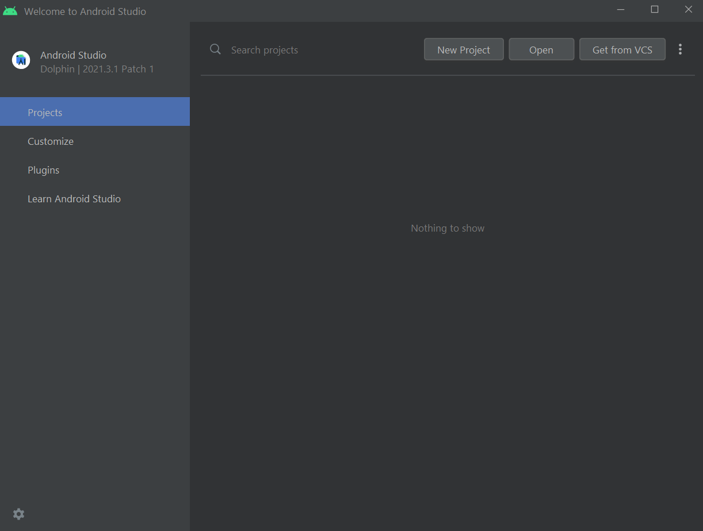
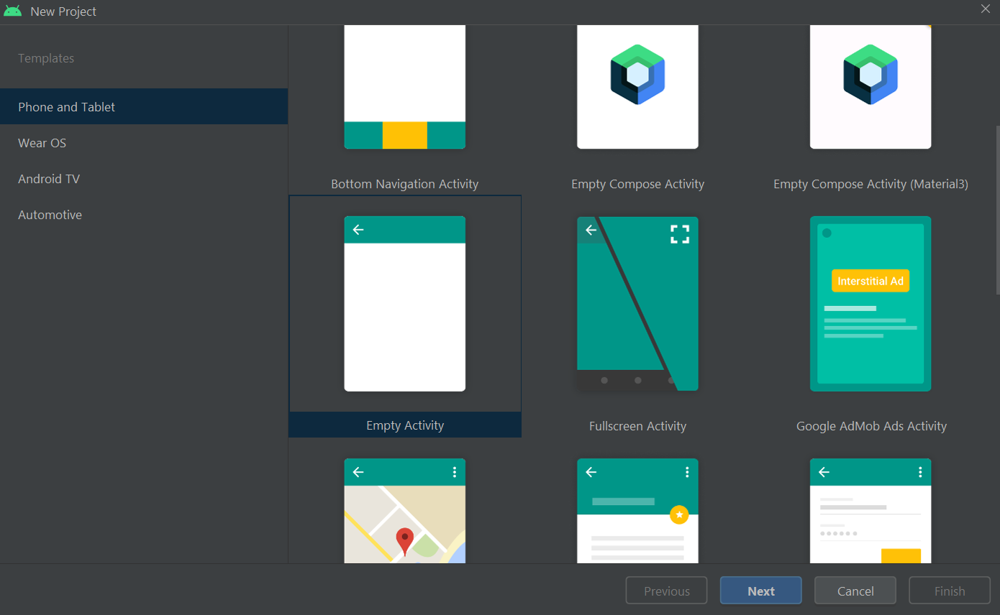
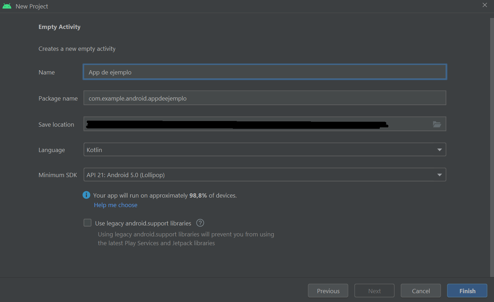
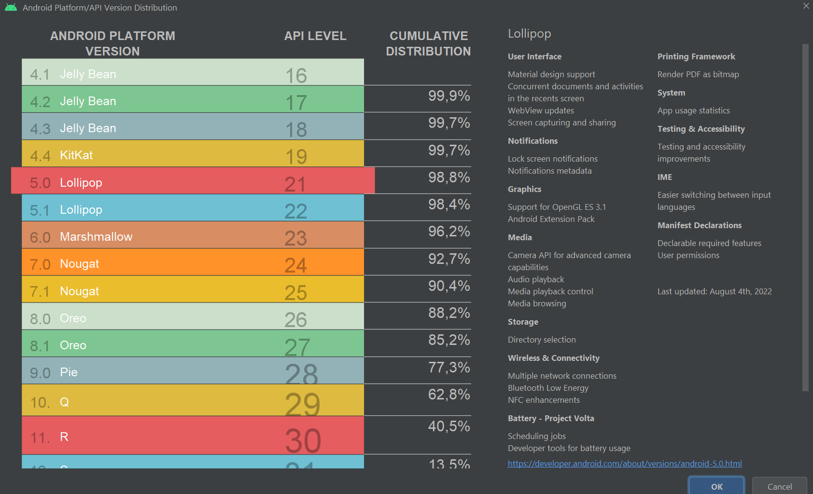
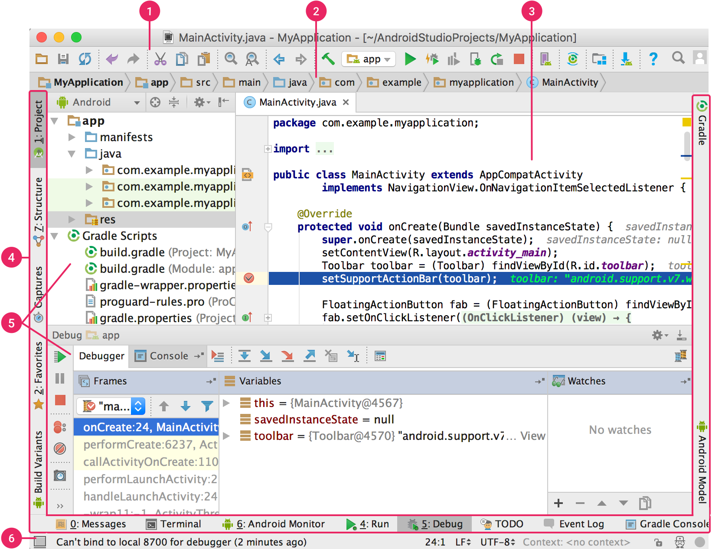

# PROYECTO

## CREANDO EL PRIMER PROYECTO


Los ejemplos de ésta guía se tomaron en:

Android Studio Dolphin | 2021.3.1 Patch 1 Build #AI-213.7172.25.2113.9123335, built on September 30, 2022&#x20;


### Welcome to Android Studio

La primera vez que abra la aplicación se encontrará con una página como la siguiente:

<figure><figcaption>
Welcome to Android Studio
</figcaption></figure>

En el panel lateral de la vista podrá realizar varias acciones:

* **Projects**: Le permite ver los proyectos abiertos anteriormente y crear proyectos nuevos.
* **Customize**: Le permite cambiar el tema para Android Studio, el tamaño de fuente y la distribución de teclado
* **Plugins**: Le permite instalar plugins del marketplace así como ver cuales tiene instalados en su dispositivo.&#x20;
* Learn Android Studio: Facilita una serie de links a recursos de aprendizaje de Android Studio. Muy práctico a la hora de aprender los atajos de teclado y los "tips and tricks" para acelerar su workflow.

Para iniciar un nuevo proyecto, clicamos en "**New Project**"

### New Project 1

<figure><figcaption>
new Project
</figcaption></figure>

Tras clicar en "New Project" seremos recibidos con la imagen superior. En ella podremos seleccionar el tipo de aplicación que queremos desarrollar así como el tipo de [actividad principal](activities-y-layouts.md) que se creará en nuestro nuevo proyecto.&#x20;

Para empezar, seleccionaremos la actividad vacía o "**Empty Activity**" y clicaremos en "**next"**.

### New Project 2

<figure><figcaption></figcaption></figure>

En este caso tendremos que rellenar una serie de campos obligatorios:

#### Name

Es el nombre de nuestra App.

#### Package Name

Es el nombre del paquete de nuestra app.&#x20;

Lo normal es nombrarlo con un dominio que nos pertenezca pero invertido. En este caso el dominio sería <mark style="color:orange;">`appdeejemplo.android.example.com`</mark>.

#### Save Location

La carpeta en la que se guardará el proyecto.

#### Languaje

El lenguaje de programación a utilizar. Android Studio permite realizar proyectos tanto en Java como en Kotlin aunque Google tiene pensado que Kotlin sea el lenguaje del futuro en cuanto a Android se refiere.

#### Minimum SDK


**SDK**

[https://www.redhat.com/es/topics/cloud-native-apps/what-is-SDK](https://www.redhat.com/es/topics/cloud-native-apps/what-is-SDK)

Un kit de desarrollo de software (SDK) es un conjunto de herramientas proporcionado usualmente por el fabricante de una plataforma de hardware, un sistema operativo (SO) o un lenguaje de programación.



**NIVEL DE API**

[https://developer.android.com/guide/topics/manifest/uses-sdk-element?hl=es-419#ApiLevels](https://developer.android.com/guide/topics/manifest/uses-sdk-element?hl=es-419#ApiLevels)

El nivel de API es un valor entero que identifica de manera única la revisión de la API de framework que ofrece una versión de la plataforma de Android.

Las actualizaciones a la API de framework están diseñadas de modo tal que la nueva API continúe siendo compatible con las versiones de API anteriores. Es decir, la mayoría de los cambios en la API se agregan, y presentan funcionalidades nuevas o de reemplazo. Debido a que se actualizan partes de la API, las partes más antiguas reemplazadas dejan de estar disponibles, pero no se quitan, de modo que las aplicaciones existentes aún puedan usarlas.&#x20;

En unos pocos casos, las partes de la API pueden modificarse o quitarse, aunque, por lo general, tales cambios solo son necesarios para garantizar la solidez de la API y la seguridad de la aplicación o del sistema. Todas las demás partes de la API de las revisiones anteriores se llevan adelante sin modificaciones.


Aquí puede seleccionar el nivel de API mínimo en el que se podrá ejecutar dicha App.&#x20;

El nivel de API afectará a las funcionalidades que se pueden utilizar en la aplicación e incluso a la forma en que estas deberán ser programadas. Lo más eficaz es utilizar la que viene seleccionada por defecto.

Si tiene dudas de cual elegir, existe un botón que le da más información sobre la cobertura de cada nivel de API con respecto a los modelos de Android en el mercado:

<figure><figcaption>
API Levels
</figcaption></figure>

#### Use legacy android.support libraries

Por último, no se recomienda utilizar las bibliotecas "legacy" ya que esto impediría que podamos utilizar los nuevos servicios de Play ni las librerias de jetpack (ya veremos lo que son).

Una vez tengamos todo relleno clicamos en "**finish**".

## INTERFAZ DE USUARIO


Fuente: Android Developers


<figure><figcaption>
Fuente: Android Developers
</figcaption></figure>

1. **Barra de Herramientas**. Permite realizar acciones tales como ejecutar tu App.
2. **Barra de Navegación**. Ayuda a explorar el proyecto y abrir archivos para editarlos. Es una vista más reducida de lo que se ve en la ventana **Project**.
3. **Ventana del editor**. Es el área en la que puedes crear y modificar código. Según el tipo de actividad actual, el editor puede cambiar. Por ejemplo, cuando ves un archivo de diseño, el editor muestra el Editor de diseño.
4. **Barra de la ventana de herramientas.** Se encuentra rodeando de la ventana del IDE y contiene los botones que permiten acceder a ventanas de herramientas individuales.
5. **Ventanas de herramientas.** Brindan acceso a tareas específicas, como la administración de proyectos, la búsqueda, el control de versiones, entre otras. Puede expandirlas y contraerlas.
6. **Barra de estado**. Se muestra el estado de tu proyecto y el IDE, además de advertencias o mensajes.
