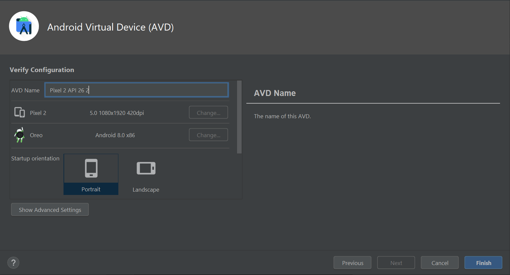

# EJECUTAR UNA APP

Una vez tenemos nuestra App desarrollada (y unas cuantas veces durante el desarrollo) querrá comprobar si todo funciona como se esperaba. Para ello Android Studio nos brinda dos opciones:

* Ejecutar nuestra App en un emulador de nuestra elección
* Ejecutra nuestra App en un dispositivo real.

## EJECUTAR APP EN EMULADOR

### Que es el emulador


Fuente: Android Developers


Android Emulator simula dispositivos Android en una computadora para que puedas probar tu app en diferentes dispositivos y niveles de API de Android sin necesidad de contar con los dispositivos físicos. El emulador ofrece las siguientes ventajas:

* Flexibilidad
* Alta Fidelidad
* Velocidad


**Requisitos del Sistema**

* 16 GB de RAM.
* Sistema operativo Windows, macOS, Linux o ChromeOS de 64 bits.
* 16 GB de espacio en disco.


### Pasos a seguir

#### 1. Device Manager

<figure><figcaption>
Device Manager
</figcaption></figure>

Pulsamos en la ventana de herramientas "**Device Manager**" y aparecerá un listado de dispositivos emulados.

Para crear un dispositivo nuevo clicamos en "Create Device".

#### 2. Select Hardware

<figure><figcaption>
Select Hardware
</figcaption></figure>

En la siguiente ventana puede seleccionar el tipo de dispositivo así como el modelo (por las características) que quiere emular.&#x20;

En este caso se ha elegido un **teléfono Pixel 2** con acceso a **Play Store**. Una vez decidido clicamos en "**next**".

#### 3. System Image

<figure><figcaption>
System Image
</figcaption></figure>

A continuación seleccionamos la versión de Android que va a tener instalada nuestro dispositivo.&#x20;

Es muy posible que tenga que descargar la versión de Android para poder utilizarla clicando en la flecha a la derecha del nombre.&#x20;

En este caso se ha seleccionado **Android 8.0 Oreo** con un **API Level mínimo de** **26**. Después clicamos "**next**".

#### Android Virtual Device

<figure><figcaption>
Android Virtual Device
</figcaption></figure>

En esta última pantalla podemos seleccionar opciones avanzadas del comportamiento del dispositivo y cuando hayamos terminado clicamos en "**Finish**".

#### Ejecutar el Dispositivo emulado

<figure><figcaption>
Ejecutar dispositivo
</figcaption></figure>

Otra vez en la ventana de herramientas  "**Device Manager**", pulsando en el botón de Play ejecutamos nuestro dispositivo virtualizado y podremos verlo en la ventana de herramientas "**Emulator**".

<figure><figcaption>
Emulador funcionando
</figcaption></figure>

Desde éste momento podremos interactuar con nuestro emulador libremente.&#x20;

### Ejecutar la App

<figure><figcaption>
Botones Play y Debug
</figcaption></figure>

Para **ejecutar** la App en nuestro emulador solo tenemos que pulsar el botón de "**Play**" que se encuentra en la **barra de herramientas**.

En cambio si queremos **debuggear** la App solo tenemos que clicar el botón con forma de "**bicho**" en la misma **barra de herramientas**. Para ello deberemos haber marcado antes un **BreakPoint** en nuestro código.

<figure><figcaption>
App ejecutada
</figcaption></figure>

## EJECUTAR APP EN DISPOSITIVO REAL

Éste tema no se va a tratar en ésta guía, sin embargo, les dejo la documentación oficial de Google sobre el tema.


Fuente: Android Developers



Cuando compilas una app de Android, es importante probar siempre la app en un dispositivo real antes de lanzarla.

