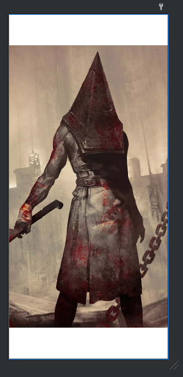

# FrameLayout


Fuente: developer.android


## DEFINICIÓN

Hereda de `ViewGroup`.

Es el Layout más sencillo de todos.

Está concevido para bloquear un area de la pantalla y pintar en la misma un solo item.

Normamente se debe utilizar FrameLayout para pintar un solo hijo, por ese motivo se utiliza cuando vamos a hacer uso de un fragment o de una vista custom.


Cuando se pinta una lista con `RecyclerView`, la estructura más sencilla es pintar dicha lista dentro de un `FrameLayout`.


## USO DESDE XML

```xml
<?xml version="1.0" encoding="utf-8"?>
<FrameLayout xmlns:android="http://schemas.android.com/apk/res/android"
    xmlns:tools="http://schemas.android.com/tools"
    android:layout_width="match_parent"
    android:layout_height="match_parent"
    tools:context=".RecyclerViewActivity">

    <androidx.recyclerview.widget.RecyclerView
        android:id="@+id/rvSilentHill"
        android:layout_width="match_parent"
        android:layout_height="wrap_content" />

</FrameLayout>
```

## ATRIBUTOS

### android:foregroundGravity <a href="#attr_android-foregroundgravity" id="attr_android-foregroundgravity"></a>

define la gravedad del drawable que se encuentra en el interior del Frame.

## EJEMPLO

Vamos a pintar una imagen en un FrameLayout. No tiene ningún misterio pero se debe de seguir la dinámica del ejemplo en cada una de las entradas:

```xml
<?xml version="1.0" encoding="utf-8"?>
<FrameLayout xmlns:android="http://schemas.android.com/apk/res/android"
    android:layout_width="match_parent"
    android:layout_height="match_parent">
    <ImageView
        android:layout_width="match_parent"
        android:layout_height="match_parent"
        android:src="@drawable/im_pyramidhead"

</FrameLayout>
```

<figure><figcaption><p>Resultado</p></figcaption></figure>
