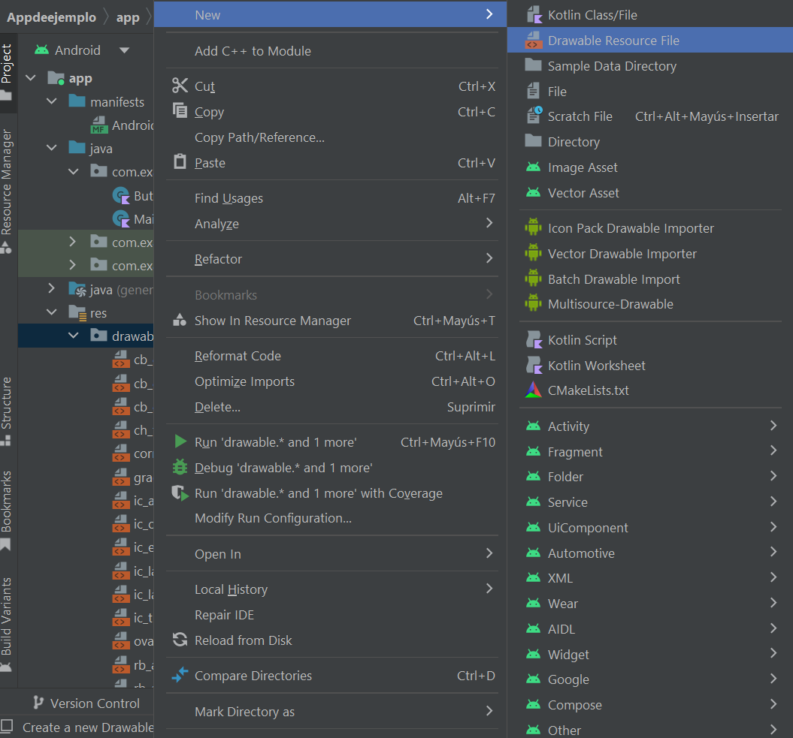
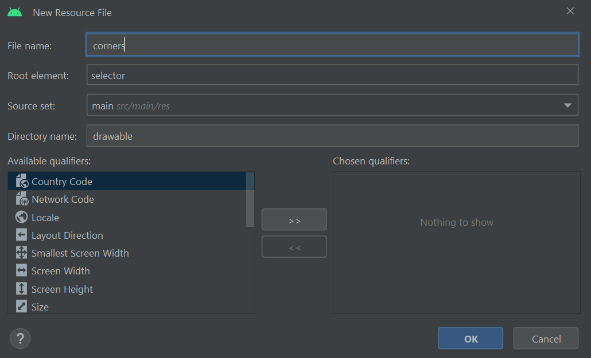

# Button


Fuente: developer.android


## DEFINICIÓN

Hereda de `TextView`.

Un **Button** es una interfaz de usuario que permite al usuario clicar para ejecutar una acción.

## USO DESDE XML


La clase `Button`, a pesar de heredar directamente de `TextView`, tiene muchas de las funcionalidades que ofrece esta última bloqueadas. Esto se debe a que las clase Button integra por defecto un estilo concreto.


Para generar un botón en nuestro archivo de layout utilizamos el siguiente código:


```xml
<?xml version="1.0" encoding="utf-8"?>
<LinearLayout xmlns:android="http://schemas.android.com/apk/res/android"
    android:layout_width="match_parent"
    android:layout_height="match_parent"
    android:layout_margin="30dp"
    android:orientation="vertical">

    <Button
        android:layout_width="wrap_content"
        android:layout_height="wrap_content"
        android:text="Log in"/>
</LinearLayout>
```


.png>)

Como podemos ver, el Botón tiene:

* Todo el texto en mayúscula.&#x20;
* tTene los bordes redondeados.&#x20;
* Se ha añadido un color de fondo (que corresponde con `colorPrimary` en el `themes.xml`).&#x20;
* Cuando se pulsa reproduce un sonido y una pequeña animación de pulsado.
* Un padding.
* Un margin (aunque en la imagen no se ve debido a que ya existe un margin del layout).

Si queremos modificar la mayoría de estas características del botón, tendremos que utilizar otra clase:

```xml
<android.widget.Button
    android:layout_width="wrap_content"
    android:layout_height="wrap_content"
    android:text="Log in"
    android:backgroundTint="@color/blue_light"/>
```

Utilizando esta clase `android.widget.Button`, tenemos acceso a todos los atributos que hereda de `TextView`. Sin embargo, habrá alguno de ellos que no funcionará como esperamos, ya que pueden entrar en conflicto con algunas de las características intrínsecas del botón.

## ATRIBUTOS

Como hemos visto, la clase Button hereda directamente de la clase TextView por lo que puede utilizar todos los atributos de esta última clase. Sin embargo, al estar algunos de ellos protegidos, vamos a ver algunos que son importantes en el caso de la clase Button:

### android:background


NO SE RECOMIENDA EL USO DE ESTE ATRIBUTO.


En los `EditText` hemos visto que se puede modificar el color de fondo de una View con el atributo `android:background`. Sin embargo,  si lo utilizamos en el contexto de un Button, perderemos parte del estilo predefinido del boton:

```xml
<Button
    android:layout_width="wrap_content"
    android:layout_height="wrap_content"
    android:text="Log in"
    android:background="@color/purple_700"/>
```

.png>)

Para evitar que esto ocurra, si queremos cambiar el color de fondo, utilizamos el siguiente atributo:

### android:backgroundTint

Permite modificar el color de fondo de un objeto de la clase Button sin afectar al estilo del botón:

```xml
<android.widget.Button
    android:layout_width="wrap_content"
    android:layout_height="wrap_content"
    android:text="Log in"
    android:backgroundTint="@color/purple_200"/>
```

.png>)

## PROGRAMAR EVENTOS EN BUTTONS

De la misma manera que hicimos con los `TextView` (un `Button` no deja de ser una de sus clases hijo) se utiliza el método `setOnClickListener` para desarrollar el código que se va a ejecutar al hacer click en el botón.


```kotlin
package com.example.android.appdeejemplo

import androidx.appcompat.app.AppCompatActivity
import android.os.Bundle
import android.widget.Button
import android.widget.Toast

class MainActivity : AppCompatActivity() {
    override fun onCreate(savedInstanceState: Bundle?) {
        super.onCreate(savedInstanceState)
        setContentView(R.layout.activity_main)

        val bEjemplo = findViewById<Button>(R.id.btEjemplo)
        bEjemplo.setOnClickListener {
            Toast.makeText(this, "Botón Pulsado", Toast.LENGTH_SHORT).show()
        }
    }
}
```


.png>)

## PERSONALIZACIÓN

La personalización de los objetos de tipo Button es ilimitada. En este caso vamos a ver tres posibilidades para que las tenga de ejemplo:

### Ejemplo 1:

Para este primer ejemplo vamos a hacer un Boton de inicio de sesión que tenga los bordes más redondeados y contenga una pequeña imagen en su interior.&#x20;

Para ello vamos a utilizar un nuevo concepto que son las **listas de estados** en XML:

### Listas de estados


Fuente: developer.android



&#x20;Un `StateListDrawable` es un objeto de diseño definido en XML que usa varias imágenes distintas para representar el mismo gráfico, según el estado del objeto.&#x20;

Por ejemplo, un widget `Button` puede estar en varios estados (presionado, en foco o ninguno de estos) y, mediante un elemento de diseño de lista de estados, puedes cambiar la imagen de fondo para cada estado.

Puede describir la lista de estados en un archivo en formato XML. Cada gráfico se representa a través de un elemento `<item>` dentro de un solo elemento `<selector>`. Cada `<item>` usa varios atributos para describir el estado en que debería usarse como gráfico del elemento de diseño.

Durante cada cambio de estado, se recorre de arriba abajo la lista de estados, y se utiliza el primer elemento que coincida con el estado actual; la selección _no_ depende de la "mejor coincidencia", sino del primer elemento que cumple con los criterios mínimos del estado.


En este ejemplo el Botón no cambiará de estado, pero para diseñar el objeto en su estado permanente, podemos utilizar el mismo proceso, vamos a realizar varios pasos:

* Crear el objeto de diseño XML, en este caso, con el nombre, corners:

<figure><figcaption><p>Nuevo Resource 1</p></figcaption></figure>

<figure><figcaption><p>Nuevo Resource 2</p></figcaption></figure>

* Una  vez tenemos el nuevo resource lo tenemos que completar con los items que queramos:\<?xml version="1.0" encoding="utf-8"?>


```xml
<selector xmlns:android="http://schemas.android.com/apk/res/android">
    <item>
        <shape android:shape="rectangle">
            <corners android:radius="12dp"/>
        </shape>
    </item>
</selector>
```


* Una vez tenemos esto podemos crear nuestro Boton con este diseño de Background. Para ello tendremos que utilizar la clase sin restrincciones `android.widget.Button`

```xml
<android.widget.Button
    android:id="@+id/btEjemplo"
    android:layout_width="wrap_content"
    android:layout_height="wrap_content"
    android:text="Log in"
    android:background="@drawable/corners"
    android:backgroundTint="@color/purple_200"
    android:drawableStart="@drawable/ic_email"/>
```

.png>)

Como se puede ver es un Botón mucho más redondeado e incluye una pequeña imagen en su interior.

### Ejemplo 2:

En este caso, utilizando el mismo concepto que en el anterior vamos a crear un botón circular.

Para ello volvemos a crear un nuevo Resource que vamos a llamar `oval.xml`. En este Resource vamos a utilizar el **item shape** de tipo **oval** para crear el círculo:


```xml
<?xml version="1.0" encoding="utf-8"?>
<selector xmlns:android="http://schemas.android.com/apk/res/android">

    <item>
        <shape android:shape="oval">
            <solid android:color="@color/purple_200"/>
            <size android:width="85dp" android:height="85dp"></size>
        </shape>
    </item>
</selector>
```


Posteriormente, solo tenemos que cambiar el atributo android:background y eliminar el atributo android:backgroundTint ya que el color viene en el Resource marcado:

```xml
<android.widget.Button
    android:id="@+id/btEjemplo"
    android:layout_width="wrap_content"
    android:layout_height="wrap_content"
    android:text="Log in"
    android:background="@drawable/oval"
    android:drawableStart="@drawable/ic_email"/>
```

 (1).png>)

### Ejemplo 3:

Por último vamos a ver como añadir un gradiente al fondo, es decir, un cambio de color progresivo (como en los wordart de office).

Para ello empezamos con un nuevo **Resource** que vamos a llamar `gradient.xml`.


```xml
<?xml version="1.0" encoding="utf-8"?>
<selector xmlns:android="http://schemas.android.com/apk/res/android">
    <item>
        <shape android:shape="rectangle">
            <gradient
                android:startColor="@color/purple_700"
                android:centerColor="@color/purple_500"
                android:endColor="@color/purple_200"
                android:angle="90"
                />
        </shape>
    </item>
</selector>
```


Como vemos estamos utilizando un rectangulo y colores para marcar los diferentes colores del van a aparecer en nuestro botón. Además de eso, hay que indicar el ángulo en el que se va a iniciar el gradiente.

Posteriormente retocamos la View en activity\_main.xml:

<pre class="language-xml"><code class="lang-xml"><strong>&#x3C;android.widget.Button
</strong>    android:id="@+id/btEjemplo"
    android:layout_width="wrap_content"
    android:layout_height="wrap_content"
    android:text="Log in"
    android:background="@drawable/gradient"
    android:drawableStart="@drawable/ic_email"/>
</code></pre>

 (1).png>)

Por último si retocamos el icono de email para que cuadre con la paleta de colores utilizada, cambiamos el color de la fuente, retocamos las esquinas y añadimos un poco de padding, tenemos un botón muy bonito y perfectamente funcional:

.png>)
