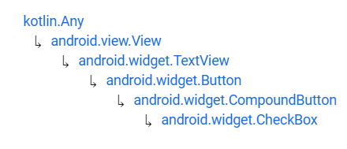
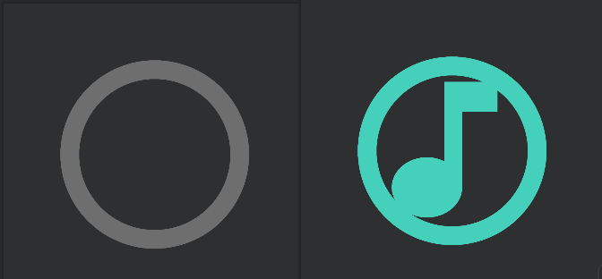

# CheckBox


Fuente: developer.android


## DEFINICIÓN

Hereda de:

<figure><figcaption><p>Herencia CheckBox</p></figcaption></figure>

Un `CheckBox` es un tipo concreto de botón que  tiene dos estados, puede encontrarse marcado (checked) o desmarcado (unchecked).&#x20;

Al contrario que los `RadioButton`, los `CheckBox` no se suelen utilizar en ningún `ViewGroup` específico y, por tanto, pueden encontrarse varios de ellos en la misma aplicación y el estado de uno no afecta al estado de los demás.

## USO DESDE XML


```xml
<?xml version="1.0" encoding="utf-8"?>
<LinearLayout xmlns:android="http://schemas.android.com/apk/res/android"
    xmlns:tools="http://schemas.android.com/tools"
    android:layout_width="match_parent"
    android:layout_height="match_parent"
    xmlns:app="http://schemas.android.com/apk/res-auto"
    android:layout_margin="30dp"
    android:orientation="vertical">

    <TextView
        android:layout_width="wrap_content"
        android:layout_height="wrap_content"
        android:text="Seleccione sus gustos musicales:"
        android:paddingBottom="30dp"/>

    <CheckBox
        android:id="@+id/cbPop"
        android:layout_width="wrap_content"
        android:layout_height="wrap_content"
        android:text="música Pop"/>
    <CheckBox
        android:id="@+id/cbRock"
        android:layout_width="wrap_content"
        android:layout_height="wrap_content"
        android:text="música Rock"/>
    <CheckBox
        android:id="@+id/cbRap"
        android:layout_width="wrap_content"
        android:layout_height="wrap_content"
        android:text="música Rap"/>
    <CheckBox
        android:id="@+id/cbTrap"
        android:layout_width="wrap_content"
        android:layout_height="wrap_content"
        android:text="música Trap."/>
    <CheckBox
        android:id="@+id/cbClassic"
        android:layout_width="wrap_content"
        android:layout_height="wrap_content"
        android:text="música Clásica"/>
</LinearLayout>
```


.png>)                               .png>)

## ATRIBUTOS

### android:checked

Heredado de `TextView`.

indica que el `CheckButton` se encuentra en el estado de **marcado**.

### android:enabled

Heredado de TextView.

Indica que el CheckButton se ve y se puede pulsar o se vé pero no se puede pulsar.

## PROGRAMAR EVENTOS DESDE CÓDIGO

La programación de eventos para los CheckBox no tiene ninguna dificultad con respecto a los que hemos visto anteriormente por lo que solamente vamos a ver el código:


```kotlin
package com.example.android.appdeejemplo

import androidx.appcompat.app.AppCompatActivity
import android.os.Bundle
import android.view.View
import android.widget.CheckBox
import android.widget.Toast

class MainActivity : AppCompatActivity() {
    override fun onCreate(savedInstanceState: Bundle?) {
        super.onCreate(savedInstanceState)
        setContentView(R.layout.activity_main)

        val cbList: List<CheckBox> = listOf(
            findViewById(R.id.cbPop),
            findViewById(R.id.cbRock),
            findViewById(R.id.cbRap),
            findViewById(R.id.cbTrap),
            findViewById(R.id.cbClassic)
        )
        for (i in cbList) {
            i.setOnClickListener{
                onCheckBoxClicked(it)
            }
        }
    }
    fun onCheckBoxClicked(view: View){
        val cb = view as CheckBox
        if (cb.isChecked) {
            Toast.makeText(this, "Le gusta la ${cb.text}", Toast.LENGTH_SHORT).show()
        } else {
            Toast.makeText(this, "No le ha convencido la ${cb.text}", Toast.LENGTH_SHORT).show()
        }
    }
}
```



Como ven, también se pueden utilizar estructuras de datos como listas de Kotlin para hacer referencia a varias `Views` aunque no se encuentren en el mismo `ViewGroup`.


 (1).png>)                              .png>)

## PERSONALIZACIÓN

### Personalizar botón

<figure><figcaption><p>cb_music_off / cb_music_on</p></figcaption></figure>

Para personalizar un CheckBox podemos hacer uso de las listas de estados para crear un drawable que se ejecute cuando el CheckBox se encuentre en estado `checked` y otro cuando se encuentre en el estado `unchecked`.

Esto ya se ha explicado anteriormente así que vamos directamente a ver el código:


```xml
<?xml version="1.0" encoding="utf-8"?>
<selector xmlns:android="http://schemas.android.com/apk/res/android">
    <item android:drawable="@drawable/cb_music_on" android:state_checked="true" />
    <item android:drawable="@drawable/cb_music_off" android:state_checked="false" />
</selector>
```



```xml
<?xml version="1.0" encoding="utf-8"?>
<vector xmlns:android="http://schemas.android.com/apk/res/android"
    android:width="32dp"
    android:height="32dp"
    android:viewportHeight="48"
    android:viewportWidth="48">

    <group
        android:scaleX=".2"
        android:scaleY=".2"
        android:translateX="6"
        android:translateY="6">
        <group
            android:scaleX="7.5"
            android:scaleY="7.5">
            <path
                android:fillColor="#6E6E6E"
                android:pathData="M12,20A8,8 0 0,1 4,12A8,8 0 0,1 12,4A8,8 0 0,1 20,12A8,8 0 0,1 12,20M12,2A10,10 0 0,0 2,12A10,10 0 0,0 12,22A10,10 0 0,0 22,12A10,10 0 0,0 12,2Z" />
        </group>
    </group>
</vector>
```



```xml
<?xml version="1.0" encoding="utf-8"?>
<vector xmlns:android="http://schemas.android.com/apk/res/android"
    android:width="32dp"
    android:height="32dp"
    android:viewportHeight="48"
    android:viewportWidth="48">

    <group
        android:scaleX=".2"
        android:scaleY=".2"
        android:translateX="6"
        android:translateY="6">
        <group
            android:scaleX="7.5"
            android:scaleY="7.5">
            <path
                android:fillColor="#45D0BB"
                android:pathData="M12,20A8,8 0 0,1 4,12A8,8 0 0,1 12,4A8,8 0 0,1 20,12A8,8 0 0,1 12,20M12,2A10,10 0 0,0 2,12A10,10 0 0,0 12,22A10,10 0 0,0 22,12A10,10 0 0,0 12,2Z" />

        </group>
        <group
            android:translateY="17"
            android:scaleX="7"
            android:scaleY="6">
            <path
                android:fillColor="#45D0BB"
                android:pathData="M12 3V13.55C11.41 13.21 10.73 13 10 13C7.79 13 6 14.79 6 17S7.79 21 10 21 14 19.21 14 17V7H18V3H12Z" />
        </group>
    </group>
</vector>
```



```xml
<?xml version="1.0" encoding="utf-8"?>
<LinearLayout xmlns:android="http://schemas.android.com/apk/res/android"
    xmlns:tools="http://schemas.android.com/tools"
    android:layout_width="match_parent"
    android:layout_height="match_parent"
    xmlns:app="http://schemas.android.com/apk/res-auto"
    android:layout_margin="30dp"
    android:orientation="vertical">
    <TextView
        android:layout_width="wrap_content"
        android:layout_height="wrap_content"
        android:text="Seleccione sus gustos musicales:"
        android:paddingBottom="30dp"/>
    <CheckBox
        android:id="@+id/cbPop"
        android:layout_width="wrap_content"
        android:layout_height="wrap_content"
        android:text="música Pop"
        android:checked="true"
        android:button="@drawable/cb_music"/>
    <CheckBox
        android:id="@+id/cbRock"
        android:layout_width="wrap_content"
        android:layout_height="wrap_content"
        android:text="música Rock"
        android:button="@drawable/cb_music"/>
    <CheckBox
        android:id="@+id/cbRap"
        android:layout_width="wrap_content"
        android:layout_height="wrap_content"
        android:text="música Rap"
        android:button="@drawable/cb_music"/>
    <CheckBox
        android:id="@+id/cbTrap"
        android:layout_width="wrap_content"
        android:layout_height="wrap_content"
        android:text="música Trap"
        android:button="@drawable/cb_music"/>
    <CheckBox
        android:id="@+id/cbClassic"
        android:layout_width="wrap_content"
        android:layout_height="wrap_content"
        android:text="música Clásica"
        android:button="@drawable/cb_music"/>
</LinearLayout>
```


.png>)                               
