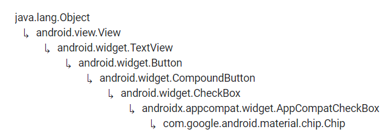

# Chip y ChipGroup


Fuente: developer.android



Fuente: developer.android


<figure><figcaption><p>ChipGroup</p></figcaption></figure>

## DEFINICIÓN

### Chip

Hereda de:

<figure><figcaption><p>Herencia de Chip</p></figcaption></figure>

Los chips son elementos compactos que representan un atributo, texto, entidad o acción. Permiten al usuario introducir información, seleccionar una opción, filtrar contenido o ejecutar una acción.


El widget `Chip` es un wrapper sobre la clase `ChipDrawable` que contiene además de dicha clase, todo lo que afecta al layout y la lógica para soportar diferentes formas de interacción (tactil, ratón, teclado, accesibilidad...).

El Chip y el icono de cerrar son considerados Views separadas y contienen su propio comportamiento y estado.


### ChipGroup

Hereda de `ViewGroup`.

Un `ChipGroup` es utilizado para acoger múltiples Chips.&#x20;

## USO DESDE XML

Como hemos visto, un `ChipGroup` contiene varios `Chips`. Por este motivo, podemos crear un `ChipGroup` de la siguiente manera:

```xml
<com.google.android.material.chip.ChipGroup
    android:layout_width="wrap_content"
    android:layout_height="wrap_content">
    <com.google.android.material.chip.Chip
        android:id="@+id/chip1"
        android:layout_width="wrap_content"
        android:layout_height="wrap_content"
        android:text="Seguro a todo riesgo"/>
    <com.google.android.material.chip.Chip
        android:id="@+id/chip2"
        android:layout_width="wrap_content"
        android:layout_height="wrap_content"
        android:text="Avión"/>
    <com.google.android.material.chip.Chip
        android:id="@+id/chip3"
        android:layout_width="wrap_content"
        android:layout_height="wrap_content"
        android:text="Tren"/>
    <com.google.android.material.chip.Chip
        android:id="@+id/chip4"
        android:layout_width="wrap_content"
        android:layout_height="wrap_content"
        android:text="Coche"/>
    <com.google.android.material.chip.Chip
        android:id="@+id/chip5"
        android:layout_width="wrap_content"
        android:layout_height="wrap_content"
        android:text="Bicicleta"/>
    <com.google.android.material.chip.Chip
        android:id="@+id/chip6"
        android:layout_width="wrap_content"
        android:layout_height="wrap_content"
        android:text="Moto"/>
</com.google.android.material.chip.ChipGroup>
```

.png>)

Estos chips son clicables y tienen una animación cuando son pulsados, pero no tienen lógica asignada.

## ATRIBUTOS CHIP

Todos los atributos de la clase Chip estan soportados. Sin embargo, hay que evitar utilizar algunos atributos heredados ya que se van a ignorar. Esto se debe a que los Chips gestionan estas funcionalidades con otros atributos específicos.&#x20;

Los atributos heredados que no se deben usar son:

* `android:background`
* `android:drawableStart`
* `android:drawableEnd`

A continuación se van a presentar los atributos básicos de la clase `Chip`:

### android:chipBackgroundColor

Permite cambiar el color de fondo del Chip.

### android:chipStrokeColor

Permite definir el color del contorno del Chip.

### android:chipStrokeWidth

Permite definir el ancho del contorno del Chip.

### android:checkable

Si esta seteado en True, el chip puede ser cambiado de estado, en caso contrario, el chip funcionará como un botón.

### android:text

Es un atributo obligatorio y expresa el texto que se va a mostrar al usuario.


A partir del siguiente atributo cambiamos el contexto a `App`.


### app:chipIcon

Expresa un icono que se coloca a la izquierda del Chip.

### app:checkedIcon

Expresa un icono que muestra si el `Chip` ha sido activado. Normalmente en la izquierda.

### app:closeIcon

Expresa un icono personalizado para cerrar el `Chip`.

## ATRIBUTOS CHIPGROUP

### app:singleLine

Las Chips se van acomodando en varias lineas por defecto. Sin embargo, a veces puede ser util acomodarlas en una sola linea y combinar esto con un `HorizontalScollView`.

### app:singleSelection

Permite limitar las Chips activadas en un `ChipGroup` a solo una.&#x20;

De esta manera se puede imitar el comportamiento de un `RadioGroup` en el cual cuando un `RadioButton` es marcado, el resto se desmarcan.

Cuando se añade un Chip a un ChipGroup, su estado se preserva. Si el ChipGroup es de selección única y ya hay un Chip seleccionado, cuando introduzcamos un Chip seleccionado, el anterior se deseleccionará.

## PERSONALIZACIÓN

En este apartado vamos a añadir otro elemento muy util para la personalización de elementos visuales, esto son los estilos:

### Styles


Fuente: developer.android


Un recurso de estilo define el formato y el aspecto de una IU. Se puede aplicar un estilo a una [`View`](https://developer.android.com/reference/android/view/View?hl=es-419) individual (desde dentro de un archivo de diseño), a una [`Activity`](https://developer.android.com/reference/android/app/Activity?hl=es-419) completa o una aplicación (desde dentro del archivo de manifiesto).


En nuestra App tenemos el archivo `themes.xml` que es el que nos da el estilo del tema "light" y tenemos otro que es `themes.xml (night)` que el que nos da el tema "oscuro".

En estos archivos se programan los estilos de los elementos visuales que cambian en función del tema.

Sin embargo, en nuestra App, los Chips no van a cambiar de estilos en función del tema, por eso vamos a crear un archivo de Resources llamado `styles.xml` donde van a ir almacenados los estilos que no varían en función del tema.


#### styles.xml


```xml
<?xml version="1.0" encoding="utf-8"?>
<resources xmlns:tools="http://schemas.android.com/tools">
    <style name="chEntry" parent="Widget.MaterialComponents.Chip.Entry">
        <item name="android:textStyle">bold</item>
        <item name="android:textColor">@color/white</item>
        <item name="chipBackgroundColor">@color/blue_light</item>
        <item name="chipStrokeColor">@color/blue_dark</item>
        <item name="chipStrokeWidth">2dp</item>
    </style>
</resources>
```


Como se puede ver, al definir un estilo para los Chips, tenemos que definir un parent, en este caso es `Widget.MaterialComponents.Chip.Entry` aunque en función de a qué le queramos definir el estilo le pondremos un parent u otro.

#### Definir el style

Una vez que hemos creado el estilo, hay que definirlo para los diferentes Chips que queremos que lo tengan.&#x20;

En este caso vamos a hacer que los Chips alternen, uno con estilo con otro predefinido para que se vea la diferencia:

```xml
<com.google.android.material.chip.ChipGroup
    android:layout_width="wrap_content"
    android:layout_height="wrap_content">
    <com.google.android.material.chip.Chip
        android:id="@+id/chip1"
        android:layout_width="wrap_content"
        android:layout_height="wrap_content"
        style="@style/chEntry"
        android:text="Seguro a todo riesgo"/>
    <com.google.android.material.chip.Chip
        android:id="@+id/chip2"
        android:layout_width="wrap_content"
        android:layout_height="wrap_content"
        android:text="Avión"/>
    <com.google.android.material.chip.Chip
        android:id="@+id/chip3"
        android:layout_width="wrap_content"
        android:layout_height="wrap_content"
        style="@style/chEntry"
        android:text="Tren"/>
    <com.google.android.material.chip.Chip
        android:id="@+id/chip4"
        android:layout_width="wrap_content"
        android:layout_height="wrap_content"
        android:text="Coche"/>
    <com.google.android.material.chip.Chip
        android:id="@+id/chip5"
        android:layout_width="wrap_content"
        android:layout_height="wrap_content"
        style="@style/chEntry"
        android:text="Bicicleta"/>
    <com.google.android.material.chip.Chip
        android:id="@+id/chip6"
        android:layout_width="wrap_content"
        android:layout_height="wrap_content"
        android:text="Moto"/>
</com.google.android.material.chip.ChipGroup>
```

.png>)

Si se fijan, en ningún sitio se ha hecho referencia al atributo android:closeIcon y sin embargo los que tienen estilo lo traen incorporado. Esto se debe a que el parent `Widget.MaterialComponents.Chip.Entry` incluye este `closeIcon` predefinido en su código.

De la misma manera trae un `checkedIcon` predefinido que se muestra en la siguiente captura:

.png>)

Sin embargo, como hemos dicho antes, al no contener la lógica, el closeIcon no tiene la capacidad de cerrar el Chip todavía.

### chipIcon

Tambien podemos personalizar los Chips para que se muestren iconos al inicio de los Chips, de esta manera mejoramos la experiencia de usuario permitiendo que con un golpe de vista se sepa a que hacemos referencia:

```xml
<com.google.android.material.chip.ChipGroup
    android:layout_width="wrap_content"
    android:layout_height="wrap_content">

    <com.google.android.material.chip.Chip
        android:id="@+id/chip1"
        style="@style/chEntry"
        android:layout_width="wrap_content"
        android:layout_height="wrap_content"
        android:text="Seguro a todo riesgo"
        app:chipIcon="@drawable/ic_doc" />

    <com.google.android.material.chip.Chip
        android:id="@+id/chip2"
        android:layout_width="wrap_content"
        android:layout_height="wrap_content"
        android:text="Avión"
        app:chipIcon="@drawable/ic_airplane" />

    <com.google.android.material.chip.Chip
        android:id="@+id/chip3"
        style="@style/chEntry"
        android:layout_width="wrap_content"
        android:layout_height="wrap_content"
        android:text="Tren"
        app:chipIcon="@drawable/ic_train" />

    <com.google.android.material.chip.Chip
        android:id="@+id/chip4"
        android:layout_width="wrap_content"
        android:layout_height="wrap_content"
        android:text="Coche"
        app:chipIcon="@drawable/ic_car" />

    <com.google.android.material.chip.Chip
        android:id="@+id/chip5"
        style="@style/chEntry"
        android:layout_width="wrap_content"
        android:layout_height="wrap_content"
        android:text="Bicicleta"
        app:chipIcon="@drawable/ic_bike" />

    <com.google.android.material.chip.Chip
        android:id="@+id/chip6"
        android:layout_width="wrap_content"
        android:layout_height="wrap_content"
        android:text="Moto"
        app:chipIcon="@drawable/ic_motorbike" />
</com.google.android.material.chip.ChipGroup>
```

.png>)                             (1).png>)

### Listas de estados

En la página de los Button, vimos ya este término pero no lo pudimos aplicar completamente ya que el Button solo tiene un estado.

#### Recordamos


Fuente: developer.android


&#x20;Un `StateListDrawable` es un objeto de diseño definido en XML que usa varias imágenes distintas para representar el mismo gráfico, según el estado del objeto.&#x20;

Por ejemplo, un widget `Button` puede estar en varios estados (presionado, en foco o ninguno de estos) y, mediante un elemento de diseño de lista de estados, puedes cambiar la imagen de fondo para cada estado.

Puede describir la lista de estados en un archivo en formato XML. Cada gráfico se representa a través de un elemento `<item>` dentro de un solo elemento `<selector>`. Cada `<item>` usa varios atributos para describir el estado en que debería usarse como gráfico del elemento de diseño.

Durante cada cambio de estado, se recorre de arriba abajo la lista de estados, y se utiliza el primer elemento que coincida con el estado actual; la selección _no_ depende de la "mejor coincidencia", sino del primer elemento que cumple con los criterios mínimos del estado.

#### Aplicamos

En el caso de los Chip, tenemos dos estados, cuando el Chip se encuentra en estado `Checked` y cuando se encuentra en el estado `unChecked`.&#x20;

A continuación vamos a utilizar un StateListDrawable para definir un cambio de color en el texto en función del estado del Chip.&#x20;

Para ello tenemos que crear un `Resource` que llamaremos `ch_textcolor.xml` y contendrá un `selector` con dos `items`, uno que se ejecutará en el estado `Checked` y otro que se ejecutará en el estado `unChecked`:


```xml
<?xml version="1.0" encoding="utf-8"?>
<selector xmlns:android="http://schemas.android.com/apk/res/android">
    <item android:color="@color/white" android:state_checked="false"  />
    <item android:color="@color/black"  android:state_checked="true"  />
</selector>
```


Para aplicar esto a los chips, simplemente llamamos al drawable llamado `ch_textcolor` en el atributo  `android:textColor`:

```xml
<com.google.android.material.chip.ChipGroup
    android:layout_width="wrap_content"
    android:layout_height="wrap_content">

    <com.google.android.material.chip.Chip
        android:id="@+id/chip1"
        style="@style/chEntry"
        android:layout_width="wrap_content"
        android:layout_height="wrap_content"
        android:text="Seguro a todo riesgo"
        android:textColor="@drawable/ch_textcolor"
        app:chipIcon="@drawable/ic_doc" />

    <com.google.android.material.chip.Chip
        android:id="@+id/chip2"
        style="@style/chEntry"
        android:layout_width="wrap_content"
        android:layout_height="wrap_content"
        android:text="Avión"
        app:chipIcon="@drawable/ic_airplane"
        android:textColor="@drawable/ch_textcolor" />

    <com.google.android.material.chip.Chip
        android:id="@+id/chip3"
        style="@style/chEntry"
        android:layout_width="wrap_content"
        android:layout_height="wrap_content"
        android:text="Tren"
        app:chipIcon="@drawable/ic_train"
        android:textColor="@drawable/ch_textcolor" />

    <com.google.android.material.chip.Chip
        android:id="@+id/chip4"
        style="@style/chEntry"
        android:layout_width="wrap_content"
        android:layout_height="wrap_content"
        android:text="Coche"
        app:chipIcon="@drawable/ic_car"
        android:textColor="@drawable/ch_textcolor" />

    <com.google.android.material.chip.Chip
        android:id="@+id/chip5"
        style="@style/chEntry"
        android:layout_width="wrap_content"
        android:layout_height="wrap_content"
        android:text="Bicicleta"
        app:chipIcon="@drawable/ic_bike"
        android:textColor="@drawable/ch_textcolor" />

    <com.google.android.material.chip.Chip
        android:id="@+id/chip6"
        style="@style/chEntry"
        android:layout_width="wrap_content"
        android:layout_height="wrap_content"
        android:text="Moto"
        app:chipIcon="@drawable/ic_motorbike"
        android:textColor="@drawable/ch_textcolor" />
</com.google.android.material.chip.ChipGroup>
```

.png>)                              .png>)

## PROGRAMAR EVENTOS DESDE CÓDIGO

### Hacer referencia a todos los Chips

En el caso de los `Chips`, al estar todos en el mismo `ChipGroup`, podemos hacer referencia a todos ellos sin utilizar los ids personales sino un **bucle for** que recorra todos los items que contiene dicho `ChipGroup`.&#x20;

Para ello lo que si que necesito es dar un id al ChipGroup:

```xml
<com.google.android.material.chip.ChipGroup
    android:id="@+id/cg_Ejemplo"
    android:layout_width="wrap_content"
    android:layout_height="wrap_content">
    ...
```

Ahora en el archivo MainActivity.kt podemos programar dicho bucle:


```kotlin
package com.example.android.appdeejemplo

import androidx.appcompat.app.AppCompatActivity
import android.os.Bundle
import com.google.android.material.chip.Chip
import com.google.android.material.chip.ChipGroup

class MainActivity : AppCompatActivity() {
    override fun onCreate(savedInstanceState: Bundle?) {
        super.onCreate(savedInstanceState)
        setContentView(R.layout.activity_main)

        val cgEjemplo = findViewById<ChipGroup>(R.id.cgEjemplo)
        var chip: Chip

        for (i in 0 until cgEjemplo.childCount) {
            chip = cgEjemplo.getChildAt(i) as Chip
        }
    }
}
```



**IMPORTANTE**

Cuando hacemos referencia a los **hijos** del `ChipGroup`, estos son referenciados como objetos de tipo `View!` (por diseño de la clase).

Es por ese motivo que es fundamental crear una variable sin inicializar de tipo `Chip` a la que darle el valor de cada uno de los hijos y castearla al tipo `Chip`.&#x20;

Esto lo vemos en la **línea 17** del código.


### setOnCloseIconClickListener

Hasta este momento, no hemos podido utilizar el botón de cerrar en los Chips ya que este no tenía la lógica implementada, eso cambia con el siguiente código:


```kotlin
package com.example.android.appdeejemplo

import androidx.appcompat.app.AppCompatActivity
import android.os.Bundle
import com.google.android.material.chip.Chip
import com.google.android.material.chip.ChipGroup

class MainActivity : AppCompatActivity() {
    override fun onCreate(savedInstanceState: Bundle?) {
        super.onCreate(savedInstanceState)
        setContentView(R.layout.activity_main)

        val cgEjemplo = findViewById<ChipGroup>(R.id.cgEjemplo)
        var chip: Chip

        for (i in 0 until cgEjemplo.childCount) {
            chip = cgEjemplo.getChildAt(i) as Chip

            chip.setOnCloseIconClickListener{
                cgEjemplo.removeView(it)
            }
        }
    }
}
```


Son nuevas las lineas 19 y 20.

Desde este momento, tenemos un listener en todos los Chips a la espera de que pulsemos el botón de cerrar para eliminar la View.

### setOnClickListener

También, como en todos los botones, podemos generar código que se ejecute al pulsar el Chip en sí. Para ello vamos a implementar el siguiente código:


```kotlin
package com.example.android.appdeejemplo

import androidx.appcompat.app.AppCompatActivity
import android.os.Bundle
import android.widget.Toast
import com.google.android.material.chip.Chip
import com.google.android.material.chip.ChipGroup

class MainActivity : AppCompatActivity() {
    override fun onCreate(savedInstanceState: Bundle?) {
        super.onCreate(savedInstanceState)
        setContentView(R.layout.activity_main)

        val cgEjemplo = findViewById<ChipGroup>(R.id.cgEjemplo)
        var chip: Chip

        for (i in 0 until cgEjemplo.childCount) {
            chip = cgEjemplo.getChildAt(i) as Chip

            chip.setOnCloseIconClickListener{
                cgEjemplo.removeView(it)
            }

            chip.setOnClickListener{
                val aux:Chip = it as Chip
                if (aux.isChecked) {
                    Toast.makeText(this, "se ha seleccionado ${aux.text}", 
                    Toast.LENGTH_SHORT).show()
                } else {
                    Toast.makeText(this, "${aux.text} ya no esta seleccionado", 
                    Toast.LENGTH_SHORT).show()
                }
            }
        }
    }
}
```



IMPORTANTE

Igual que ocurría con los hijos del `ChipGroup`, cuando utilizo un **condicional if**, la variable `it` hace referencia a un objeto de clase `View!`.&#x20;

Los objetos `View!` no tienen atributo `text` y por lo tanto **me daría error intentar acceder al text de it**.&#x20;

Es por ese motivo que tenemos que realizar un **cast a Chip que si que tienen el atributo text**.


### Añadir Chips desde código

A continuación vamos a añadir un Chip desde código. Los datos son fijos por que aún no sabemos interaccionar con el usuario pero podrían ser Tags de búsqueda que marque el usuario en un EditText por ejemplo:


```kotlin
package com.example.android.appdeejemplo

import androidx.appcompat.app.AppCompatActivity
import android.os.Bundle
import android.view.View
import android.widget.Toast
import com.google.android.material.chip.Chip
import com.google.android.material.chip.ChipGroup

class MainActivity : AppCompatActivity() {
    override fun onCreate(savedInstanceState: Bundle?) {
        super.onCreate(savedInstanceState)
        setContentView(R.layout.activity_main)

        val cgEjemplo = findViewById<ChipGroup>(R.id.cgEjemplo)
        var chip: Chip

        for (i in 0 until cgEjemplo.childCount) {
            chip = cgEjemplo.getChildAt(i) as Chip

            chip.setOnCloseIconClickListener{
                cgEjemplo.removeView(it)
            }

            chip.setOnClickListener{
                val aux:Chip = it as Chip
                if (aux.isChecked) {
                    Toast.makeText(this, "se ha seleccionado ${aux.text}", 
                    Toast.LENGTH_SHORT).show()
                } else {
                    Toast.makeText(this, "${aux.text} ya no esta seleccionado", 
                    Toast.LENGTH_SHORT).show()
                }
            }
        }

        val newChip: Chip = Chip(this)
        newChip.text="Recibir email"
        newChip.chipIcon=getDrawable(R.drawable.ic_email)
        newChip.isCloseIconVisible=true
        newChip.isCheckedIconVisible=true
        newChip.isClickable=true

        cgEjemplo.addView(newChip as View)
        newChip.setOnCloseIconClickListener{
            cgEjemplo.removeView(newChip as Chip)
        }
    }
}
```



**IMPORTANTE**

En este caso en las líneas 44 y 46 vemos que tambien es necesario realizar casting para cumplir con las necesidades de tipos ya que el método `addView(View!)` solo permite parametros de tipo View y el método `removeView()`, al estar en un ChipGroup, tiene que recibir un Chip.&#x20;


.png>)                             .png>)

 (1).png>)                              .png>)

### Modificar estilo de nuevos Chips

Como hemos visto, se pueden crear Chips desde código, sin embargo, no existe una API que permita cambiar el estilo de este Chip.

Por ese motivo, AirBNB que es una de las empresas que más soluciones desarrolla para Android ha creado una biblioteca pensada para modificar el estilo de manera programática.&#x20;

Dejo un enlace por si les interesa:


Fuente: GitHub

