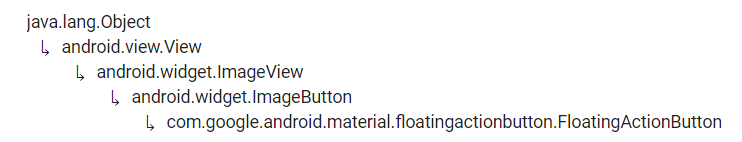

# FloatingActionButton


Fuente: developer.android


## DEFINICIÓN

Hereda de:

<figure><figcaption><p>Herencia de FloatingActionButton</p></figcaption></figure>

Los FloatingActionButton se utilizan para dar acceso en todo momento a la acción principal de nuestra App. Por ejemplo, en Twitter sería el botón para escribir un nuevo tweet, éste siempre se encuentra visible.

Se caracteríza por tener un icono circular y flotar sobre el resto de la UI. Además tiene comportamientos de movilidad especiales como ya veremos.


El botón no flotará en un LinearLayout ya que se este tipo de ViewGroup no lo permite.


Tienen dos medidas, el normal y el mini.

## USO DESDE XML

Hemos tenido que realizar unas variaciones en el archivo de `layout` para que se pueda realizar el ejemplo.

Lo principal es que el `FloatingActionButton` se encuentra en un `RelativeLayout` para poder cumplir su función.

Además hemos añadido una `ScrollView` para poder scrolear la imagen y ver que el `FloatingActionButton` sigue en su sitio.


```xml
<?xml version="1.0" encoding="utf-8"?>
<RelativeLayout xmlns:android="http://schemas.android.com/apk/res/android"
    xmlns:app="http://schemas.android.com/apk/res-auto"
    xmlns:tools="http://schemas.android.com/tools"
    android:layout_width="match_parent"
    android:layout_height="match_parent"
    android:orientation="vertical">

    <ScrollView
        android:layout_width="match_parent"
        android:layout_height="match_parent">
        <LinearLayout
            android:layout_width="match_parent"
            android:layout_height="match_parent"
            android:layout_margin="15dp">

            <ImageView
                android:id="@+id/iv1"
                android:layout_width="wrap_content"
                android:layout_height="wrap_content"
                android:src="@drawable/im_pyramidhead" />

        </LinearLayout>
    </ScrollView>

    <com.google.android.material.floatingactionbutton.FloatingActionButton
        android:layout_width="wrap_content"
        android:layout_height="wrap_content"
        android:src="@drawable/ic_email"
        android:layout_margin="15dp"/>

</RelativeLayout>
```


.png>)                               .png>)


No se va a tratar más sobre este botón. Si quieren más información les recomiendo el enlace que pondré abajo:



Fuente: Material Design

