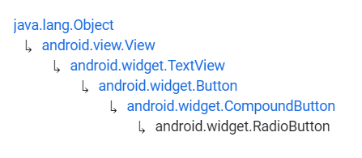
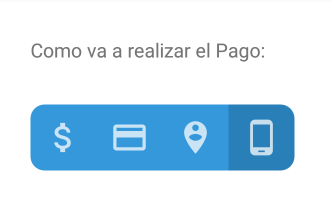

# RadioButton y RadioGroup


Fuente: developer.android



Fuente: developer.android


## DEFINICIÓN

### RadioButton

Hereda de:

<figure><figcaption><p>Herencia de RadioButton</p></figcaption></figure>

Un `RadioButton` es un botón que tiene dos estados, puede encontrarse marcado (checked) o desmarcado (unchecked).&#x20;

Cuando el botón se encuentra desmarcado, el usuario puede marcarlo, sin embargo, al contrario que los `CheckBox`, el usuario no puede desmarcarlo una vez marcado.

Los `RadioButtons` suelen utilizarse dentro de un `RadioGroup`.

### RadioGroup

Hereda de `LinearLayout`.

Esta clase se utiliza para crear un grupo de `RadioButtons` mutuamente excluyentes, es decir, solo puede haber uno de ellos en el estado de marcado.&#x20;

Esto significa que si el usuario marca uno de ellos, el resto, automáticamente pasan al estado de desmarcados.

Mientras que no se puede desmarcar un `RadioButton` concreto, si que se puede limpiar un RadioGroup para eliminar el estado de marcado de sus `RadioButtons`.

La selección es identificada mediante el atributo `android:id` de cada uno de los RadioButton.

## USO DESDE XML

Como hemos visto, un `RadioGroup` contiene varios `RadioButtons`. Por este motivo, podemos crear un `RadioGroup` de la siguiente manera:


```xml
<?xml version="1.0" encoding="utf-8"?>
<LinearLayout xmlns:android="http://schemas.android.com/apk/res/android"
    android:layout_width="match_parent"
    android:layout_height="match_parent"
    xmlns:app="http://schemas.android.com/apk/res-auto"
    android:layout_margin="30dp"
    android:orientation="vertical">

    <TextView
        android:layout_width="wrap_content"
        android:layout_height="wrap_content"
        android:text="Como va a realizar el Pago:"
        android:paddingBottom="30dp"/>

    <RadioGroup
        android:layout_width="wrap_content"
        android:layout_height="wrap_content"
        android:orientation="vertical">
        <RadioButton
            android:id="@+id/rb_1"
            android:layout_width="wrap_content"
            android:layout_height="wrap_content"
            android:text="Pago en efectivo"/>
        <RadioButton
            android:id="@+id/rb_2"
            android:layout_width="wrap_content"
            android:layout_height="wrap_content"
            android:text="Pago con tarjeta"/>
        <RadioButton
            android:id="@+id/rb_3"
            android:layout_width="wrap_content"
            android:layout_height="wrap_content"
            android:text="Pago contrarrembolso"/>
        <RadioButton
            android:id="@+id/rb_4"
            android:layout_width="wrap_content"
            android:layout_height="wrap_content"
            android:text="Pago por Bizum"/>
    </RadioGroup>
</LinearLayout>
```


.png>)                              (1).png>)


**IMPORTANTE**

Si no asigno un `android:id` a cada uno de los `RadioButtons`, podré marcar todas las opciones pues el sistema no tiene forma de identificar si lo están o no.


## ATRIBUTOS RADIOBUTTON

### android:button

Heredada de `CompoundButton`.


[Fuente: developer.android](https://developer.android.com/reference/android/widget/CompoundButton#attr\_android:buttonTintMode)


Define el drawable que se va a utilizar en el gráfico del botón.

### android:buttonTint

Hereda de `CompoundButton`.

Color que se debe aplicar al drawable del botón.

### android:buttonTintMode

Hereda de `CompoundButton`.

Define el modo en el que se va a aplicar ese "tinte" al drawable. Puede ser uno de varios valores constantes que se pueden ver definidos en el siguiente enlace:


[Fuente: developer.android](https://developer.android.com/reference/android/widget/CompoundButton#attr\_android:buttonTintMode)


## ATRIBUTOS RADIOGROUP

### android:checkedButton

Define el **id** del `RadioButton` que se encuentra marcado por defecto. No es obligatorio puesto que puede no haber ninguno marcado inicialmente.

## PROGRAMAR EVENTOS DESDE CÓDIGO

El caso de los RadioButton es muy similar al caso de los Chips que vimos en la página anterior. Por ese motivo sólo se va a presentar el código:


```kotlin
package com.example.android.appdeejemplo

import androidx.appcompat.app.AppCompatActivity
import android.os.Bundle
import android.view.View
import android.widget.RadioButton
import android.widget.RadioGroup
import android.widget.Toast

class MainActivity : AppCompatActivity() {
    override fun onCreate(savedInstanceState: Bundle?) {
        super.onCreate(savedInstanceState)
        setContentView(R.layout.activity_main)

        val rgEjemplo = findViewById<RadioGroup>(R.id.rgEjemplo)
        var rb: RadioButton
        for (i in 0 until rgEjemplo.childCount) {
            rb = rgEjemplo.getChildAt(i) as RadioButton
            rb.setOnClickListener{
                onRadioButtonClicked(it)
            }
        }
    }

    fun onRadioButtonClicked(view: View) {
        if (view is RadioButton) {
            var checked = view.isChecked

            when (view.id){
                R.id.rb1 -> {
                    Toast.makeText(this, "Va a pagar en metálico", 
                    Toast.LENGTH_SHORT).show()
                }
                R.id.rb2 -> {
                    Toast.makeText(this, "Va a pagar con tarjeta", 
                    Toast.LENGTH_SHORT).show()
                }
                R.id.rb3 -> {
                    Toast.makeText(this, "Va a pagar contrarreembolso", 
                    Toast.LENGTH_SHORT).show()
                }
                R.id.rb4 -> {
                    Toast.makeText(this, "Va a pagar por Bizum", 
                    Toast.LENGTH_SHORT).show()
                }
            }
        }
    }
}
```



```xml
<?xml version="1.0" encoding="utf-8"?>
<LinearLayout xmlns:android="http://schemas.android.com/apk/res/android"
    xmlns:tools="http://schemas.android.com/tools"
    android:layout_width="match_parent"
    android:layout_height="match_parent"
    xmlns:app="http://schemas.android.com/apk/res-auto"
    android:layout_margin="30dp"
    android:orientation="vertical">

    <TextView
        android:layout_width="wrap_content"
        android:layout_height="wrap_content"
        android:text="Como va a realizar el Pago:"
        android:paddingBottom="30dp"/>

    <RadioGroup
        android:id="@+id/rgEjemplo"
        android:layout_width="wrap_content"
        android:layout_height="wrap_content"
        android:orientation="vertical">
        <RadioButton
            android:id="@+id/rb1"
            android:layout_width="wrap_content"
            android:layout_height="wrap_content"
            android:text="Pago en efectivo"/>
        <RadioButton
            android:id="@+id/rb2"
            android:layout_width="wrap_content"
            android:layout_height="wrap_content"
            android:text="Pago con tarjeta"/>
        <RadioButton
            android:id="@+id/rb3"
            android:layout_width="wrap_content"
            android:layout_height="wrap_content"
            android:text="Pago contrarreembolso"/>
        <RadioButton
            android:id="@+id/rb4"
            android:layout_width="wrap_content"
            android:layout_height="wrap_content"
            android:text="Pago por Bizum"/>
    </RadioGroup>

</LinearLayout>
```


.png>)                             .png>)

.png>)                             .png>)

## PERSONALIZACIÓN

Vamos a utilizar los conocimientos que tenemos hasta ahora para desarrollar un RadioGroup personalizado con una estética muy diferente a la habitual:

<figure><figcaption><p>RadioGroup personalizado</p></figcaption></figure>

Para ello vamos a utilizar conocimientos adquiridos a lo largo del curso:

### Listas de estados

Como vemos, el `RadioButton` que se encuentra en el estado de `checked` tiene un color diferente al resto, esto lo hacemos con **listas de estados** como ya hicimos en la página anterior con los `Chips`.

Para este ejercicio vamos a necesitar crear 4 archivos drawables por cada RadioButton:

* Un archivo drawable que contenga el icono. (ic\_ejemplo)
* Un archivo drawable que contenga la lista de estados. (rb\_ejemplo\_bg)
* Un archivo drawable que contenga el estado cuando está checked (rb\_ejemplo\_on)
* Un archivo drawable que contenga el estado cuando está unchecked (rb\_ejemplo\_off)

Empecemos:

#### Iconos

Los iconos se encuentran en el siguiente enlace y luego se añaden a Android Studio como un nuevo drawable con el nombre que queramos:


Fuente: Material Design Icons




```xml
<vector android:alpha="0.74" android:height="24dp"
    android:tint="#FFFFFF" android:viewportHeight="24"
    android:viewportWidth="24" android:width="24dp" xmlns:android="http://schemas.android.com/apk/res/android">
    <path android:fillColor="@android:color/white" android:pathData="M11.8,10.9c-2.27,-0.59 -3,-1.2 -3,-2.15 0,-1.09 1.01,-1.85 2.7,-1.85 1.78,0 2.44,0.85 2.5,2.1h2.21c-0.07,-1.72 -1.12,-3.3 -3.21,-3.81V3h-3v2.16c-1.94,0.42 -3.5,1.68 -3.5,3.61 0,2.31 1.91,3.46 4.7,4.13 2.5,0.6 3,1.48 3,2.41 0,0.69 -0.49,1.79 -2.7,1.79 -2.06,0 -2.87,-0.92 -2.98,-2.1h-2.2c0.12,2.19 1.76,3.42 3.68,3.83V21h3v-2.15c1.95,-0.37 3.5,-1.5 3.5,-3.55 0,-2.84 -2.43,-3.81 -4.7,-4.4z"/>
</vector>
```



```xml
<vector android:alpha="0.74" android:height="24dp"
    android:tint="#FFFFFF" android:viewportHeight="24"
    android:viewportWidth="24" android:width="24dp" xmlns:android="http://schemas.android.com/apk/res/android">
    <path android:fillColor="@android:color/white" android:pathData="M20,4L4,4c-1.11,0 -1.99,0.89 -1.99,2L2,18c0,1.11 0.89,2 2,2h16c1.11,0 2,-0.89 2,-2L22,6c0,-1.11 -0.89,-2 -2,-2zM20,18L4,18v-6h16v6zM20,8L4,8L4,6h16v2z"/>
</vector>
```



```xml
<vector android:alpha="0.74" android:height="24dp"
    android:tint="#FFFFFF" android:viewportHeight="24"
    android:viewportWidth="24" android:width="24dp" xmlns:android="http://schemas.android.com/apk/res/android">
    <path android:fillColor="@android:color/white" android:pathData="M12,2C8.14,2 5,5.14 5,9c0,5.25 7,13 7,13s7,-7.75 7,-13C19,5.14 15.86,2 12,2zM12,4c1.1,0 2,0.9 2,2c0,1.11 -0.9,2 -2,2s-2,-0.89 -2,-2C10,4.9 10.9,4 12,4zM12,14c-1.67,0 -3.14,-0.85 -4,-2.15c0.02,-1.32 2.67,-2.05 4,-2.05s3.98,0.73 4,2.05C15.14,13.15 13.67,14 12,14z"/>
</vector>
```



```xml
<vector android:alpha="0.74" android:height="24dp"
    android:tint="#FFFFFF" android:viewportHeight="24"
    android:viewportWidth="24" android:width="24dp" xmlns:android="http://schemas.android.com/apk/res/android">
    <path android:fillColor="@android:color/white" android:pathData="M16,1L8,1C6.34,1 5,2.34 5,4v16c0,1.66 1.34,3 3,3h8c1.66,0 3,-1.34 3,-3L19,4c0,-1.66 -1.34,-3 -3,-3zM14,21h-4v-1h4v1zM17.25,18L6.75,18L6.75,4h10.5v14z"/>
</vector>
```


#### Listas de estados

Las **listas de estados** las creamos con un nuevo `drawable` que tenga de root el elemento `selector`:


```xml
<?xml version="1.0" encoding="utf-8"?>
<selector xmlns:android="http://schemas.android.com/apk/res/android">
    <item android:drawable="@drawable/rb_money_on" android:state_checked="true" />
    <item android:drawable="@drawable/rb_money_off" android:state_checked="false" />
</selector>
```



```xml
<?xml version="1.0" encoding="utf-8"?>
<selector xmlns:android="http://schemas.android.com/apk/res/android">
    <item android:drawable="@drawable/rb_card_on" android:state_checked="true" />
    <item android:drawable="@drawable/rb_card_off" android:state_checked="false" />
</selector>
```



```xml
<?xml version="1.0" encoding="utf-8"?>
<selector xmlns:android="http://schemas.android.com/apk/res/android">
    <item android:drawable="@drawable/rb_person_on" android:state_checked="true" />
    <item android:drawable="@drawable/rb_person_off" android:state_checked="false" />
</selector>
```



```xml
<?xml version="1.0" encoding="utf-8"?>
<selector xmlns:android="http://schemas.android.com/apk/res/android">
    <item android:drawable="@drawable/rb_phone_on" android:state_checked="true" />
    <item android:drawable="@drawable/rb_phone_off" android:state_checked="false" />
</selector>
```


#### Drawables para cada estado

Por último creamos los `drawables` con los estados **checked** y **unchecked** de cada botón. En estos utilizaremos de **root element** un `layer-list`:


```xml
<?xml version="1.0" encoding="utf-8"?>
<layer-list xmlns:android="http://schemas.android.com/apk/res/android">
    <item>
        <shape android:shape="rectangle">
            <corners
                android:bottomLeftRadius="10dp"
                android:topLeftRadius="10dp" />
            <solid android:color="@color/colorOn" />
        </shape>
    </item>
    <item
        android:drawable="@drawable/ic_money"
        android:top="10dp"
        android:bottom="10dp"
        android:left="10dp"
        android:right="10dp"/>
</layer-list>
```



```xml
<?xml version="1.0" encoding="utf-8"?>
<layer-list xmlns:android="http://schemas.android.com/apk/res/android">
    <item>
        <shape android:shape="rectangle">
            <corners
                android:bottomLeftRadius="10dp"
                android:topLeftRadius="10dp" />
            <solid android:color="@color/colorOff" />
        </shape>
    </item>
    <item
        android:drawable="@drawable/ic_money"
        android:top="10dp"
        android:bottom="10dp"
        android:left="10dp"
        android:right="10dp"/>
</layer-list>
```



```xml
<?xml version="1.0" encoding="utf-8"?>
<layer-list xmlns:android="http://schemas.android.com/apk/res/android">
    <item>
        <shape android:shape="rectangle">
            <solid android:color="@color/colorOn" />
        </shape>
    </item>
    <item
        android:drawable="@drawable/ic_card"
        android:top="10dp"
        android:bottom="10dp"
        android:left="10dp"
        android:right="10dp"/>
</layer-list>
```



```xml
<?xml version="1.0" encoding="utf-8"?>
<layer-list xmlns:android="http://schemas.android.com/apk/res/android">
    <item>
        <shape android:shape="rectangle">
            <solid android:color="@color/colorOff" />
        </shape>
    </item>
    <item
        android:drawable="@drawable/ic_card"
        android:top="10dp"
        android:bottom="10dp"
        android:left="10dp"
        android:right="10dp"/>
</layer-list>
```



```xml
<?xml version="1.0" encoding="utf-8"?>
<layer-list xmlns:android="http://schemas.android.com/apk/res/android">
    <item>
        <shape android:shape="rectangle">
            <solid android:color="@color/colorOn" />
        </shape>
    </item>
    <item
        android:drawable="@drawable/ic_person"
        android:top="10dp"
        android:bottom="10dp"
        android:left="10dp"
        android:right="10dp"/>
</layer-list>
```



```xml
<?xml version="1.0" encoding="utf-8"?>
<layer-list xmlns:android="http://schemas.android.com/apk/res/android">
    <item>
        <shape android:shape="rectangle">
            <solid android:color="@color/colorOff" />
        </shape>
    </item>
    <item
        android:drawable="@drawable/ic_person"
        android:top="10dp"
        android:bottom="10dp"
        android:left="10dp"
        android:right="10dp"/>
</layer-list>
```



```xml
<?xml version="1.0" encoding="utf-8"?>
<layer-list xmlns:android="http://schemas.android.com/apk/res/android">
    <item>
        <shape android:shape="rectangle">
            <corners
                android:bottomRightRadius="10dp"
                android:topRightRadius="10dp" />
            <solid android:color="@color/colorOn" />
        </shape>
    </item>
    <item
        android:drawable="@drawable/ic_phone"
        android:top="10dp"
        android:bottom="10dp"
        android:left="10dp"
        android:right="10dp"/>
</layer-list>
```



```xml
<?xml version="1.0" encoding="utf-8"?>
<layer-list xmlns:android="http://schemas.android.com/apk/res/android">
    <item>
        <shape android:shape="rectangle">
            <corners
                android:bottomRightRadius="10dp"
                android:topRightRadius="10dp" />
            <solid android:color="@color/colorOff" />
        </shape>
    </item>
    <item
        android:drawable="@drawable/ic_phone"
        android:top="10dp"
        android:bottom="10dp"
        android:left="10dp"
        android:right="10dp"/>
</layer-list>
```


.png>)                               .png>)

.png>)                               .png>)
