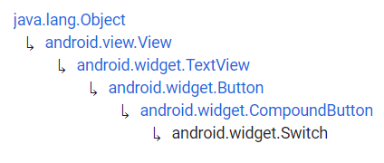
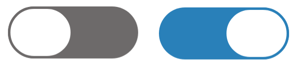

# Switch


Fuente: developer.android



Fuente: developer.android


## DEFINICIÓN

Hereda de:

<figure><figcaption><p>herencia Switch</p></figcaption></figure>

Un `Switch` es un botón deslizante que permite elegir entre dos opciones. El usuario puede deslizar hacia un lado o hacia el otro para seleccionar o simplemente tocar el botoón como si fuera un CheckBox.

## USO DESDE XML

```xml
<Switch
    android:id="@+id/swEjemplo"
    android:layout_width="wrap_content"
    android:layout_height="wrap_content"
    android:text="¿Recibir Newsletter mensual?"
    android:showText="true"
    android:textOff="No"
    android:textOn="Si"/>
```

.png>)                               .png>)

## ATRIBUTOS

### android:showText

Indica con un Booleano si se muestra el texto de los atributos `android:textOn` y `android:TextOff` sobre el `thumb`.

### android:splitTrack

Indica con un Booleano si se separa el `Thumb` del `Track` (**true**) o si se mantienen como si el `Track` estuviera debajo del `Thumb` (**false**).

### android:switchMinWidth

Define la anchura mínima del botón.

### android:switchPadding

Define la distancia mínima entre el Texto de `android:text` y el botón.

### android:switchTextAppearance

Define la Apariencia del texto que se muestra sobre el `Thumb`, es decir el que se define en `android:textOn` y en `android:textOff`.

### android:textOff

Define el texto que se muestra en el `Thumb` cuando el botón está en estado desmarcado.

### android:textOn

Define el texto que se muestra en el `Thumb` cuando el botón está en estado desmarcado.

### android:textStyle

Define el estilo del texto que se muestra con el atributo `android:text`.

### android:thumb

Define el **drawable** que se muestra en el `Thumb`.

### android:thumbTextPadding

Define el espacio entre los lados del `Thumb` y el texto en su interior.

### android:thumbTint

Define el color del `Thumb`.

### android:thumbTintMode

Define el modo de color del `Thumb`.

### android:track

Define el **drawable** que se muestra en el `Track`.

### android:trackTint

Define el color del `Track`.

### android:TrackTintMode

Define el modo de color del `Track`.

### android:typeface

El tipo de texto que se va a utilizar (normal, sans, serif, monospace).&#x20;

## PROGRAMAR EVENTOS DESDE CÓDIGO

La dinámica que siguen los Switch es similar a la de los `ToggleButton` por lo que vamos a utilizar el mismo código:


```kotlin
package com.example.android.appdeejemplo

import androidx.appcompat.app.AppCompatActivity
import android.os.Bundle
import android.widget.Switch
import android.widget.Toast

class MainActivity : AppCompatActivity() {
    override fun onCreate(savedInstanceState: Bundle?) {
        super.onCreate(savedInstanceState)
        setContentView(R.layout.activity_main)

        val tbReady: Switch = findViewById(R.id.swEjemplo)
        tbReady.setOnCheckedChangeListener{_, isChecked ->
            if (isChecked) Toast.makeText(this, "¡Perfecto! Se la enviaremos pronto.", 
            Toast.LENGTH_SHORT).show()
            else Toast.makeText(this, "¡Que lástima! No sabe lo que se pierde.", 
            Toast.LENGTH_SHORT).show()
        }
    }
}
```


.png>)                              .png>)

## PERSONALIZACIÓN


Si quiero personalizar en profundidad el `Switch`, voy a necesitar crear una View del tipo `SwitchCompat`, igual que pasaba con los Button.

El link se encuentra al inicio de la página.


En este caso vamos a personalizarlo igual que los `ToggleButton` pero con imágenes vectoriales.

Para ello vamos a necesitar personalizar por un lado el `Thumb` y por el otro el `Track`.&#x20;

El diseño será el siguiente:

<figure><figcaption><p>Diseño del Switch</p></figcaption></figure>


Para definir ese borde del `thumb` que hace que parezca que flota, debemos generar un borde en el thumb (stroke) del mismo color que el `track`.


### Personalizar Thumb

Vamos a utilizar una lista de estados para el `Thumb`:


```xml
<?xml version="1.0" encoding="utf-8"?>
<selector xmlns:android="http://schemas.android.com/apk/res/android">
    <item android:state_checked="true">
        <shape android:shape="rectangle">
            <solid android:color="#fff"></solid>
            <size android:width="50dp"
                android:height="40dp"></size>
            <corners android:radius="40dp"></corners>
            <stroke android:width="2dp" android:color="@color/colorOn"></stroke>
        </shape>
    </item>
    <item android:state_checked="false">
        <shape android:shape="rectangle">
            <solid android:color="#fff"></solid>
            <size android:width="50dp"
                android:height="40dp"></size>
            <corners android:radius="40dp"></corners>
            <stroke android:width="2dp" android:color="@color/gray"></stroke>
        </shape>
    </item>
</selector>
```


### Personalizar Track

Vamos a utilizar otra lista de estados para el `Track`:


```xml
<?xml version="1.0" encoding="utf-8"?>
<selector xmlns:android="http://schemas.android.com/apk/res/android">
    <item android:state_checked="true">
        <shape android:shape="rectangle">
            <solid android:color="@color/colorOn"></solid>
            <corners android:radius="200dp"></corners>
        </shape>
    </item>
    <item android:state_checked="false">
        <shape android:shape="rectangle">
            <solid android:color="@color/gray"></solid>
            <corners android:radius="200dp"></corners>
        </shape>
    </item>
</selector>
```


### Añadirlo al layout


```xml
<?xml version="1.0" encoding="utf-8"?>
<LinearLayout xmlns:android="http://schemas.android.com/apk/res/android"
    android:layout_width="match_parent"
    android:layout_height="match_parent"
    android:layout_margin="30dp"
    android:orientation="vertical">

    <TextView
        android:layout_width="wrap_content"
        android:layout_height="wrap_content"
        android:text="Pulse el botón cuando se sienta preparado:"
        android:paddingBottom="30dp"/>


    <Switch
        android:id="@+id/swEjemplo"
        android:layout_width="match_parent"
        android:layout_height="wrap_content"
        android:text="¿Recibir Newsletter mensual?"
        android:showText="true"
        android:textOff="No"
        android:textOn="Si"
        android:thumb="@drawable/sw_thumb"
        android:track="@drawable/sw_track"
        android:switchPadding="10dp"
        android:checked="true"/>

</LinearLayout>
```


.png>)                               .png>)
