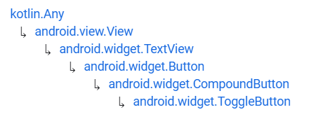

# ToggleButton


Fuente: developer.android


## DEFINICIÓN

Hereda de:

<figure><figcaption><p>Herencia ToggleButton</p></figcaption></figure>

Un botón que muestra el estado marcado (`checked`) y desmarcado (`unchecked`) con un indicador luminoso y por defecto el texto "**ON**" u "**OFF**".

## USO DESDE XML

```xml
<ToggleButton
    android:layout_width="match_parent"
    android:layout_height="wrap_content"/>
<ToggleButton
    android:layout_width="match_parent"
    android:layout_height="wrap_content"
    android:checked="true"/>
```

.png>)

## ATRIBUTOS

### android:disabledAlpha

Define el valor de transparencia del `ToggleButton` cuando se encuentra deshabilitado. Debe ser un valor de coma flotante entre `0.0` (completamente transparente) y `1.0` (completamente visible).

### android:textOff

Define el texto que se muestra en el `ToggleButton` cuando está en estado **desmarcado**.

### android:textOn

Define el texto que se muestra en el `ToggleButton` cuando está en estado **marcado**.

## PROGRAMAR EVENTOS EN CÓDIGO

La programación de eventos para los CheckBox no tiene ninguna dificultad con respecto a los que hemos visto anteriormente por lo que solamente vamos a ver el código:


```kotlin
package com.example.android.appdeejemplo

import androidx.appcompat.app.AppCompatActivity
import android.os.Bundle
import android.widget.Toast
import android.widget.ToggleButton

class MainActivity : AppCompatActivity() {
    override fun onCreate(savedInstanceState: Bundle?) {
        super.onCreate(savedInstanceState)
        setContentView(R.layout.activity_main)

        val tbReady: ToggleButton = findViewById(R.id.tbReady)
        tbReady.setOnCheckedChangeListener{_, isChecked ->
            if (isChecked) Toast.makeText(this, "¡Estamos listos! Comenzamos...", 
            Toast.LENGTH_SHORT).show()
            else Toast.makeText(this, "Vamos a descansar un rato...", 
            Toast.LENGTH_SHORT).show()
        }
    }
}
```


```xml
<ToggleButton
    android:id="@+id/tbReady"
    android:layout_width="match_parent"
    android:layout_height="wrap_content"
    android:textOn="Estoy listo"
    android:textOff="Vamos a descansar..."/>
```

.png>)                              .png>)

## PERSONALIZACIÓN

Como pueden ver, el ToggleButton tiene un diseño muy concreto, además de no muy atractivo.&#x20;

En este apartado vamos a ver una opción de personalización que permite modificar el botón al completo. Esto lo vamos a hacer con conocimientos que ya hemos adquirido a lo largo del curso.

### Lista de estados:


```xml
<?xml version="1.0" encoding="utf-8"?>
<selector xmlns:android="http://schemas.android.com/apk/res/android"
    android:enterFadeDuration="@android:integer/config_shortAnimTime"
    android:exitFadeDuration="@android:integer/config_shortAnimTime">

    <item android:drawable="@drawable/tb_ready_on" android:state_checked="true" />
    <item android:drawable="@drawable/tb_ready_off" android:state_checked="false" />
</selector>
```



Como vemos, se pueden añadir animaciones para hacer el cambio más suave.


### tb\_ready\_on

En este caso, no son imagenes vectoriales sino simples imagenes en formato png:

<figure><figcaption><p>tb_ready_on</p></figcaption></figure>

### tb\_ready\_off

<figure><figcaption><p>tb_ready_off</p></figcaption></figure>

### activity\_main.xml

<pre class="language-xml" data-title="activity_main.xml"><code class="lang-xml">&#x3C;?xml version="1.0" encoding="utf-8"?>
<strong>&#x3C;LinearLayout xmlns:android="http://schemas.android.com/apk/res/android"
</strong>    android:layout_width="match_parent"
    android:layout_height="match_parent"
    android:layout_margin="30dp"
    android:orientation="vertical">

    &#x3C;TextView
        android:layout_width="wrap_content"
        android:layout_height="wrap_content"
        android:text="Pulse el botón cuando se sienta preparado:"
        android:paddingBottom="30dp"/>

    &#x3C;ToggleButton
        android:id="@+id/tbReady"
        android:layout_width="wrap_content"
        android:layout_height="wrap_content"
        android:background="@drawable/tb_ready_bg"
        android:textOn="@null"
        android:textOff="@null"/>
&#x3C;/LinearLayout>
</code></pre>

.png>)                               .png>)

&#x20;                                                  .png>)
