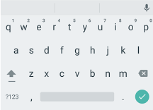
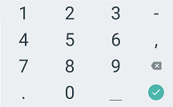
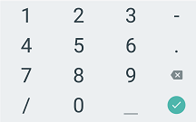
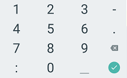
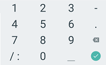
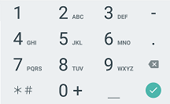

# EditText


En esta página se presupone que ha leido antes la de [TextView](textview.md) y se van a obviar las informaciones que se repiten.



Fuente: developer.android


## DEFINICIÓN

Hereda de `TextView`.

Los **EditText** son interfaces de usuario que permiten introducir y modificar texto.&#x20;

## USO DESDE XML

El ejemplo más básico de un **EditText** en la **MainActivity** sería el siguiente:


```xml
<?xml version="1.0" encoding="utf-8"?>
<LinearLayout
    xmlns:android="http://schemas.android.com/apk/res/android"
    android:layout_width="match_parent"
    android:layout_height="match_parent"
    android:orientation="vertical">

    <EditText
        android:id="@+id/etEjemplo"
        android:layout_width="wrap_content"
        android:layout_height="wrap_content"
        android:inputType="text"
        android:hint="Introduzca su nombre"
        />
    
</LinearLayout>
```



```kotlin
package com.example.android.appdeejemplo

import androidx.appcompat.app.AppCompatActivity
import android.os.Bundle

class MainActivity : AppCompatActivity() {
    override fun onCreate(savedInstanceState: Bundle?) {
        super.onCreate(savedInstanceState)
        setContentView(R.layout.activity_main)
        }
    }
}
```


El resultado es el siguiente:

.png>)

## ATRIBUTOS

La clase EditText hereda de la clase TextView por lo que comparte todos los atributos que vimos en la anterior, siendo obligatorios los mismos que lo eran en la clase TextView.

Además de los atributos importantes que vimos para la clase TextView, en este caso podemos destacar algunos otros:

### android:text

En este caso, este atributo (que se crea por defecto cuando creo un objeto del tipo EditText) es importante que se encuentre vacío, ya que sino el usuario tendrá que borrar el texto para escribir el que él considere.

### android:hint

Por el contrario, si quiero mostrar un texto que se borre cuando el usuario comience a escribir, tendré que utilizar este atributo.

Estos hints son muy importantes para guiar al usuario sobre qué es lo que queremos que escriba en dicho texto editable.

### android:background

Atributo heredado de View.

Permite cambiar el fondo de nuestra interfaz. Puede darse un valor que sea color, drawable o imagen.

### android:digits

En un EditText me permite limitar los caracteres que se pueden introducir a aquellos que se encuentran expresados dentro de este atributo:

```xml
<EditText android:digits="0123456789"/>
```

Esto implica que solo podemos utilizar los dígitos del 0 al 9 en nuestro input.

### android:ems

Marca la anchura del EditText en la unidad de medida **ems**.


La unidad relativa **ems** se usa para determinar el tamaño de un carácter según la cantidad de puntos que use la fuente del texto. Quiere decir que hablar de 3em representa 3 veces el tamaño de la fuente utilizada.


### android:inputType

Es el atributo más importante de un EditText ya que marcará el tipo de input que nuestro dispositivo nos va a permitir introducir cuando el foco se encuentre en el EditText. Existen varios tipos, como por ejemplo:

#### text

Es texto plano.

<figure><figcaption><p>android:inputType="text"</p></figcaption></figure>

#### textPassword

Es texto plano pero se oculta tras pulsar cada tecla.

#### textEmailAddress

Es texto plano acompañado de los símbolos utilizados habitualmente en direcciones de email.

<figure><figcaption><p>android:inputType="textEmailAddress"</p></figcaption></figure>

#### number

Son números.

<figure><figcaption><p>android:inputType="number"</p></figcaption></figure>

#### numberPassword

Son números pero se ocultan tras pulsar cada tecla.

#### date

Son números acompañados de los símbolos utilizados habitualmente en fechas.

<figure><figcaption><p>android:inputType="date"</p></figcaption></figure>

#### time

Son números acompañados de los símbolos utilizados habitualmente en horas.

<figure><figcaption><p>android:inputType="time"</p></figcaption></figure>

#### datetime

Son números acompañados de los símbolos utilizados habitualmente en fechas y en horas.

<figure><figcaption><p>android:inputType="datetime"</p></figcaption></figure>

#### phone

Son números acompañados de los símbolos utilizados habitualmente en números telefónicos.

<figure><figcaption><p>android:inputType="phone"</p></figcaption></figure>

## PROGRAMAR EVENTOS EN EDITTEXT

En los **EditText** igual que en todas las Views se pueden programar eventos. Estos tienen un evento por defecto que es muy útil para mejorar la experiencia de usuario:

### Ejemplo addTextChangedListener

Con `addTextChangedListener`, podemos programar un evento que realice una acción cada vez que el texto introducido es modificado. Combinado con `setError` se convierte en una herramienta muy potente.

Con `setError` podemos definir errores que avisen al usuario si se cumplen determinadas características del input introducido. Con el ejemplo se verá más claro:


```xml
<?xml version="1.0" encoding="utf-8"?>
<LinearLayout xmlns:android="http://schemas.android.com/apk/res/android"
    android:layout_width="match_parent"
    android:layout_height="match_parent"
    android:orientation="vertical">

    <EditText
        android:id="@+id/etEjemplo"
        android:layout_width="wrap_content"
        android:layout_height="wrap_content"
        android:layout_margin="30dp"
        android:inputType="textEmailAddress"
        android:background="@drawable/style_etbg"
        android:drawableStart="@drawable/email"
        android:drawablePadding="20sp"
        android:paddingBottom="20sp"
        android:paddingTop="20sp"
        android:paddingStart="10sp"
        android:paddingEnd="10sp"
        android:hint="Introduzca su email"

        />

</LinearLayout>
```



```kotlin
package com.example.android.appdeejemplo

import androidx.appcompat.app.AppCompatActivity
import android.os.Bundle
import android.widget.EditText
import androidx.core.widget.addTextChangedListener

class MainActivity : AppCompatActivity() {
    override fun onCreate(savedInstanceState: Bundle?) {
        super.onCreate(savedInstanceState)
        setContentView(R.layout.activity_main)

        val etEjemplo: EditText = findViewById(R.id.etEjemplo)
        etEjemplo.addTextChangedListener {
            if (etEjemplo.text.length == 0) etEjemplo.setError("Campo Vacío.")
        }
    }
}
```


Con este ejemplo, el código en Kotlin comprueba sí el input ha pasado a estar vacío y lanza un error avisando al usuario de que dicho campo se encuentra vacío.

.png>)
