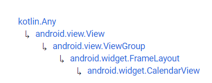

# CalendarView


Fuente: developer.android


## DEFINICIÓN

Hereda de:

<figure><figcaption><p>Herencia de CalendarView</p></figcaption></figure>

Esta clase presenta un calendario para seleccionar fechas. El rango de fechas soportado por el calendario es configurable.

La apariencia exacta y la interacción concreta con esta View puede variar entre Versiones de Sistema Operativo y temas instalados en el equipo.&#x20;

De manera general un usuario puede seleccionar una fecha pinchando en ella y puede moverse entre meses scroleando.

## USO DESDE XML

```xml
<CalendarView
    android:id="@+id/cvEjemplo"
    android:layout_width="match_parent"
    android:layout_height="wrap_content"/>
<TextView
    android:id="@+id/tvCalendar"
    android:layout_width="wrap_content"
    android:layout_height="wrap_content"
    android:text="Fecha Seleccionada: XX/XX/XXXX"/>
```

&#x20;                                               .png>)

## ATRIBUTOS

### android:dateTextAppearance

Define la apariencia del texto que representa los números de los días en el calendario.

### android:firstDayOfWeek

Representa el primer día de la semana de acuerdo con la clase `java.util.Calendar`.


La clase [`java.util.Calendar`](https://developer.android.com/reference/kotlin/java/util/Calendar.html) es una clase abstracta que proporciona métodos para la conversión de un momento concreto en el tiempo a un conjunto de datos que puedan ser representados como una fecha (Año, Mes, Dia del mes, Hora...).

Esta clase provee muchos métodos pero lo que nos interesa para este atributo concreto es **como conseguir que el primer día de la semana sea Lunes y no Domingo**.

Esto lo veremos más adelante, en el apartado **Personalización**.


### android:focusedMonthDateColor

El color de la fecha que se encuentra seleccionada en el mes que tiene el foco.


Este atributo ha sido deprecado en la API Level 23. Debido a la inclusión de [Material Design](https://m2.material.io/components/date-pickers).


### android:maxDate

Define la fecha máxima que se puede mostrar en formato `MM/DD/YYYY`.

### android:minDate

Define la fecha mínima que se puede mostrar en formato `MM/DD/YYYY`.

### android:SelecetedDateVerticalBar

_Define el drawable de las barras verticales que se muestran al inicio y al final de la fecha elegida._


Este atributo ha sido deprecado en la API Level 23. Debido a la inclusión de [Material Design](https://m2.material.io/components/date-pickers).


### android:selectedWeekBackgroundColor <a href="#android-selectedweekbackgroundcolor" id="android-selectedweekbackgroundcolor"></a>

Define el color de fondo de la semana elegida.


Este atributo ha sido deprecado en la API Level 23. Debido a la inclusión de [Material Design](https://m2.material.io/components/date-pickers).


### android:showWeekNumber <a href="#android-showweeknumber" id="android-showweeknumber"></a>

Define si se muestra el número de la semana o no.


Este atributo ha sido deprecado en la API Level 23. Debido a la inclusión de [Material Design](https://m2.material.io/components/date-pickers).


### android:shownWeekCount <a href="#android-shownweekcount" id="android-shownweekcount"></a>

Define el número de semanas que se van a mostrar.


Este atributo ha sido deprecado en la API Level 23. Debido a la inclusión de [Material Design](https://m2.material.io/components/date-pickers).


### android:unfocusedMonthDateColor <a href="#attr_android-unfocusedmonthdatecolor" id="attr_android-unfocusedmonthdatecolor"></a>

El color de la fecha que se encuentra seleccionada en el mes que NO tiene el foco.


Este atributo ha sido deprecado en la API Level 23. Debido a la inclusión de [Material Design](https://m2.material.io/components/date-pickers).


### android:weekDayTextAppearance <a href="#attr_android-weekdaytextappearance" id="attr_android-weekdaytextappearance"></a>

Define la apariencia del texto que representa las iniciales de los días de la semana en el calendario.

### android:weekNumberColor <a href="#attr_android-weeknumbercolor" id="attr_android-weeknumbercolor"></a>

Define el color del número de semana.


Este atributo ha sido deprecado en la API Level 23. Debido a la inclusión de [Material Design](https://m2.material.io/components/date-pickers).


### android:weekSeparatorLineColor <a href="#attr_android-weekseparatorlinecolor" id="attr_android-weekseparatorlinecolor"></a>

Define el color de la linea que separa las semanas.


Este atributo ha sido deprecado en la API Level 23. Debido a la inclusión de [Material Design](https://m2.material.io/components/date-pickers).


## PERSONALIZACIÓN

### Definir un Listener

Lo más importante de un CalendarView es ser capaz de ejecutar código al seleccionar una fecha. En este caso, podemos definir un **Listener** del tipo `setOnDateChangeListener(CalendarView, year, month, day)`.

```kotlin
package com.example.android.appdeejemplo

import androidx.appcompat.app.AppCompatActivity
import android.os.Bundle
import android.widget.CalendarView
import android.widget.TextView


class MainActivity : AppCompatActivity() {
    override fun onCreate(savedInstanceState: Bundle?) {
        super.onCreate(savedInstanceState)
        setContentView(R.layout.activity_main)

        val cvEjemplo = findViewById<CalendarView>(R.id.cvEjemplo)
        val tvCalendar = findViewById<TextView>(R.id.tvCalendar)

        cvEjemplo.setOnDateChangeListener { cv, year, month, day ->
            var date = "$day/${month+1}/$year"
            tvCalendar.text = "Fecha Seleccionada: $date"
        }
    }
}
```

.png>)                                (1).png>)


Es importante tener en cuenta que el mes se maneja como un Array y por lo tanto, los meses van de 0 a 11 a nivel interno.


### Definir limitaciones en el Calendario

En ocasiones, las opciones del calendario se deben limitar para mejorar la experiencia de usuario.&#x20;

Por ejemplo, si hay que coger un tren de ida y otro de vuelta, la fecha de regreso no puede ser menor que la de ida. Tampoco se puede reservar un tren anterior a la fecha de hoy ni dentro de un año y medio.

Todo esto, hemos visto que se puede limitar desde XML con atributos, pero lo ideal es limitarlo dinámicamente desde código.

Para hacer esto, hacemos lo siguiente:

* Generamos una instancia de la clase [`java.util.Calendar()`](https://developer.android.com/reference/kotlin/java/util/Calendar).

```kotlin
val calendar = Calendar.getInstance()
```

* Generamos una variable que almacene el día de hoy, ayudados por la instancia de `Calendar()`, y la almacenamos en el atributo `minDate`:

```kotlin
val today = calendar.timeInMillis
cvEjemplo.minDate = today
```

* Seteamos la instancia de Calendar() en el último día permitido (en este caso el 31/12/2023).

```kotlin
calendar.set(2023, 11, 31)
```

* Generamos una variable que almacene el último día permitido, ayudados por la instancia de `Calendar()`, y la almacenamos en el atributo `maxDate`:

```kotlin
val lastDay = calendar.timeInMillis
cvEjemplo.maxDate = lastDay
```


Como vemos arriba, es fundamental mostrar las fechas en **milisegundos**.

Esta es la forma estandarizada de referirse a las fechas en computación, se denomina **tiempo Epoch** o **tiempo UNIX** y referencia exactamente a los milisegundos que han pasado desde el 1 de enero de 1970.&#x20;

Para iOS el tiempo Epoch comienza desde el 1 de enero de 1904.

Para Microsoft el tiempo Epoch comienza desde el 1 de enero de 1601.

**Normalmente se utiliza de manera estandarizada el tiempo UNIX.**


De esta manera el código queda como sigue:

```kotlin
package com.example.android.appdeejemplo

import androidx.appcompat.app.AppCompatActivity
import android.os.Bundle
import android.widget.CalendarView
import android.widget.TextView
import java.util.Calendar


class MainActivity : AppCompatActivity() {
    override fun onCreate(savedInstanceState: Bundle?) {
        super.onCreate(savedInstanceState)
        setContentView(R.layout.activity_main)

        val cvEjemplo = findViewById<CalendarView>(R.id.cvEjemplo)
        val tvCalendar = findViewById<TextView>(R.id.tvCalendar)

        cvEjemplo.setOnDateChangeListener { cv, year, month, day ->
            var date = "$day/${month+1}/$year"
            tvCalendar.text = "Fecha Seleccionada: $date"
        }

        val calendar = Calendar.getInstance()

        val today = calendar.timeInMillis
        cvEjemplo.minDate = today

        calendar.set(2023, 11, 31)
        val lastDay = calendar.timeInMillis
        cvEjemplo.maxDate = lastDay

    }
}
```

.png>)                              .png>)

### Cambiar primer día de la semana

Como vemos en los ejemplos superiores, el primer día de la semana está referenciado como Domingo mientras que en España, por ejemplo, se empiezan a contar (de manera general) desde el lunes.&#x20;

Para cambiar esto, vamos a modificar el valor de android:firstDayOfWeek desde código, sin embargo, se va a tener que realizar un calculo concreto:

```kotlin
cvEjemplo.firstDayOfWeek = (cvEjemplo.firstDayOfWeek + 1) % 7
```

&#x20;                                             .png>)
