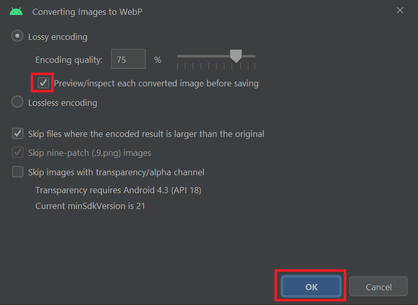

# ImageView


Fuente: developer.android


## DEFINICIÓN

Hereda de `View`.

Muestra un recurso de imagen, por ejemplo, un Bitmap o un Drawable.&#x20;

ImageView es tambien utilizado para aplicar colores a una imagen o escalarlas, haciendo uso de sus métodos.

## USO DESDE XML

```xml
<ImageView
    android:layout_width="wrap_content"
    android:layout_height="wrap_content"
    android:src="@drawable/im_pyramidhead"/>
```

&#x20;                                                    (1).png>)

## ATRIBUTOS

### android:adjustViewBounds

Si lo marcamos como `true`, limitará el espacio ocupado por el drawable a aquel que puede ocupar manteniendo su ratio de aspecto.

### android:cropToPadding

Si lo marcamos como `true`, la imagen se cortará para cumplir los Paddings marcados en la misma.

### android:maxHeight

Marca la altura máxima permitida para la imagen.

### android:maxWidth

Marca la anchura máxima permitida para la imagen.

### android:scaleType

Define la forma en que la imagen debe ser escalada para cumplir con las restricciones dadas.

Puede ser una de las siguientes:

* **center** -> La imagen se centra en la View sin realizar ningún escalado.
* **centerCrop** -> Escala la imagen de manera uniforme (manteniendo el ratio de aspecto). Sus medidas serán **iguales o superiores** a las de origen. La imagen se centra en la View.
* **centerInside** -> Escala la imagen de manera uniforme (manteniendo el ratio de aspecto). Sus medidas serán **iguales o menores** a las de origen. La imagen se centra en la View.
* **fitCenter** -> Escalado utilizando  [`android.graphics.Matrix.ScaleToFit#CENTER`](https://developer.android.com/reference/kotlin/android/graphics/Matrix.ScaleToFit.html).
* **fitEnd** -> Escalado utilizando [`android.graphics.Matrix.ScaleToFit#END`](https://developer.android.com/reference/kotlin/android/graphics/Matrix.ScaleToFit.html).
* **fitStart** -> Escalado utilizando [`android.graphics.Matrix.ScaleToFit#START`](https://developer.android.com/reference/kotlin/android/graphics/Matrix.ScaleToFit.html).
* **fitXY** -> Escalado utilizando [`android.graphics.Matrix.ScaleToFit#FILL`](https://developer.android.com/reference/kotlin/android/graphics/Matrix.ScaleToFit.html).
* **matrix** -> Escalado utilizando una matriz de imagen. &#x20;

### android:src

Define el origen del recurso de imagen que se va a utilzar.&#x20;

### android:tint

El color con el que se va a tintar la imagen.

## USO DE RECURSOS ONLINE

En el caso de que quiera utilizar una imagen que se encuentre en Internet, por ejemplo, como hacen las redes sociales para cargar nuestras imagenes de la base de datos, debemos realizar varios pasos:

### Solicitar permiso de Internet

En primer lugar se debe ir al `AndroidManifest.xml` y solicitar permisos para el uso de Internet. Esto se hace con la siguiente línea de código:

&#x20;

```xml
<manifest>
....
<uses-permission android:name="android.permission.INTERNET" />

<application>
.....
```

### Importar la biblioteca Picasso

Para ver imagenes desde la Red en nuestra aplicación debemos utilizar una biblioteca externa.&#x20;

Para esto existen dos referencias claras, una de ellas es `Picasso` (que es la que vamosa  utilizar) y la otra es `Glide`.

Para utilizarla debemos añadir a nuestro script de graddle `build.graddle(:app)` la siguiente linea:

```groovy
implementation 'com.squareup.picasso:picasso:2.71828'
```

### Utilizar Picasso para mostrar la Imagen

Ahora que ya hemos dejado el terreno preparado necesitamos implementar el código.

Primero necesitamos una ImageView con `android:id`:

```xml
<ImageView
    android:id="@+id/ivUrl"
    android:layout_width="match_parent"
    android:layout_height="match_parent"
    android:scaleType="center"/>
```

Y después debemos utilizar el código en Kotlin para llamar a Picasso y mostrar nuestra imagen:


```kotlin
package com.example.android.appdeejemplo

import androidx.appcompat.app.AppCompatActivity
import android.os.Bundle
import android.widget.ImageView
import com.squareup.picasso.Picasso

class MainActivity : AppCompatActivity() {
    override fun onCreate(savedInstanceState: Bundle?) {
        super.onCreate(savedInstanceState)
        setContentView(R.layout.activity_main)

        val ivUrl: ImageView = findViewById(R.id.ivUrl)
        val ImageUrl = "https://www.urldeejemplo.com"
        Picasso.get().load(ImageUrl).into(ivUrl)
    }
}
```


&#x20;                                                  .png>)

## OPTIMIZACIÓN DE IMÁGENES

Cuando se utiliza una imagen en nuestra aplicación surge el problema de que en función de la pantalla en la que veamos esa Imagen, la calidad será mejor o peor.&#x20;

Para solucionarlo, Android nos permite crear imágenes con **densidades de pixeles diferentes** y el propio dispositivo decidirá cual es la más adecuada para él.&#x20;

Sin embargo esto es muy trabajoso y además genera un uso de almacenamiento muy superior.

En este apartado veremos como crear de manera fácil estas diferentes imágenes y como reducir el espacio que ocupan:

### android-drawable-importer


Fuente: github


`Android Drawable Importer` es un plugin para **Android Studio** que facilita la creación de Imágenes con diferente **densidad de pixeles** a partir de una imagen base.

#### Instalación

Para instalarlo, solo debe descargarse la última release del enlace superior y esto le descargará un archivo con extensión `.zip`  Con un nombre parecido al siguiente `ADI-hack-0.81.zip` (variará en función de la versión).

Una vez hecho esto, en Android Studio debe buscar en la **Barra de Herramientas**, en `File / Settings / Plugins` y una vez ahí buscar lo siguiente:

<figure><figcaption><p>Instalación del Plugin</p></figcaption></figure>

En la ventana emergente busca el archivo que se ha descargado (no es necesario descomprimir) y listo, tendrá que reiniciar Android Studio para tener todo en orden.

#### Funcionamiento

Una vez tenga el plugin instalado y habilitado, cuando vaya a añadir un nuevo `drawable`, se encontrará las siguientes nuevas opciones:

<figure><figcaption><p>Nuevas opciones del plugin</p></figcaption></figure>


Si no le aparecen las nuevas opciones, compruebe que tiene el nuevo Plugin habilitado.


Vamos a utilizar la `Batch Drawable Import` para importar **imagenes no vectoriales**:

* Para empezar, añadimos la imagen que queremos importar:

<figure><figcaption><p>Añadimos una nueva imagen</p></figcaption></figure>

* Después seleccionamos el contexto, lo normal será que se añadan al superior:

<figure><figcaption><p>Selección de contexto</p></figcaption></figure>

* Por último elegimos las densidades de píxeles que queremos que se creen y el nombre de salida de las imáegnes:

<figure><figcaption><p>Selección de densidades de pixeles y nombre de salida</p></figcaption></figure>

* Esto creará una carpeta dentro de drawable con el nombre de salida que contendrá las imágenes con diferentes densidades.

### Reducción de tamaño

Como hemos visto, al crear estas imágenes, se generan varios MegaBytes de datos. Para evitar aumentar de manera considerable el peso de nuestra App al realizar esta técnica, podemos **convertir nuestras imágenes a  formato webp**.

#### Conversión de imagen a webp

* Para empezar, seleccionamos la imagen que queremos convertir y con click derecho, buscamos la opción:

<figure><figcaption><p>Seleccionar la Opción correcta</p></figcaption></figure>

* Posteriormente nos debemos asegurar de que la preview está marcada:

<figure><figcaption><p>Preview marcada</p></figcaption></figure>

* Por último, en la preview vemos cómo va a quedar nuestra imagen:&#x20;
  * En el centro vemos los colores que se van a eliminar y de donde.
  * Debajo de las imágenes vemos lo que ocupaba y lo que ocupará.
  * En el extremo derecho marca el porcentaje de calidad (por defecto se pone en 75%).

<figure><figcaption><p>Preview</p></figcaption></figure>

Una vez hecho esto con todas las imagenes creadas por el Plugin, habremos reducido en gran medida el peso de nuestra App.
