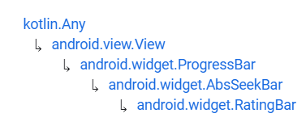

# RatingBar


Fuente: developer.android


## DEFINICIÓN

Hereda de:

<figure><figcaption><p>Herencia de RatingBar</p></figcaption></figure>

Una RatingBar es una extensión de SeekBar y ProgressBar que muestra una puntuación en estrellas. El usuario puede tocar o deslizar para definir una puntuación.&#x20;

Se puede utilizar un progreso secundario como en las ProgressBar para mostrar al usuario una media de las valoraciones pasadas.

## USO DESDE XML

```xml
<RatingBar
    android:id="@+id/rbEjemplo"
    android:layout_width="wrap_content"
    android:layout_height="wrap_content"
    android:stepSize="0.5"
    android:numStars="5"
    android:rating="3.5"/>
```

&#x20;                                               (1).png>)

## ATRIBUTOS

### android:isIndicator

Define si el RatingBar es simplemente un indicador (`true`) o permite la interacción del usuario (`false`).

### android:numStars

Define el número de estrellas que se muestran en el RatingBar.


Si en `android:layoutWidth` hemos puesto la opción "`matchParent`", se llenará de estrellas hasta cubrir esa anchura y se ignorará el `android:numStars`.


### android:rating

Define el valor de puntuación que se va a mostrar al usuario.

### android:stepSize

Define cual es la distancia mínima entre valoraciones. Es recomendable que se utilice solo 0.5 ya que sino, se puede confundir al usuario y estropear la experiencia.

## PROGRAMAR EVENTOS DESDE CÓDIGO

### setOnRatingBarChangeListener


Fuente: developer.android


De la misma manera que ocurría con los `SeekBar`, existe un listener específico para los `RatingBar`.


```xml
<?xml version="1.0" encoding="utf-8"?>
<ScrollView xmlns:android="http://schemas.android.com/apk/res/android"
    android:layout_width="match_parent"
    android:layout_height="match_parent">
    <LinearLayout
        android:layout_width="match_parent"
        android:layout_height="match_parent"
        android:orientation="vertical"
        android:layout_margin="15dp">
        <TextView
            android:layout_width="match_parent"
            android:layout_height="wrap_content"
            android:text="Valore la película que se ha montado:"
            android:padding="30dp"/>
        <RatingBar
            android:id="@+id/rtbEjemplo"
            android:layout_width="wrap_content"
            android:layout_height="wrap_content"
            android:stepSize="0.5"
            android:numStars="5"
            android:rating="3.5"/>
        <TextView
            android:id="@+id/tvRating"
            android:layout_width="match_parent"
            android:layout_height="wrap_content"
            android:text="SU VALORACIÓN: 3.5 / 5"
            android:padding="30dp"/>
    </LinearLayout>
</ScrollView>
```



```kotlin
package com.example.android.appdeejemplo

import androidx.appcompat.app.AppCompatActivity
import android.os.Bundle
import android.widget.RatingBar
import android.widget.TextView
import android.widget.Toast


class MainActivity : AppCompatActivity() {
    override fun onCreate(savedInstanceState: Bundle?) {
        super.onCreate(savedInstanceState)
        setContentView(R.layout.activity_main)

        val rtbEjemplo = findViewById<RatingBar>(R.id.rtbEjemplo)
        rtbEjemplo.setOnRatingBarChangeListener { ratingBar, rating, fromUser ->
            Toast.makeText(this, "Ha cambiado su valoración", Toast.LENGTH_LONG).show()

            val tvRating = findViewById<TextView>(R.id.tvRating)
            tvRating.text = "SU VALORACIÓN: $rating / 5"
        }
    }
}
```


.png>)                               
