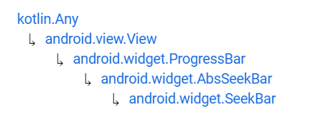

# SeekBar


Fuente: developer.android


## DEFINICIÓN

Hereda de:

<figure><figcaption><p>Herencia de SeekBar</p></figcaption></figure>

Una `SeekBar` es una extensión de `ProgressBar` que añade un botón (**thumb**) que se puede arrastrar. El usuario puede tocar el `Thumb` y mover de izquierda a derecha para definir el progreso de la barra.

Existen dos tipos de SeekBar:

* **Normal** -> Es como un `ProgressBar` pero el usuario puede setear la posición del `Thumb`.
* **Discreta** -> Incluye una serie de marcas que definen los puntos en los que se puede setear el `Thumb`.

## USO EN XML


```xml
<?xml version="1.0" encoding="utf-8"?>
<ScrollView xmlns:android="http://schemas.android.com/apk/res/android"
    android:layout_width="match_parent"
    android:layout_height="match_parent">
    <LinearLayout
        android:layout_width="match_parent"
        android:layout_height="match_parent"
        android:orientation="vertical"
        android:layout_margin="15dp">
        <SeekBar
            android:id="@+id/sbNormal"
            android:layout_width="match_parent"
            android:layout_height="wrap_content"
            android:padding="20dp"/>
        <SeekBar
            android:id="@+id/sbDiscreta"
            style="@style/Widget.AppCompat.SeekBar.Discrete"
            android:layout_width="match_parent"
            android:layout_height="wrap_content"
            android:padding="20dp"
            android:max="10"/>
    </LinearLayout>
</ScrollView>
```


&#x20;                                         .png>)

## ATRIBUTOS


Una SeekBar utiliza los atributos heredados de ProgressBar para gestionar el progreso.&#x20;


Para controlar el Thumb, se han añadido los siguientes atributos:

### android:thumb

Define el drawable que se mostrará en el Thumb.

### android:thumbTint

Define el color que se aplica al Thumb.

### android:tickMark

Define el drawable que se mostrará en las marcas de progreso.

### android:tickMarkTint

Define el color que se aplica a las marcas de progreso.

## PROGRAMAR EVENTOS DESDE CÓDIGO

### setOnSeekBarChangeListener


Fuente: developer.android


El método `setOnSeekBarChangeListener()` es el que utilizamos para gestionar los eventos que se dan en una `SeekBar`.

El método `setOnSeekBarChangeListener()` recibe un objeto del tipo `seekBar.OnSeekBarChangeListener{}` y contiene los siguientes controladores:

#### onProgressChanged(seekBar: seekBar?, progress: Int, fromUser: Boolean)

Controla cualquier cambio sufrido por la SeekBar.&#x20;

En este método es donde podemos gestionar el comportamiento de otros elementos en función del progreso de la barra. Esto gracias al argumento `progress: Int`.

También podemos diferenciar si la modificación la ha realizado el sistema o el usuario. Esto gracias al argunemnto `fromUser: Boolean`.

**onStartTrackingTouch(seekBar: seekBar?)**

Controla el momento en el que se comienza a mover el thumb.

**onStopTrackingTouch(seekBar: seekBar?)**

Controla el momento en el que se deja de mover el thumb.

### Código

He implementado una pequeña App para que vean como se puede controlar cada pequeño detalle de una SeekBar.


```xml
<?xml version="1.0" encoding="utf-8"?>

<ScrollView xmlns:android="http://schemas.android.com/apk/res/android"
    android:layout_width="match_parent"
    android:layout_height="match_parent">
    <LinearLayout
        android:layout_width="match_parent"
        android:layout_height="match_parent"
        android:orientation="vertical"
        android:layout_margin="15dp">
        <TextView
            android:layout_width="match_parent"
            android:layout_height="wrap_content"
            android:text="Prueba de setOnSeekBarChangeListener"
            android:padding="30dp"/>
        <SeekBar
            android:id="@+id/sbNormal"
            android:layout_width="match_parent"
            android:layout_height="wrap_content"
            android:padding="20dp" />
        <TextView
            android:id="@+id/tvMod"
            android:layout_width="match_parent"
            android:layout_height="wrap_content"
            android:text="Se ha modificado el progreso?: NO"
            android:padding="30dp"/>
        <TextView
            android:id="@+id/tvUsuario"
            android:layout_width="match_parent"
            android:layout_height="wrap_content"
            android:text="Quien ha modificado el progreso: ---"
            android:padding="30dp"/>
        <TextView
            android:id="@+id/tvInicioCambio"
            android:layout_width="match_parent"
            android:layout_height="wrap_content"
            android:text="Se ha iniciado un cambio?: NO"
            android:padding="30dp"/>
        <TextView
            android:id="@+id/tvFinCambio"
            android:layout_width="match_parent"
            android:layout_height="wrap_content"
            android:text="Se ha soltado el Thumb?: NO"
            android:padding="30dp"/>
        <TextView
            android:id="@+id/tvProgreso"
            android:textStyle="bold"
            android:textSize="18sp"
            android:layout_width="match_parent"
            android:layout_height="wrap_content"
            android:text="PROGRESO:    --%"
            android:paddingTop="60dp"/>
        <Button
            android:id="@+id/btProgreso"
            android:layout_width="match_parent"
            android:layout_height="wrap_content"
            android:layout_marginTop="30dp"
            android:text="Modificar Progreso"/>
    </LinearLayout>
</ScrollView>
```



```kotlin
package com.example.android.appdeejemplo

import androidx.appcompat.app.AppCompatActivity
import android.os.Bundle
import android.widget.Button
import android.widget.SeekBar
import android.widget.TextView
import kotlin.random.Random


class MainActivity : AppCompatActivity() {
    override fun onCreate(savedInstanceState: Bundle?) {
        super.onCreate(savedInstanceState)
        setContentView(R.layout.activity_main)

        var sbNormal = findViewById<SeekBar>(R.id.sbNormal)

        val tvMod = findViewById<TextView>(R.id.tvMod)
        val tvUsuario = findViewById<TextView>(R.id.tvUsuario)
        val tvInicioCambio = findViewById<TextView>(R.id.tvInicioCambio)
        val tvFinCambio = findViewById<TextView>(R.id.tvFinCambio)
        val tvProgreso = findViewById<TextView>(R.id.tvProgreso)
        val btProgreso = findViewById<Button>(R.id.btProgreso)

        btProgreso.setOnClickListener {
            sbNormal.progress = Random(System.nanoTime()).nextInt(100)
        }

        sbNormal.setOnSeekBarChangeListener(object: SeekBar.OnSeekBarChangeListener{
            override fun onProgressChanged(seekBar: SeekBar?, progress: Int, fromUser: Boolean) {

                tvMod.text = "Se ha modificado el progreso?: SI"
                tvProgreso.text = "PROGRESO:    $progress%"

                if (fromUser) tvUsuario.text ="Quien ha modificado el progreso: USUARIO"
                else {
                    tvUsuario.text = "Quien ha modificado el progreso: SISTEMA"
                    tvFinCambio.text = "Se ha soltado el Thumb?: NO"
                }
            }

            override fun onStartTrackingTouch(seekBar: SeekBar?) {
                tvInicioCambio.text = "Se ha iniciado un cambio?: SI"
                tvFinCambio.text = "Se ha soltado el Thumb?: NO"
            }

            override fun onStopTrackingTouch(seekBar: SeekBar?) {
                tvInicioCambio.text = "Se ha iniciado un cambio?: YA NO"
                tvFinCambio.text = "Se ha soltado el Thumb?: SI"
            }

        })
    }
}
```



Es recomendable que la implementen en su laboratorio de pruebas para entender el funcionamiento ya que con imágenes no se ve del todo bien.

Cuando se está produciendo el cambio, hay una serie de marcadores que se actualizan en vivo.

Cuando pulsamos el botón inferior, la App entiende que ha sido el sistema el que ha modificado el progreso.


 (1) (1).png>)                               .png>)

&#x20;                                                  (1).png>)
