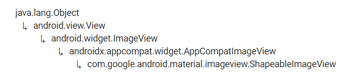

# ShapeableImageView


Fuente: developer.android


## DEFINICIÓN

Hereda de:

<figure><figcaption><p>Herencia ShapeableImageView</p></figcaption></figure>

Una `ImageView` que dibuja el **bitMap** con la forma que se halla definido.

## USO DESDE XML

```xml
<com.google.android.material.imageview.ShapeableImageView
    android:id="@+id/siv1"
    android:layout_width="wrap_content"
    android:layout_height="wrap_content"
    android:maxWidth="150dp"
    android:maxHeight="150dp"
    android:padding="5dp"
    android:src="@drawable/shapeable_image" />
```

&#x20;                                             .png>)

## ATRIBUTOS

### app:shapeAppearanceOverlay

Define el estilo de la Imagen.

### app:StrokeColor

Define el color del contorno de la Imagen.

### app:StrokeWidth

Define la anchura del contorno.

## PERSONALIZACIÓN

### styles.xml

La personalización de las imagenes se hace directamente desde el recurso de estilos y quedaría una cosa tal que así:


```xml
<?xml version="1.0" encoding="utf-8"?>
<resources xmlns:tools="http://schemas.android.com/tools">
    <style name="Circular">
        <item name="cornerSize">50%</item>
    </style>
    <style name="RoundedSquare">
        <item name="cornerSize">10%</item>
    </style>
    <style name="CornerCut">
        <item name="cornerSize">15dp</item>
        <item name="cornerFamily">cut</item>
    </style>
    <style name="DiamondCut">
        <item name="cornerSize">75dp</item>
        <item name="cornerFamily">cut</item>
    </style>
    <style name="SpecificCornerCut">
        <item name="cornerSizeTopRight">75dp</item>
        <item name="cornerFamilyTopRight">cut</item>
        <item name="cornerSizeBottomLeft">75dp</item>
        <item name="cornerFamilyBottomLeft">cut</item>
    </style>
    <style name="SpecificCornerRounded">
        <item name="cornerSizeTopRight">75dp</item>
        <item name="cornerFamilyTopRight">rounded</item>
        <item name="cornerSizeBottomLeft">75dp</item>
        <item name="cornerFamilyBottomLeft">rounded</item>
    </style>
</resources>
```


En este caso tenemos 6 estilos diferentes.

Si vamos al layout XML, podremos aplicar dichos estilos:


```xml
<?xml version="1.0" encoding="utf-8"?>

<ScrollView xmlns:android="http://schemas.android.com/apk/res/android"
xmlns:app="http://schemas.android.com/apk/res-auto"
xmlns:tools="http://schemas.android.com/tools"
    android:layout_width="match_parent"
    android:layout_height="match_parent">
    <LinearLayout
        android:layout_width="match_parent"
        android:layout_height="match_parent"
        android:orientation="vertical"
        android:layout_margin="100dp">

        <com.google.android.material.imageview.ShapeableImageView
            android:id="@+id/siv1"
            android:layout_width="150dp"
            android:layout_height="150dp"
            android:padding="5dp"
            android:layout_marginBottom="15dp"
            android:src="@drawable/shapeable_image"
            app:shapeAppearanceOverlay="@style/Circular"/>

        <com.google.android.material.imageview.ShapeableImageView
            android:id="@+id/siv2"
            android:layout_width="150dp"
            android:layout_height="150dp"
            android:maxWidth="150dp"
            android:maxHeight="150dp"
            android:padding="5dp"
            android:layout_marginBottom="15dp"
            android:src="@drawable/shapeable_image"
            app:shapeAppearanceOverlay="@style/Circular"
            app:strokeColor="#00BCD4"
            app:strokeWidth="5dp"/>
        <com.google.android.material.imageview.ShapeableImageView
            android:id="@+id/siv3"
            android:layout_width="150dp"
            android:layout_height="150dp"
            android:maxWidth="150dp"
            android:maxHeight="150dp"
            android:padding="5dp"
            android:layout_marginBottom="15dp"
            android:src="@drawable/shapeable_image"
            app:shapeAppearanceOverlay="@style/SpecificCornerCut"/>
        <com.google.android.material.imageview.ShapeableImageView
            android:id="@+id/siv4"
            android:layout_width="150dp"
            android:layout_height="150dp"
            android:maxWidth="150dp"
            android:maxHeight="150dp"
            android:padding="5dp"
            android:layout_marginBottom="15dp"
            android:src="@drawable/shapeable_image"
            app:shapeAppearanceOverlay="@style/SpecificCornerRounded"
            app:strokeColor="#00BCD4"
            app:strokeWidth="5dp" />
        <com.google.android.material.imageview.ShapeableImageView
            android:id="@+id/siv5"
            android:layout_width="150dp"
            android:layout_height="150dp"
            android:maxWidth="150dp"
            android:maxHeight="150dp"
            android:padding="5dp"
            android:layout_marginBottom="15dp"
            android:src="@drawable/shapeable_image"
            app:shapeAppearanceOverlay="@style/RoundedSquare"/>
        <com.google.android.material.imageview.ShapeableImageView
            android:id="@+id/siv6"
            android:layout_width="150dp"
            android:layout_height="150dp"
            android:maxWidth="150dp"
            android:maxHeight="150dp"
            android:padding="5dp"
            android:layout_marginBottom="15dp"
            android:src="@drawable/shapeable_image"
            app:shapeAppearanceOverlay="@style/RoundedSquare"
            app:strokeColor="#00BCD4"
            app:strokeWidth="5dp"/>
        <com.google.android.material.imageview.ShapeableImageView
            android:id="@+id/siv7"
            android:layout_width="150dp"
            android:layout_height="150dp"
            android:maxWidth="150dp"
            android:maxHeight="150dp"
            android:padding="5dp"
            android:layout_marginBottom="15dp"
            android:src="@drawable/shapeable_image"
            app:shapeAppearanceOverlay="@style/CornerCut"/>
        <com.google.android.material.imageview.ShapeableImageView
            android:id="@+id/siv8"
            android:layout_width="150dp"
            android:layout_height="150dp"
            android:maxWidth="150dp"
            android:maxHeight="150dp"
            android:padding="5dp"
            android:layout_marginBottom="150dp"
            android:src="@drawable/shapeable_image"
            app:shapeAppearanceOverlay="@style/DiamondCut"/>

    </LinearLayout>
</ScrollView>
```


.png>)                               .png>)
