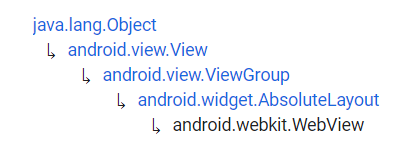

# WebView


Fuente: developer.android


## DEFINICIÓN

Hereda de:

<figure><figcaption><p>Herencia de WebView</p></figcaption></figure>

Una View que presenta páginas web.


USO BÁSICO

En la mayoría de los casos se recomienda utilizar un navegador estándar como Chrome para mostrar éste contenido a los usuarios. Para ello utilizamos un [intent](https://developer.android.com/guide/components/intents-common?hl=es-419#Browser).

Esto es debido a que, aunque el WebView permite mostrar este contenido, se pierden algunas de las características base de cualquier navegador estándar.

Una WebView es útil cuando se necesita tener un control sobre la UI y las configuraciones avanzadas de navegación. De esta manera se puede desarrollar un diseño concreto de navegación para nuestra APP.


## USO DESDE XML

```xml
<WebView
    android:id="@+id/wv"
    android:layout_width="match_parent"
    android:layout_height="match_parent"/>
```

&#x20;                                                .png>)


No se muestra nada en la Activity por que es necesario configurar el WebView antes de poder hacer uso de él.


## CONFIGURACIÓN <a href="#basic-usage" id="basic-usage"></a>

Para configurar un WebView hay que realizar varios pasos:

### Solicitar permiso de Internet

En primer lugar se debe ir al `AndroidManifest.xml` y solicitar permisos para el uso de Internet. Esto se hace con la siguiente línea de código:

```xml
<manifest>
....
<uses-permission android:name="android.permission.INTERNET" />

<application>
.....
```

### Ejecutar el web Browser

Esto lo realizamos en el `MainActivity.kt`

```kotlin
package com.example.android.appdeejemplo

import androidx.appcompat.app.AppCompatActivity
import android.os.Bundle
import android.webkit.WebView

class MainActivity : AppCompatActivity() {
    override fun onCreate(savedInstanceState: Bundle?) {
        super.onCreate(savedInstanceState)
        setContentView(R.layout.activity_main)

        val webView: WebView = findViewById(R.id.wv)
        val url = "http://www.google.es"
        webView.loadUrl(url)
    }
}
```

&#x20;                                               .png>)


Como puede ver, no recibimos el resultado que queremos ya que nos reenvía directamente a seleccionar navegador.

Esto ocurre por que, por defecto, no está activado Javascript.&#x20;


### Activar Javascript

Para activar `Javascript` debemos hacer lo siguiente:

* En primer lugar, crear una instancia de `WebSettings`.

```kotlin
val webSettings: WebSettings = webView.settings
```

* Después, en esas `WebSettings`, activamos Javascript

```kotlin
webSettings.javaScriptEnabled = true
```

* Por último, relacionamos estas `WebSettings` con nuestro `WebView` creando un `WebViewClient`:

```kotlin
webView.webViewClient = WebViewClient()
```

De esta manera nos queda:


```kotlin
package com.example.android.appdeejemplo

import androidx.appcompat.app.AppCompatActivity
import android.os.Bundle
import android.webkit.WebSettings
import android.webkit.WebView
import android.webkit.WebViewClient

class MainActivity : AppCompatActivity() {
    override fun onCreate(savedInstanceState: Bundle?) {
        super.onCreate(savedInstanceState)
        setContentView(R.layout.activity_main)

        val webView: WebView = findViewById(R.id.wv)
        val url = "http://www.google.es"
        val webSettings: WebSettings = webView.settings

        webSettings.javaScriptEnabled = true
        webView.webViewClient = WebViewClient()

        webView.loadUrl(url)
    }
}
```


&#x20;                                                   .png>)
